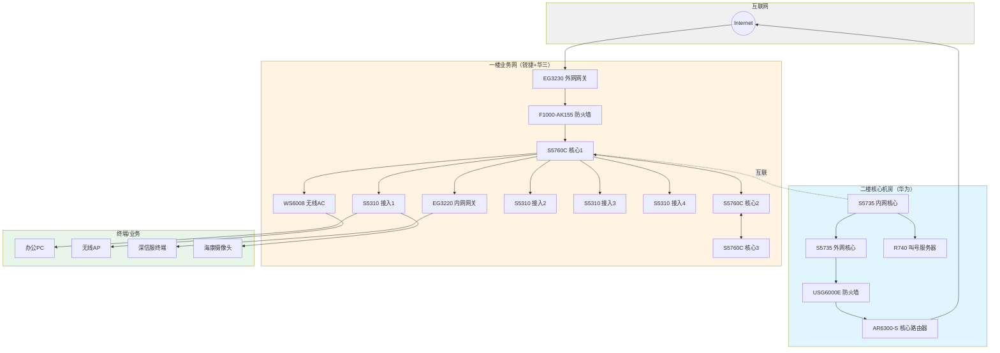
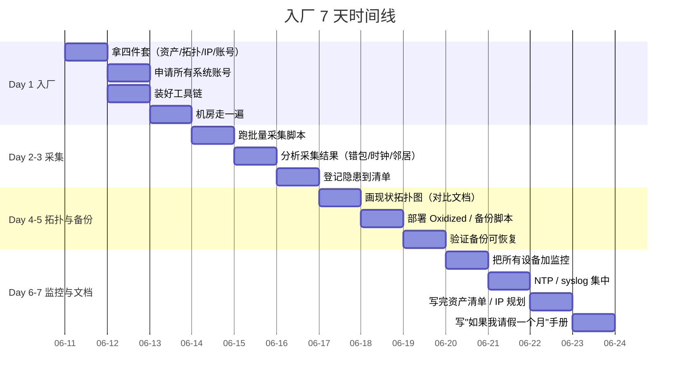
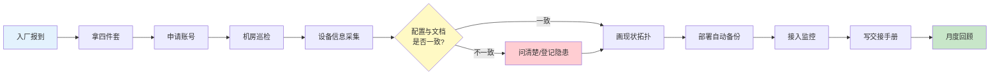
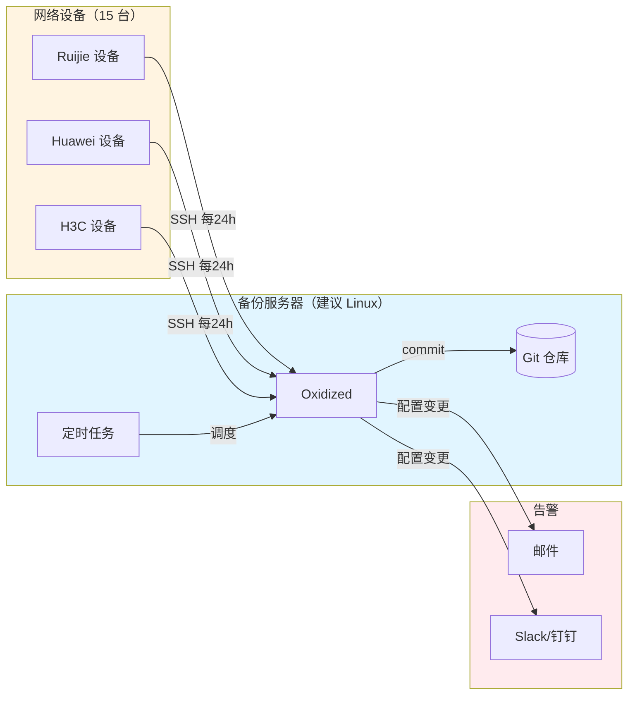

# 网络运维工程师入厂标准操作程序（SOP）

> **版本**：v1.0
> **适用**：首次入驻新环境/接手新网络的网络运维工程师
> **目标**：用一套可重复的步骤，在 **7 天内**完成环境摸底、建立基线、消除明显隐患

---

## 目录

- [第 0 步：准备工作](#第-0-步准备工作)
- [第 1 步：拿到"四件套"](#第-1-步拿到四件套)
- [第 2 步：搭建工作环境](#第-2-步搭建工作环境)
- [第 3 步：设备信息采集](#第-3-步设备信息采集)
- [第 4 步：物理与逻辑梳理](#第-4-步物理与逻辑梳理)
- [第 5 步：监控/告警/日志接入](#第-5-步监控告警日志接入)
- [第 6 步：建立配置备份机制](#第-6-步建立配置备份机制)
- [第 7 步：风险排查与隐患清单](#第-7-步风险排查与隐患清单)
- [第 8 步：写交接手册](#第-8-步写交接手册)
- [第 9 步：第一次月度回顾](#第-9-步第一次月度回顾)
- [附录 A：推荐软件清单](#附录-a推荐软件清单)
- [附录 B：常用账户/资产表模板](#附录-b常用账户资产表模板)
- [附录 C：变更流程与回滚模板](#附录-c变更流程与回滚模板)

---

## 总览图

### 整体网络架构



### 入厂 7 天时间线



### 入厂流程泳道



### 配置备份架构



---

## 第 0 步：准备工作

入厂前/入厂第一天先准备好这些东西，能省你后面 80% 的麻烦。

### 必须带的物品

- 笔记本电脑（推荐 16G 内存 + 512G SSD，运维要跑的东西不少）
- Console 线 × 2（USB 转 RJ45 + 传统 RJ45 转 USB，最好各带一条）
- USB 转串口驱动（CH340 / FT232 芯片都要支持）
- 螺丝刀（十字 + 一字 + 6 角套筒，机柜门/U 位固定）
- 手电筒（机房普遍偏暗）
- 标签纸 + 油性笔（标注线缆、U 位）
- 小本子 + 多支笔
- U 盘（2 个以上，备份用）

### 账号与权限申请

入厂当天就找 IT 主管开这些账号：

| 账号类型 | 用途 | 紧急程度 |
|---------|-----|---------|
| 网络设备 SSH/Console 账号 | 看配置、改配置 | ⭐⭐⭐ |
| 堡垒机/跳板机 | 集中登录审计 | ⭐⭐⭐ |
| 服务器/虚拟化平台 | vCenter / iDRAC | ⭐⭐⭐ |
| 监控平台 Admin | Zabbix / PRTG / 其它 | ⭐⭐ |
| 防火墙/AC Web 控制台 | 图形化管理 | ⭐⭐ |
| 域名/SSL 证书管理 | 业务侧 | ⭐ |
| OA/工单系统 | 变更审批 | ⭐⭐⭐ |
| 业务对接人微信/电话 | 紧急联系 | ⭐⭐⭐ |

---

## 第 1 步：拿到"四件套"

跟前任/主管要下面这 4 份东西，**拿不到就先别动配置**。

### 1. 资产清单

需要包含：
- 设备型号、序列号、采购日期、维保截止日期
- 物理位置（机房、机柜、U 位）
- 管理 IP、Console 口位置
- 上联/下联关系

模板在 `06-资产与拓扑/01-资产清单模板.md`

### 2. 网络拓扑图

要 **L2 和 L3 两份**：
- L2：VLAN 划分、Trunk 链路、生成树
- L3：IP 网段、互联地址、路由协议

> **重要**：文档里的拓扑和现实很可能不一样，**要自己核对**。

### 3. IP 地址规划表

包含：
- 业务网段（用户 VLAN、服务器 VLAN）
- 互联地址（设备之间互联用）
- Loopback 地址
- 公网 IP / NAT 映射
- 保留网段

模板在 `06-资产与拓扑/02-IP规划表模板.md`

### 4. 账号表

包含：
- 设备本地账号
- 堡垒机账号
- Web 控制台账号
- 各级密码（按规范应放密码管理器，不应明文保存）

> ⚠️ 密码建议用 **1Password / KeePass / Bitwarden** 之类的工具管，别明文存电脑或文档里。

---

## 第 2 步：搭建工作环境

### 推荐软件清单（详见附录 A）

按"必备 → 推荐 → 选装"三档分类。

#### 必备（不装没法干活）

| 软件 | 用途 | 推荐 |
|------|------|------|
| 终端工具 | SSH / Telnet / Console | **MobaXterm**（Windows 神器，SSH + 串口 + 文件传输 + 多标签） |
| 串口驱动 | USB 转 Console | CH340 / FT232 驱动 |
| 文本编辑器 | 看配置、写文档 | **VS Code**（装 SSH + Markdown 插件） |
| 密码管理 | 存账号密码 | **Bitwarden**（开源免费） / 1Password |
| 抓包工具 | 排错 | **Wireshark** |
| 远程桌面 | 跳板/服务器 | Windows 自带 mstsc |

#### 推荐（强烈建议装）

| 软件 | 用途 |
|------|------|
| NetBox | IP 资产管理 + 拓扑（自建，免费） |
| Zabbix / Prometheus | 监控告警（自建） |
| Oxidized / RANCID | 自动备份配置（自建） |
| Draw.io / Visio | 画拓扑图 |
| Xshell + Xftp | 备选终端工具 |
| SecureCRT | 备选终端（老牌稳） |
| Snipaste | 截图贴图（写文档神器） |
| Everything | 文件搜索 |

#### 选装（按需要）

| 软件 | 用途 |
|------|------|
| Solar-Putty | 轻量 SSH 客户端 |
| Termius | 跨平台 SSH |
| 网络管理平台 | 华为 eSight / 锐捷 RIIL / H3C iMC |
| PRTG / LibreNMS | 商业 / 开源监控 |
| Docusaurus / MkDocs | 内网 Wiki |

### 跳板/堡垒机配置

大多数公司有堡垒机，没有的话自己搭一个 **Jumpserver**（开源免费）。

- 第一周内完成跳板机登录验证
- 所有 SSH 通过跳板机，记录审计
- 关键操作二次授权

---

## 第 3 步：设备信息采集

> **核心原则：能采就采，能存就存，所有信息都要落地到本地。**

### 3.1 准备采集清单

把 `02-设备操作手册/` 下每台设备的命令清单过一遍，整理成一张执行表。

### 3.2 用脚本批量采集（强烈推荐）

不要一台台手敲，用 Python + Netmiko 批量跑。

**脚本位置**：`03-自动化脚本/01-批量采集设备配置.py`

执行：
```bash
pip install netmiko
# 编辑脚本里的设备清单和账号
python 01-批量采集设备配置.py
```

结果会按设备分文件保存到 `04-配置备份/采集结果-YYYYMMDD/`。

### 3.3 手敲命令（脚本跑不通的设备）

按设备类型打开对应的手册，挨个敲命令，输出复制保存。

### 3.4 采集完成后必看的几项

- [ ] **时钟准不准**（`show clock` / `display clock`），差太多的话日志对不上
- [ ] **接口有没有 err/discard/crc 错包**（`show interface counters`）
- [ ] **running-config 和 startup-config 一不一致**（不一致 = 之前有人改完没保存，是个雷）
- [ ] **HSRP/VRRP/双机/聚合有没有单挂**（`show standby` / `display vrrp` / `show aggregateport`）
- [ ] **路由邻居有没有起来**（`show ip ospf neighbor` / `display ospf peer`）
- [ ] **CPU/内存有没有长期高负载**（`show cpu` / `display cpu-usage`）

把异常项登记到 `05-变更流程与记录/02-入厂隐患清单.md`。

---

## 第 4 步：物理与逻辑梳理

### 4.1 物理巡检

进机房（**带手电、戴静电环**），对每台设备做：

- [ ] 设备在哪个机柜、几 U
- [ ] 设备前面板灯：SYS/PWR/LINK 灯状态（**拍照**）
- [ ] 电源：单电源还是双电源，分别接哪路 PDU
- [ ] Console 线：接哪台笔记本/堡垒机
- [ ] 上联/下联光纤/SFP 模块型号、剩余几根备用
- [ ] 风扇/温度（用红外测温枪，**电源和 SFP 模块位置**）
- [ ] U 位标签、线缆标签是否清晰（**不清的当场补**）

巡检记录表模板：`06-资产与拓扑/03-物理巡检记录模板.md`

### 4.2 画现状拓扑

打开 Draw.io / Visio，**照着设备实际跑出来的结果**画：

- L2：交换机、VLAN、Trunk、生成树
- L3：路由器、防火墙、互联地址、路由协议
- 标注 IP、端口、链路类型

**一定要和文档对比**，差异点列出来，问清楚为什么。

### 4.3 整理互联矩阵

每个设备列出"我接了谁、对端是谁、什么 VLAN/IP/链路类型"。

---

## 第 5 步：监控/告警/日志接入

> 没监控的网络是瞎子网络，**第一周必须把监控接上**。

### 5.1 监控平台

- 已有 Zabbix/PRTG：用现成的，把所有设备加入监控
- 没有任何监控：自建 Zabbix 或 LibreNMS（详见附录 A）

关键监控项：
- 设备存活（ICMP / SNMP）
- CPU / 内存 / 温度
- 接口流量 / 错包 / 丢包
- 上下联链路状态
- 关键业务端口 UP/DOWN
- 设备重启 / 配置变更

### 5.2 日志

- 设备本地日志：`display logbuffer` / `show logging`
- 远端日志：用 syslog 服务器集中收（Kiwi Syslog / Graylog / ELK）
- 时间同步：NTP，所有设备必须同步到同一时钟源

### 5.3 告警

设置告警分级：
- **P0**（立即响应）：核心设备宕机、出口中断、关键业务不通
- **P1**（30 分钟内）：单链路中断、备用资源耗尽
- **P2**（工作时间）：性能指标异常、错包率升高
- **P3**（次日处理）：告警风暴、可疑配置

---

## 第 6 步：建立配置备份机制

> **没备份别动配置，动了配置没备份是找死。**

### 6.1 手动备份

每台设备采集后立刻手动备份：
- 本地：`copy running-config startup-config`（或 `write` / `save`）
- 远端：TFTP / SCP / FTP，保存到 `04-配置备份/`

### 6.2 自动备份

**强烈推荐自建 Oxidized**（开源，免费，支持 70+ 厂商）：

配置文件：`03-自动化脚本/02-Oxidized配置示例.rb`

执行后：
- 每台设备每天自动备份
- 配置变更自动 diff，邮件/Slack 通知
- 历史版本保留 90 天

**没有 Oxidized 的备选方案**：
- RANCID（老牌）
- 简单 cron + Python + Netmiko 脚本（项目里有示例）

### 6.3 备份检查

- 每周抽 3 台设备，看备份文件大小、修改时间
- 每月做一次"恢复演练"：找台旧设备，把备份灌进去，看能不能启动

---

## 第 7 步：风险排查与隐患清单

第一周内必须排查的 **10 大风险**：

| # | 风险 | 排查方法 | 优先级 |
|---|------|---------|--------|
| 1 | 设备时差不一致 | `show clock` 对比 | P1 |
| 2 | running/startup 不一致 | 查采集结果 | P1 |
| 3 | 接口错包/CRC 长期高 | `show interface counters` | P1 |
| 4 | 冗余协议单挂（HSRP/VRRP/聚合/STP） | `show standby/vrrp/aggregateport/spanning-tree` | P0 |
| 5 | 路由邻居不稳 | `show ip ospf neighbor` | P0 |
| 6 | 防火墙策略漏洞 | `display policy` 人工 review | P0 |
| 7 | 弱口令/默认账号 | 设备审计 | P1 |
| 8 | 公网暴露的设备 Web | `display http server` / `show ip http server` | P0 |
| 9 | 未关闭的测试配置 | 人工 review | P1 |
| 10 | 缺失或过期 license | `display license` | P2 |

把所有发现登记到 `05-变更流程与记录/02-入厂隐患清单.md`，按 P0/P1/P2/P3 排期处理。

---

## 第 8 步：写交接手册

不管有没有人来交接，你都要写一份"如果我明天请假一个月，谁能接手"。

包含：
- 设备清单 + 物理位置
- 拓扑图（更新到最新）
- 账号表（在密码管理器里，不在文档里）
- 日常巡检 SOP
- 常见告警处理流程
- 紧急联系人
- 雷区清单（**别动什么配置**）

推荐用 **Markdown + 内网 Wiki**（Docusaurus / Confluence / 语雀），不要用 Word 散在硬盘里。

---

## 第 9 步：第一次月度回顾

入厂 30 天后做一次完整回顾：

- [ ] 所有设备是否都已纳入监控
- [ ] 所有设备是否已加入自动备份
- [ ] 隐患清单 P0/P1 是否全部处理
- [ ] 文档是否更新到最新
- [ ] 变更流程是否跑通过
- [ ] 团队成员是否都接受过变更流程培训

---

## 附录 A：推荐软件清单

### A.1 终端/连接类

| 软件 | 平台 | 免费 | 备注 |
|------|------|------|------|
| **MobaXterm** | Windows | 个人版免费 | SSH/串口/文件传输全能，强烈推荐 |
| Xshell 7 | Windows | 家庭/学校免费 | 商业功能要付费 |
| SecureCRT | 全平台 | 付费 | 老牌稳定，习惯的人多 |
| Termius | 全平台 | 个人版免费 | 跨平台 |
| PuTTY | Windows | 免费 | 极简，老古董 |
| Windows Terminal | Windows | 免费 | Windows 11 自带 |
| iTerm2 | macOS | 免费 | macOS 首选 |
| Tabby | 全平台 | 免费 | 新一代，颜值高 |

### A.2 抓包/诊断

| 软件 | 用途 | 备注 |
|------|------|------|
| **Wireshark** | 抓包分析 | 必备 |
| tcpdump | 命令行抓包 | Linux 服务器 |
| ping / traceroute / mtr | 路径追踪 | 内置 |
| nmap | 端口扫描 | 排查用，别乱扫生产 |
| iperf3 | 带宽测试 | 测链路质量 |
| BestTrace | 路由追踪 | 有中国地图展示 |

### A.3 配置管理

| 软件 | 用途 | 备注 |
|------|------|------|
| **Oxidized** | 自动备份 + diff | 开源，强推 |
| RANCID | 自动备份 | 老牌 |
| NetBox | IP 资产 + 拓扑 | 开源，自建 |
| Git | 配置版本管理 | 配 Oxidized 用 |

### A.4 监控告警

| 软件 | 用途 | 备注 |
|------|------|------|
| **Zabbix** | 综合监控 | 开源，企业首选 |
| LibreNMS | 网络监控 | 开源，自动发现强 |
| Prometheus + Grafana | 监控 + 大屏 | 容器化场景 |
| PRTG | 商业监控 | 颜值高，license 贵 |
| SolarWinds | 商业监控 | 功能强，贵 |
| 华为 eSight | 华为设备管理 | 有华为设备建议装 |
| 锐捷 RIIL | 锐捷设备管理 | 有锐捷设备建议装 |
| 华三 iMC | 华三设备管理 | 有华三设备建议装 |

### A.5 资产管理

| 软件 | 用途 | 备注 |
|------|------|------|
| **NetBox** | IP/DCIM/线缆 | 开源，强推 |
| Snipe-IT | 资产 IT 管理 | 开源 |
| GLPI | 资产 + 工单 | 开源，功能多 |

### A.6 文档协作

| 软件 | 用途 | 备注 |
|------|------|------|
| **语雀 / 飞书文档 / 钉钉文档** | 团队 Wiki | 国内首选 |
| Notion | 团队 Wiki | 国际团队 |
| Confluence | 团队 Wiki | Atlassian 系 |
| Docusaurus | 技术文档 | 开源 |
| MkDocs | 技术文档 | 开源 |
| **Obsidian** | 个人/小团队笔记 | 适合运维手册 |

### A.7 密码管理

| 软件 | 平台 | 备注 |
|------|------|------|
| **Bitwarden** | 全平台 | 开源免费，强推 |
| 1Password | 全平台 | 付费，体验好 |
| KeePass | 全平台 | 老牌，离线 |

### A.8 远程/堡垒机

| 软件 | 用途 | 备注 |
|------|------|------|
| **Jumpserver** | 堡垒机 | 开源，国内最流行 |
| Teleport | 堡垒机 | 开源，新潮 |
| WindTerm | 终端+文件 | 新秀 |
| mstsc | Windows 远程桌面 | 内置 |
| VNC Viewer | 跨平台远程 | 备选 |

### A.9 画图

| 软件 | 用途 | 备注 |
|------|------|------|
| **Draw.io (diagrams.net)** | 通用画图 | 免费，强推 |
| Visio | 专业画图 | 微软，付费 |
| ProcessOn | 在线画图 | 国内，协作 |
| Lucidchart | 在线画图 | 国际，付费 |
| yEd | 自动布局 | 复杂图省力 |
| NetBox 内置拓扑 | DCIM 拓扑 | 自建首选 |

### A.10 提效工具

| 软件 | 用途 |
|------|------|
| **Snipaste** | 截图贴图 |
| Everything | 文件搜索 |
| uTools | 工具集 |
| QuickLook | 空格预览 |
| PowerToys | Windows 工具集 |
| 7-Zip | 解压缩 |
| Notepad++ | 文本编辑 |
| Typora / MarkText | Markdown 编辑 |

---

## 附录 B：常用账户/资产表模板

参见 `06-资产与拓扑/01-资产清单模板.md`

---

## 附录 C：变更流程与回滚模板

参见 `05-变更流程与记录/01-变更申请单模板.md`

---

## 几条铁律

> 1. **没有变更方案不动配置**——变更前先写方案、回滚步骤、影响范围
> 2. **没有备份不动配置**——变更前必须备份当前配置
> 3. **核心设备改配置必须有第二人在场**——能多一双眼睛救命
> 4. **变更在窗口期做**——别在业务高峰期动核心设备
> 5. **改完配置观察 30 分钟再走**——出问题了人还在
> 6. **一切操作留痕**——命令、截图、时间、结果都要记
> 7. **不懂就问，别猜**——猜错一次比问十次代价都大
> 8. **把账号密码交给密码管理器，别交给运气**
