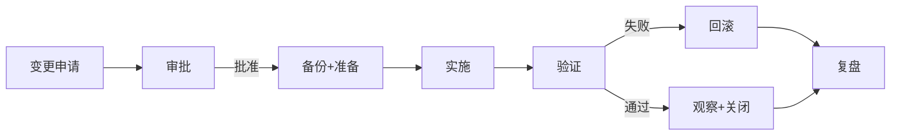

# 通用项目手册模板

> **用途**：把这套模板**直接复制到新项目**目录里，按实际内容填进去就行。
> **适用场景**：
> - 接手一个新客户的网络
> - 给新员工做 onboarding
> - 项目交付文档
> - 内部技术沉淀
> - 招投标技术方案
>
> **填写原则**：
> - 能截图就截图（不写"如右图"，写"见下"）
> - 能给具体 IP/账号就给（账号/密码可以分开放）
> - 不确定的写"待确认"，**不要瞎编**
> - 每个章节都允许"本项目不适用"——留空就行

---

## 第 0 部分：封面

```markdown
# [项目名称] 网络运维手册

> **项目名称**：___
> **项目地址**：___
> **客户名称**：___
> **维保期**：___ 至 ___
> **运维负责人**：___（姓名/电话/邮箱）
> **编制日期**：___
> **版本**：v1.0
> **变更记录**：
> | 版本 | 日期 | 修订人 | 说明 |
> |------|------|--------|------|
> | v1.0 | | | 首次发布 |
> | v1.1 | | | |
>
> **保密等级**：☐ 公开 ☐ 内部 ☐ 机密
```

---

## 第 1 部分：项目概述

### 1.1 项目背景

> 简单说这个项目是什么、为什么做、谁负责

```
项目名称：___
启动日期：___
完工日期：___
维保期：___
客户方接口人：___（姓名/电话/邮箱）
集成方接口人：___（姓名/电话/邮箱）
```

### 1.2 网络规模

| 指标 | 数量 |
|------|------|
| 机房数量 | |
| 机柜数量 | |
| 网络设备总数 | |
| 服务器数量 | |
| 终端用户数 | |
| 业务系统数 | |
| 公网出口带宽 | |
| 业务子网数 | |

### 1.3 网络架构

> **画一张架构图**（用 Draw.io / Visio），图里包含：
> - 设备型号 + 数量
> - 互联关系
> - 公网出口
> - 关键业务
> - VLAN / IP 段（标注在边上）


### 1.4 厂商分布

| 厂商 | 设备数 | 主要型号 | 备注 |
|------|--------|---------|------|
| 思科 | | | |
| 华为 | | | |
| 华三 | | | |
| 锐捷 | | | |
| 山石 | | | |
| 深信服 | | | |
| 海康 | | | |
| 其它 | | | |

---

## 第 2 部分：网络拓扑

### 2.1 物理拓扑

> **机房布局图**（哪个设备在哪个机柜、几 U）
> **光纤/网线走线图**

### 2.2 逻辑拓扑

> **L2 拓扑**：VLAN、Trunk、生成树
> **L3 拓扑**：IP 网段、路由协议

### 2.3 互联清单

| 起点 | 终点 | 类型 | 速率 | VLAN/IP | 物理路径 | 备注 |
|------|------|------|------|---------|---------|------|
| | | | | | | |
| | | | | | | |

---

## 第 3 部分：设备清单

### 3.1 网络设备

> 按设备类型分组，**每台都要列**

| # | 设备名 | 型号 | 序列号 | 固件版本 | 管理 IP | 物理位置 | 角色 | 维保截止 | 备注 |
|---|--------|------|--------|----------|---------|---------|------|---------|------|
| | | | | | | | | | |

### 3.2 服务器

| # | 设备名 | 型号 | 序列号 | 操作系统 | 业务 IP | iDRAC IP | 角色 | 维保截止 | 备注 |
|---|--------|------|--------|----------|---------|----------|------|---------|------|
| | | | | | | | | | |

### 3.3 安全/终端

| # | 设备/系统 | 型号 | 数量 | 管理地址 | 角色 | 维保截止 | 备注 |
|---|----------|------|------|---------|------|---------|------|
| | | | | | | | |

---

## 第 4 部分：IP 地址规划

### 4.1 管理网段

| 用途 | 网段 | 备注 |
|------|------|------|
| 设备管理 | | |
| 带外 iDRAC | | |
| 堡垒机 | | |

### 4.2 业务网段

| VLAN | 名称 | 网段 | 网关 | DHCP | 用途 |
|------|------|------|------|------|------|
| | | | | | |

### 4.3 互联地址

| 起点 | 终点 | IP 段 | 掩码 | 协议 |
|------|------|-------|------|------|
| | | | | |

### 4.4 公网 IP / NAT

| 公网 IP | 内网 IP | 端口 | 用途 |
|---------|---------|------|------|
| | | | |

---

## 第 5 部分：账号管理

> **密码不要写在这里**，用 ☐ 标记，密码存到 Bitwarden / 1Password

| 设备/系统 | 用户名 | 角色 | 密码位置 | 备注 |
|----------|--------|------|---------|------|
| | | | Bitwarden: ___ | |

### 5.1 堡垒机

```
地址：https://___
账号：___
认证方式：☐ 静态密码 ☐ LDAP ☐ AD ☐ 双因子
登录方式：☐ Web ☐ SSH ☐ RDP
授权审批流程：___
```

### 5.2 密码策略

- 长度：___ 位
- 复杂度：☐ 数字+大小写+符号
- 有效期：___ 天
- 历史密码：不允许重复最近 ___ 个
- 失败锁定：___ 次后锁定 ___ 分钟

### 5.3 账号清单（建议模板）

| 用户名 | 姓名 | 角色 | 设备范围 | 授权时间 | 失效时间 |
|--------|------|------|---------|---------|---------|
| | | | | | |

---

## 第 6 部分：监控与告警

### 6.1 监控平台

| 项 | 内容 |
|------|------|
| 平台 | ☐ Zabbix ☐ Prometheus ☐ PRTG ☐ 其它 ___ |
| 地址 | |
| 版本 | |
| 部署方式 | ☐ 物理机 ☐ 虚机 ☐ 容器 ☐ SaaS |
| 容量 | 当前监控 ___ 设备项 |
| 数据保留 | ___ 天 |

### 6.2 关键监控项

| 设备类型 | 监控项 | 告警阈值 | 告警等级 |
|---------|--------|---------|---------|
| 路由器 | CPU | > 80% | P1 |
| 路由器 | 内存 | > 85% | P1 |
| 路由器 | 接口流量 | > 90% 带宽 | P1 |
| 路由器 | 接口 err/discard | > 0.1% 持续 5 分钟 | P2 |
| 路由器 | 邻居丢失 | 立即 | P0 |
| 交换机 | 设备不可达 | 立即 | P0 |
| 交换机 | 接口 DOWN | 立即（关键口） | P0 |
| 防火墙 | session 数 | > 80% 上限 | P1 |
| 服务器 | CPU | > 85% | P1 |
| 服务器 | 磁盘空间 | < 10% | P1 |
| 服务器 | 内存 | > 90% | P1 |
| 温度 | 设备进风 | > 25℃ | P2 |
| 温度 | 设备出风 | > 35℃ | P1 |

### 6.3 告警分级

| 等级 | 含义 | 响应时间 | 通知方式 |
|------|------|---------|---------|
| P0 | 紧急，业务中断 | 5 分钟 | 电话 + 短信 + 微信 |
| P1 | 高，影响业务 | 30 分钟 | 短信 + 微信 |
| P2 | 中，潜在风险 | 4 小时 | 微信 + 邮件 |
| P3 | 低，优化项 | 24 小时 | 邮件 |

### 6.4 值班与响应

| 项 | 内容 |
|------|------|
| 值班方式 | ☐ 7×24 ☐ 5×8 + 7×24 oncall ☐ 仅工作时间 |
| 一线值班 | ___（姓名/电话） |
| 二线支持 | ___（姓名/电话） |
| 升级路径 | 一线 → 二线 → 主管 → 厂商 |

---

## 第 7 部分：配置备份

### 7.1 备份策略

| 项 | 内容 |
|------|------|
| 工具 | ☐ Oxidized ☐ RANCID ☐ Python 脚本 ☐ 手动 |
| 频率 | ☐ 每天 ☐ 每周 ☐ 变更后 |
| 保留期 | ___ 天 |
| 存储位置 | ☐ 本地 ☐ 异地 ☐ Git 仓库 |
| 验证频率 | ☐ 每周抽检 ☐ 每月演练 |

### 7.2 备份清单

| 设备 | 自动备份 | 最近一次备份 | 文件大小 | MD5 | 验证人 |
|------|---------|-------------|---------|-----|--------|
| | ☐ | | | | |

### 7.3 恢复演练

| 日期 | 演练设备 | 结果 | 演练人 | 备注 |
|------|---------|------|--------|------|
| | | ☐ 成功 ☐ 失败 | | |

---

## 第 8 部分：变更管理

### 8.1 变更流程



### 8.2 变更窗口

| 类型 | 窗口 | 申请提前期 |
|------|------|----------|
| 紧急变更（P0） | 随时 | 即时 |
| 高风险变更 | 周五 23:00 - 周日 23:00 | 3 天 |
| 普通变更 | 工作日 22:00-次日 06:00 | 2 天 |
| 低风险变更 | 工作日任意 | 1 天 |

### 8.3 变更记录

> 每次变更填写 `09-变更记录/CHG-YYYYMMDD-XXX.md`

---

## 第 9 部分：日常运维

### 9.1 巡检

#### 每日巡检

- [ ] 设备存活（监控告警）
- [ ] 关键业务端口 UP
- [ ] 备份任务执行（夜间任务）
- [ ] 重要告警处理
- [ ] 用户报修处理

#### 每周巡检

- [ ] 备份文件抽查
- [ ] 配置变更 review
- [ ] 设备日志异常检查
- [ ] 接口错包/丢包
- [ ] 安全告警 review

#### 每月巡检

- [ ] 备份恢复演练
- [ ] 固件漏洞扫描
- [ ] 账号审计
- [ ] 策略精简
- [ ] license 有效期
- [ ] 维保到期检查

#### 每季度

- [ ] 全设备完整备份
- [ ] 拓扑图更新
- [ ] 资产清单核对
- [ ] 应急预案演练
- [ ] 文档 review

### 9.2 常用操作 SOP

> 每个常用任务写一份，**单独的 SOP 文档**放到 `10-常用操作SOP/`

| 任务 | SOP 文件 |
|------|---------|
| 新增 VLAN | 01-新增VLAN.md |
| 新增设备入网 | 02-新增设备入网.md |
| 端口映射（NAT） | 03-端口映射.md |
| 防火墙策略 | 04-防火墙策略.md |
| 设备重启 | 05-设备重启.md |
| 故障应急 | 06-故障应急.md |
| 数据备份 | 07-数据备份.md |
| 数据恢复 | 08-数据恢复.md |

---

## 第 10 部分：应急预案

### 10.1 故障分级

| 等级 | 影响 | 响应 |
|------|------|------|
| P0 | 核心业务全断 | 立即响应，10 分钟内有人处理 |
| P1 | 部分业务中断 | 30 分钟内有人处理 |
| P2 | 业务降级 | 4 小时内处理 |
| P3 | 不影响业务 | 24 小时内处理 |

### 10.2 常见故障处理

#### 故障 1：单台设备不可达

```
1. 监控告警 + 业务报修
2. Ping / SSH 测试是否可达
3. 不通 → Console 直连
4. Console 也不通 → 物理重启
5. 仍不行 → 备件替换
6. 事后：分析根因，登记到 12-故障案例库
```

#### 故障 2：单条链路中断

```
1. 监控告警
2. 查对端端口状态
3. 查 SFP 模块收发光（光功率计）
4. 换光纤/模块测试
5. 查是否有冗余链路可走
6. 修复后观察 30 分钟
```

#### 故障 3：核心设备宕机

```
1. 启动应急响应
2. 通知相关方
3. 启备件
4. 配置灌入（从最近一次备份）
5. 验证业务
6. 事后：根因分析 + 加固
```

#### 故障 4：广播风暴

```
1. 监控告警（接口流量突增）
2. 在核心断开可疑区域
3. 定位风暴源
4. 处理后恢复
5. 加 BPDU Guard 防止复发
```

#### 故障 5：被攻击（DoS / 勒索）

```
1. 立即隔离（防火墙封源 IP / 断网）
2. 评估影响
3. 启用备份恢复
4. 报安全应急
5. 复盘 + 加固
```

#### 故障 N：___

> 每一个真实发生过的故障都写一份，存到 `12-故障案例库/`

### 10.3 应急联系

| 角色 | 姓名 | 电话 | 邮箱 | 备注 |
|------|------|------|------|------|
| 一线值班 | | | | 7×24 |
| 二线支持 | | | | 工作时间 |
| 项目经理 | | | | |
| 客户接口 | | | | |
| 厂商 1（思科） | | | | |
| 厂商 2（华为） | | | | |
| 厂商 3（华三） | | | | |
| ISP 客服 | | | | |

---

## 第 11 部分：知识库 / 常见问题 FAQ

> 实际遇到的、客户常问的、容易踩坑的，都记下来

### FAQ 1：用户上不了网

```
排查顺序：
1. 物理：网线 / 交换机端口灯
2. 接入：是否在正确的 VLAN
3. IP：DHCP 拿到 IP 没 / 静态 IP 配对没
4. 网关：能否 ping 通网关
5. DNS：能否解析域名
6. 策略：是否被防火墙拦
7. 出口：是否通外网
```

### FAQ 2：业务系统慢

```
排查顺序：
1. 监控：业务系统 CPU / 内存 / 磁盘 / 网络
2. 链路：是否有拥塞
3. 数据库：慢查询 / 锁等待
4. 应用：连接数 / 线程池
5. 网络：丢包 / 延迟（ping / mtr）
```

### FAQ N：___

---

## 第 12 部分：附录

### 附录 A：术语表

| 术语 | 全称 | 含义 |
|------|------|------|
| VLAN | Virtual LAN | 虚拟局域网 |
| OSPF | Open Shortest Path First | 链路状态路由协议 |
| BGP | Border Gateway Protocol | 边界网关协议 |
| VRRP | Virtual Router Redundancy Protocol | 虚拟路由冗余协议 |
| STP | Spanning Tree Protocol | 生成树协议 |
| ACL | Access Control List | 访问控制列表 |
| NAT | Network Address Translation | 网络地址转换 |
| DNS | Domain Name System | 域名系统 |
| DHCP | Dynamic Host Configuration Protocol | 动态主机配置协议 |
| IPS | Intrusion Prevention System | 入侵防御系统 |
| AV | Antivirus | 杀毒 |
| WAF | Web Application Firewall | Web 应用防火墙 |
| SIEM | Security Information and Event Management | 安全信息与事件管理 |
| SNMP | Simple Network Management Protocol | 简单网络管理协议 |
| NTP | Network Time Protocol | 网络时间协议 |
| Syslog | System Log | 系统日志 |
| HA | High Availability | 高可用 |
| SLA | Service Level Agreement | 服务等级协议 |
| KPI | Key Performance Indicator | 关键性能指标 |
| MTTR | Mean Time To Repair | 平均修复时间 |
| MTBF | Mean Time Between Failures | 平均故障间隔时间 |

### 附录 B：参考文档

- 设备厂商文档：见各设备操作手册
- 项目交付文档：见 `13-项目交付文档/`
- 招投标文件：见 `14-招投标文件/`

### 附录 C：版本历史

| 版本 | 日期 | 修订人 | 主要变更 |
|------|------|--------|---------|
| v1.0 | | | 首次发布 |
| v1.1 | | | |

---

## 填写指南（项目模板怎么用）

### 用法 1：完整新项目

1. 复制整个模板到项目目录
2. 按章节填写
3. 设备操作手册直接引用 `02-设备操作手册/` 下的现成文档
4. 把项目特定的信息（账号/IP/拓扑）补到对应章节

### 用法 2：补充老项目

1. 复制模板到老项目目录
2. 对比缺什么、补什么
3. 不需要的章节直接删

### 用法 3：客户交付

1. 去掉"内部"内容（值班、薪资、内部账号）
2. 加保密声明
3. 转换成 PDF / Word 给客户
4. 现场讲解 + 培训

### 用法 4：作为投标技术文档

1. 抽取"项目概述"、"网络架构"、"厂商分布"
2. 加"实施方法"、"服务承诺"、"应急响应"
3. 加"团队介绍"、"资质证书"

---

## 写文档的几个原则

> 1. **能截图就截图** —— 一张图胜过 1000 字
> 2. **能跑的命令就给出来** —— 别只写"按规范操作"
> 3. **账号密码不要写正文** —— 统一放密码管理器
> 4. **"待确认"是允许的** —— 比瞎编强 100 倍
> 5. **每年 review 一次** —— 网络在变，文档要跟上
> 6. **面向"明天的我"** —— 假设接手的人什么都不懂

---

**完。复制走，改改就是你的了。**
