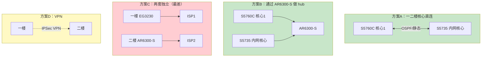
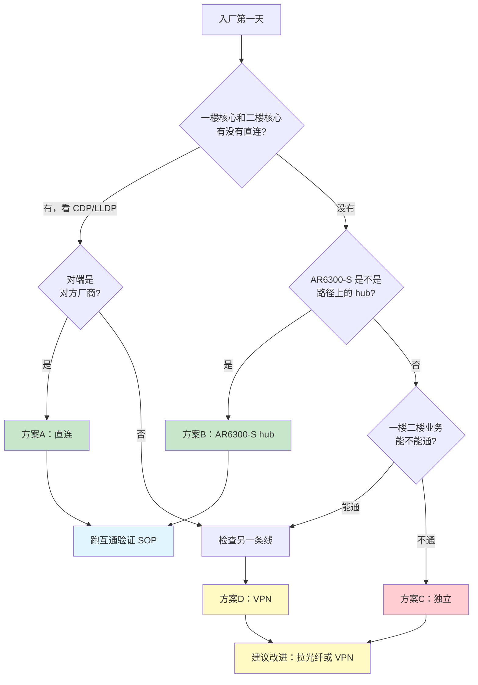
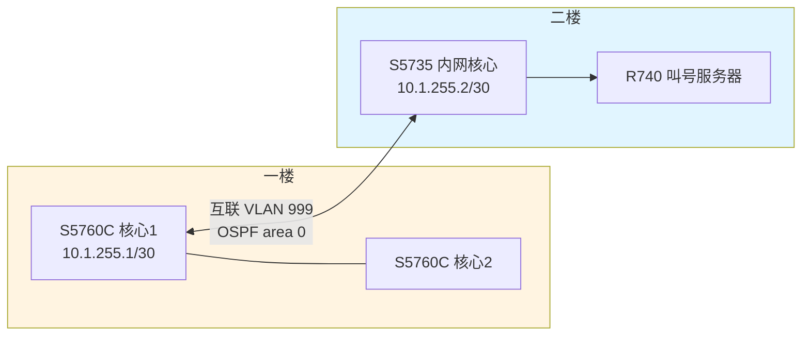
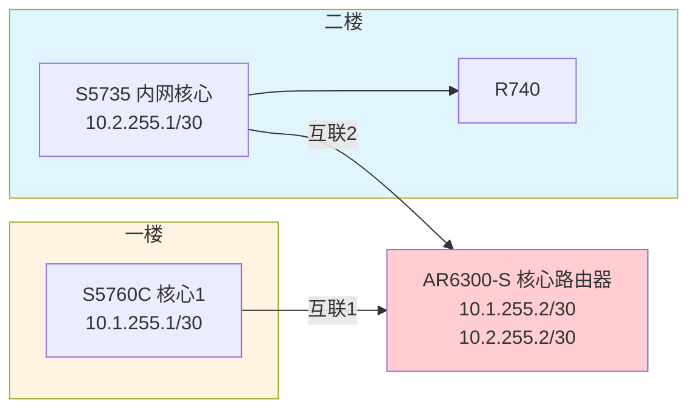
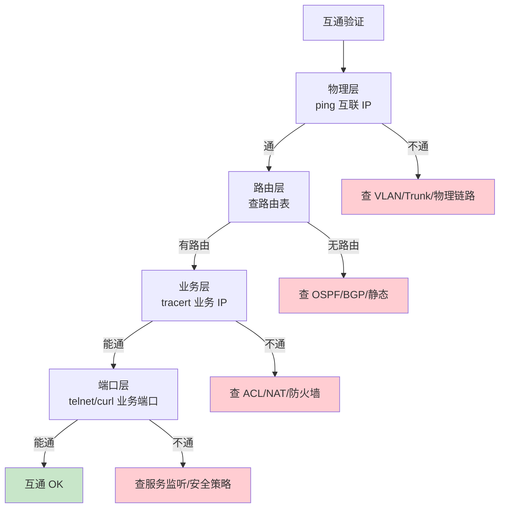

# 双机房网络互联方案

> **适用**：一楼业务网（锐捷）与二楼核心机房（华为）的互联
> **最后更新**：v1.0
> **重要**：本方案需要你**对照现场实际拓扑核对**后落地

---

## 互联方案全景图

### 4 种方案对比



### 排查决策树



### 排查时间线（30 分钟定位）

```mermaid
gantt
    title 30 分钟定位双机房互联方案
    dateFormat HH:mm
    axisFormat %H:%M

    section Step 1 物理
    看一楼 S5760C 光纤走向           :s1a, 00:00, 4m
    看二楼 S5735 接口                :s1b, after s1a, 4m
    问物业/前任                     :s1c, after s1b, 2m

    section Step 2 逻辑
    一楼 show ip route             :s2a, after s1c, 3m
    一楼 show lldp/cdp neighbors    :s2b, after s2a, 3m
    二楼 display routing-table      :s2c, after s2b, 2m
    二楼 display lldp neighbor      :s2d, after s2c, 2m

    section Step 3 协议
    一楼 show ospf/bgp neighbor     :s3a, after s2d, 2m
    二楼 display ospf/bgp peer      :s3b, after s3a, 3m

    section Step 4 业务
    tracert / ping 测试              :s4a, after s3b, 5m
```



### 方案 A 直连示意（推荐）



### 方案 B 通过 AR6300-S hub



### 互通验证四层测试



---

## 0. 为什么要单独写这个

你列出来的设备里，**一楼和二楼是两套完全独立的网络**：
- 一楼：锐捷 EG3220 / S5760C / S5310 / WS6008 / EG3230 + 华三 F1000
- 二楼：华为 S5735 × 2 / USG6000E / AR6300-S + 戴尔 R740

但实际环境里这两套**一定是要通的**（叫号服务器在二楼，业务网在一楼），怎么通、谁走什么 VLAN、用什么路由协议、是否要做 HA —— 这些直接决定了你入厂第一周要画的那张"现状拓扑图"长什么样。

入厂第一天，**第一件事就是把这个搞清楚**。

---

## 1. 可能的几种互联方式（先猜，再现场核对）

### 方案 A：一楼核心 → 二楼核心（直连 + OSPF/BGP）

```
[一楼 S5760C-核心1] ──光纤/双绞线──> [二楼 S5735-内网核心]
                                            │
                                            └─→ [S5735-外网核心]
                                            └─→ [R740 叫号服务器]
```

**特征**：
- 一楼核心和二楼核心直接互联，跑路由协议（OSPF / 静态）
- 两边都作为 L3 网关
- 二楼业务回一楼走这条线

**判断方法**：
- 一楼核心 `show cdp neighbors` / `show lldp neighbors` 看有没有华为设备
- 二楼核心 `display lldp neighbor` 看有没有锐捷设备
- 一楼到二楼有没有跨楼层光缆/网线

### 方案 B：一楼核心 → AR6300-S 出口汇聚

```
[一楼 S5760C-核心1] ──> [AR6300-S] ──> [USG6000E] ──> [ISP]
                            │
                            └─→ [S5735-内网核心]
                            └─→ [S5735-外网核心]
                            └─→ [R740]
```

**特征**：
- AR6300-S 作为两套网络共同的"核心路由器"
- 一楼、二楼各自通过 S5760C/S5735 上联到 AR6300-S
- 出口统一走 AR6300-S → USG6000E

**判断方法**：
- AR6300-S 上接口数量（4 个 SFP/SFP+ 比较常见）
- 一楼核心和二楼核心是不是都接了 AR6300-S
- AR6300-S 上跑 OSPF / IS-IS / BGP 的邻居数

### 方案 C：两套独立出口，互相不通（最差情况）

```
[一楼 EG3230] ──> [ISP 1]
[二楼 AR6300-S] ──> [USG6000E] ──> [ISP 2]
```

**特征**：
- 一楼有自己的出口
- 二楼有自己的出口
- 业务走外网的话两边都能出
- 但**内部不通**（一楼用户访问不了二楼 R740）

**判断方法**：
- 一楼核心有没有到二楼的路由
- 二楼核心有没有到一楼的路由
- ping 测试：一楼客户端 → 二楼 R740 IP

### 方案 D：专线 / 楼层间光缆

```
[一楼] ──<光缆/专线>── [二楼]
```

物理上多见的是楼层间走光纤（多模/单模），少数是 RJ45 双绞线（50 米内）。

---

## 2. 入厂第一天怎么确认

按这个顺序查，**30 分钟内能定位**：

### Step 1：物理层（10 分钟）

- [ ] 进一楼机房，看 S5760C-核心 1/2/3 的光纤 / 网线走向
- [ ] 找有没有光纤走"出机房"的，标号一般是"到二楼"或"floor-2"
- [ ] 进二楼机房，看 S5735-内网核心的接口上有没有跨楼层光缆
- [ ] 听机房老员工 / 物业说"这条线到哪"

### Step 2：逻辑层（10 分钟）

- [ ] 一楼核心 `show ip route`，看有没有到 172.16.0.0/16 或 10.2.0.0/16 的路由
- [ ] 一楼核心 `show cdp neighbors detail` / `show lldp neighbors detail`，看对端是不是华为
- [ ] 二楼核心 `display ip routing-table`，看有没有到 192.168.0.0/16 或 10.1.0.0/16
- [ ] 二楼核心 `display lldp neighbor`，看对端是不是锐捷
- [ ] 看 AR6300-S `display ip routing-table`，看邻居 IP 段

### Step 3：协议层（5 分钟）

- [ ] 一楼：`show ip ospf neighbor` / `show ip bgp summary`
- [ ] 二楼：`display ospf peer` / `display bgp peer`
- [ ] 看 area-id / AS 号能不能对上
- [ ] 跑 `traceroute / tracert` 从一楼 PC 到 R740，看路径

### Step 4：业务测试（5 分钟）

- [ ] 一楼 PC ping 二楼 R740 IP（业务 IP）
- [ ] 一楼 PC telnet / SSH 二楼 R740 业务端口
- [ ] 反向再测一次
- [ ] 抓包看路径（`tracert -d`）

---

## 3. 三种典型情况的检查清单

### 3.1 如果是【方案 A 直连】

**典型配置**：
- 一楼核心：互联 VLAN 999，IP 10.1.255.0/30
- 二楼核心：互联 VLAN 999，IP 10.2.255.0/30
- 协议：OSPF area 0

**入厂必看**：
- [ ] 一楼 `show ip ospf neighbor`，有没有到二楼核心的邻居
- [ ] 二楼 `display ospf peer brief`，有没有到一楼核心的邻居
- [ ] 两边 area-id、hello/dead timer 一致
- [ ] 互联接口是 trunk 还是 access？两端 VLAN 透传一致
- [ ] 一楼核心 → 二楼核心的 IP 是否能 ping 通

**潜在问题**：
- VLAN 不通：Trunk 没放行对应 VLAN
- OSPF 卡在 EXSTART：MTU 不一致
- 邻居时起时落：cost 值不合理 / 认证不匹配

### 3.2 如果是【方案 B 通过 AR6300-S】

**典型配置**：
- 一楼核心 → AR6300-S，互联地址如 10.1.255.0/30
- 二楼核心 → AR6300-S，互联地址如 10.2.255.0/30
- AR6300-S 上跑 OSPF / IS-IS，作为两边的 hub

**入厂必看**：
- [ ] AR6300-S `display ospf peer`，看邻居数（应该有 2 个 + 可能的内网）
- [ ] AR6300-S `display ip routing-table`，看有没有汇总路由
- [ ] AR6300-S 自身 CPU/内存（**双机房流量都过它，它是核心中的核心**）
- [ ] 一楼核心到 AR6300-S 的互联接口 UP
- [ ] 二楼核心到 AR6300-S 的互联接口 UP

**潜在问题**：
- AR6300-S 单点故障（强烈建议**双机 / 堆叠**）
- 一楼到 AR6300-S 单链路（建议**双链路聚合**）
- 路由黑洞（汇总不当）

### 3.3 如果是【方案 C 两套独立】

**业务不通的风险**：
- 一楼用户访问不了二楼 R740
- 二楼业务对外可能要绕一圈
- 监控 / 备份都会受限

**建议改进**（不一定要立刻做，先登记为隐患）：
- 拉一条光纤把两套核心互联
- 跑 OSPF 做互通
- 或用 VPN（不推荐，公网绕）
- 或拉专线（贵但稳）

---

## 4. 互联相关的命令速查

### 一楼（锐捷）侧

```bash
# 看所有邻居
show cdp neighbors
show lldp neighbors
show cdp neighbors detail
show lldp neighbors detail

# 看路由
show ip route
show ip route summary
show ip ospf neighbor
show ip bgp summary

# 看特定网段路由
show ip route 172.16.0.0
show ip route 10.2.0.0

# 看接口
show ip interface brief
show interface description

# 抓包定位
traceroute 172.16.x.x
ping 172.16.x.x source 10.1.1.10
```

### 二楼（华为）侧

```bash
# 看邻居
display lldp neighbor
display lldp neighbor brief
display lldp neighbor detail

# 看路由
display ip routing-table
display ip routing-table 172.16.0.0
display ospf peer
display ospf peer brief
display bgp peer

# 看接口
display ip interface brief
display interface description

# 抓包
tracert 192.168.x.x
ping -a 10.2.1.1 192.168.x.x
```

### AR6300-S（如果它在中间）

```bash
# 看自己身上跑了什么
display ip routing-table
display ospf peer
display bgp peer

# 看邻居的 IP
display ip interface brief

# 看流量过不过自己
display interface | include rate
display cpu-usage
display memory-usage
```

---

## 5. 互通验证 SOP（必做）

入厂第一天，跑一遍下面这套测试：

### 5.1 物理连通性

```bash
# 一楼核心 → 二楼核心
ping 10.2.x.x source 10.1.1.10

# 二楼核心 → 一楼核心
ping 10.1.x.x source 10.2.1.1
```

### 5.2 路由可达性

```bash
# 一楼核心看能不能学到二楼网段
show ip route 172.16.0.0

# 二楼核心看能不能学到一楼网段
display ip routing-table 192.168.0.0
```

### 5.3 业务连通性

```bash
# 找一台一楼办公 PC（或笔记本接一楼网线）
tracert <R740 业务 IP>

# 反向
# 通过 iDRAC KVM 进 R740
tracert <一楼的某个用户 IP 或网关 IP>
```

### 5.4 跨机房端口

```bash
# 一楼 PC 访问二楼 R740 的业务端口
# 比如 R740 提供 8080 端口
curl -v http://<R740 IP>:8080

# 看是否通
```

---

## 6. 互联部分的"雷区清单"

| 雷区 | 表现 | 排查 |
|------|------|------|
| VLAN 不通 | ping 不通 / OSPF 起不来 | 查 Trunk 放行 |
| MTU 不一致 | 大包丢 / OSPF 卡 EXSTART | `show interface` / `display interface` |
| 路由协议不匹配 | 一边 OSPF 一边静态 | 看 neighbor 状态 |
| ACL 误拦 | 业务不通但 ping 通 | 看防火墙策略 |
| NAT 错配 | 跨机房访问被 NAT 错改源 | 看 NAT 规则 |
| 单链路 | 一断全断 | 加冗余 |
| 单点设备 | 核心设备单点 | 加 HA |
| IP 段冲突 | 路由震荡 | 查 IP 规划 |
| 路由环路 | 业务时通时不通 | TTL 抓包 |

---

## 7. 如果是"两套独立不通"，改进建议

### 7.1 方案一：拉光纤直连（推荐）

- 走楼层间光缆（多模 OM3 / 单模 OS2 看距离）
- 两端各起一个互联 VLAN / 接口
- 跑 OSPF area 0，互联 IP 用 /30

```
[一楼 S5760C-核心1 Gi1/0/24] ──光缆── [二楼 S5735-内网核心 GE0/0/24]
       10.1.255.1/30                        10.1.255.2/30
       OSPF area 0                          OSPF area 0
```

### 7.2 方案二：通过 AR6300-S 做 hub

如果 AR6300-S 已经有互联接口，加邻居就行：
- 一楼核心：起互联 VLAN，加 IP，写 OSPF
- AR6300-S：起互联接口，加 IP，宣告 OSPF
- 二楼核心：起互联 VLAN，加 IP，写 OSPF

### 7.3 方案三：VPN（不推荐）

只在拉不了光纤的情况下用：
- IPSec site-to-site
- 慢 + 复杂 + 业务敏感数据不应用

---

## 8. 登记到"入厂隐患清单"

不管你发现的是哪种方案，把下面这些填到 `05-变更流程与记录/02-入厂隐患清单.md`：

```markdown
| # | 隐患描述 | 影响设备 | 严重程度 | 处理建议 | 状态 |
|---|---------|---------|---------|---------|------|
| 1 | 一楼二楼互联方案未明确 | 全部一楼 + 二楼设备 | P0 | 1 周内画清楚现状拓扑，确认方案 A/B/C/D | ☐ |
| 2 | AR6300-S 单点（如适用） | 全部业务 | P0 | 加冗余 / 备机 | ☐ |
| 3 | 一楼到二楼单链路 | 跨机房业务 | P1 | 加第二条链路 / 聚合 | ☐ |
| 4 | 时钟不同步 | 全部设备 | P1 | 统一 NTP | ☐ |
| 5 | 配置未备份 | 全部设备 | P0 | 部署 Oxidized | ☐ |
```

---

## 9. 第一周结束时要交付

- [ ] 一张"两机房 + 两出口"真实拓扑图（Draw.io 画）
- [ ] 一份"互联现状"文档（用什么协议、IP、VLAN、路径）
- [ ] 一份"互联风险"清单
- [ ] 整改方案（如果你判断有问题）

---

## 10. 常见提问

**Q：一楼二楼怎么通，光纤在哪？**
> 现场问物业 / 找机房强电井 / 找前任。最快的办法是拔一根跳线，CDP/LLDP 找对端。

**Q：跑 OSPF 还是静态路由？**
> 两端设备数量 < 10 跑静态，> 10 跑 OSPF。如果中间只有 1 个 hub（AR6300-S），静态足够。

**Q：VLAN 要不要打通？**
> 看业务。一楼用户访问 R740，二楼 R740 的业务 VLAN 要在一楼核心能见到。Trunk 透传。

**Q：要不要做 HA？**
> 跨机房业务如果重要，AR6300-S 一定要双机。一楼核心双机看预算。

**Q：怎么快速判断是哪一种方案？**
> 跑到 AR6300-S 上 `display ip routing-table` + `display ospf peer brief`，30 秒就知道它在不在路径上。

---

**这文档要等你跑完 Step 1-4 才能确定具体是哪一种方案。先查，再判断，再处理。**
