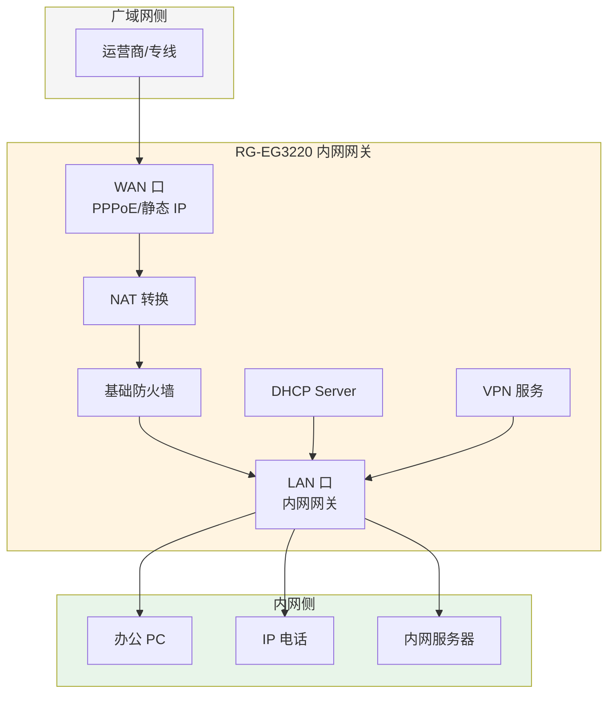
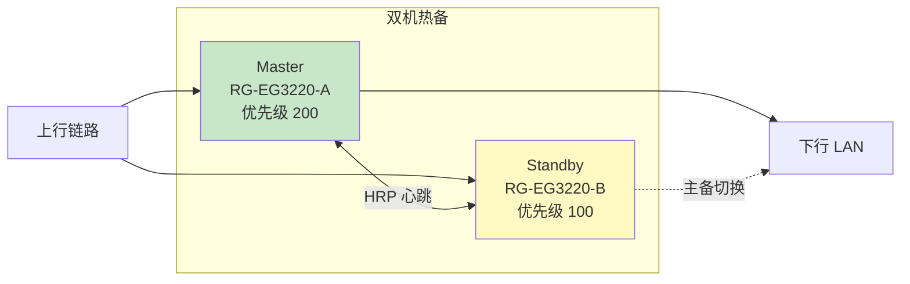
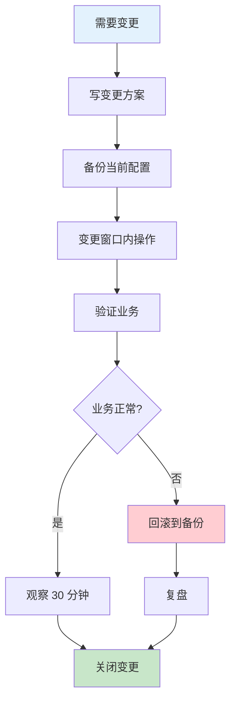

# 锐捷 RG-EG3220 - 内网网关 - 操作手册

> **设备类型**：NBR（Network Broadband Router）网关路由器
> **角色**：业务网内网网关（DHCP/路由/NAT）
> **采集中**：每年入厂一次完整采集，日常变更前后采集
> **最后更新**：v1.0

---

## 设备架构图

### EG3220 在网络中的位置



### EG3220 双机热备（如部署）



### EG3220 配置变更流程



---

## 1. 设备基本信息

| 项目 | 内容 |
|------|------|
| 设备型号 | RG-EG3220 |
| 角色 | 业务网内网网关 |
| 厂商 | 锐捷（Ruijie） |
| 操作系统 | RGOS（基于 Linux） |
| 物理位置 | ___ 机柜 ___ U 位 |
| 管理 IP | ___ |
| Console 账号 | ___ |
| Web 控制台 | https://___ |
| 序列号 | ___ |
| 固件版本 | ___ |
| 维保截止 | ___ |
| 上联设备 | ___ |
| 下联设备 | ___ |

---

## 2. 登录方式

### 2.1 Console 登录

```
# SecureCRT / MobaXterm 串口设置
Baud Rate: 9600
Data Bits: 8
Stop Bits: 1
Parity: None
Flow Control: None
```

用户名/密码：参见 `06-资产与拓扑/账号表.md`

### 2.2 SSH 登录

```bash
ssh admin@<管理IP>
```

### 2.3 Web 登录

浏览器打开 `https://<管理IP>`，忽略证书告警（自签名证书），使用 admin 账号登录。

---

## 3. 完整信息采集命令清单

### 3.1 基础信息

```
show version
show running-config
show startup-config
show clock
show inventory
```

### 3.2 接口与 VLAN

```
show ip interface brief
show interface
show interface brief
show interface description
show vlan
show vlan brief
show mac-address-table
show arp
```

### 3.3 路由

```
show ip route
show ip route summary
show ip protocols
show ip ospf neighbor
show ip bgp summary
show ip rip database
```

### 3.4 NAT / 防火墙策略

```
show ip nat translation
show ip nat statistics
show ip access-list
show policy
show policy statistics
show session
show zone
show zone-pair
```

### 3.5 DHCP / DNS

```
show dhcp server
show dhcp binding
show dhcp pool
show ip dhcp pool
show dns
show dns server
```

### 3.6 高可用

```
show redundancy
show device
show track
```

### 3.7 VPN（如有）

```
show ipsec tunnel
show sslvpn session
show l2tp tunnel
show vpn
```

### 3.8 性能与日志

```
show cpu
show cpu history
show memory
show log
show logging
show environment
show fan
show temperature
show power
```

### 3.9 流量分析

```
show flow
show netflow
show interface counters
show interface rate
```

### 3.10 杂项

```
show users
show privilege
show running-config include password
show snmp
show ntp
show clock
show file systems
dir
```

---

## 4. 配置保存与备份

### 4.1 保存到本地

```
write
copy running-config startup-config
```

### 4.2 备份到 TFTP

```
copy running-config tftp://<TFTP服务器IP>/eg3220-<日期>.cfg
```

### 4.3 备份到 USB（如有）

```
copy running-config usb0:/eg3220.cfg
```

---

## 5. 常见操作

### 5.1 查看当前在线用户

```
show users
show login
```

### 5.2 查看 NAT 转换

```
show ip nat translation verbose
```

### 5.3 临时抓包（锐捷特有）

```
# 注意：抓包会影响性能，用完立刻停止
capture start interface gigabitEthernet 0/1
# 等待一段时间
capture stop
# 导出
capture export tftp <TFTP服务器IP> capture.pcap
```

### 5.4 重启（⚠️ 慎用）

```
# 1. 先保存配置
write
# 2. 确认维护窗口
# 3. 提前通知
# 4. 执行
reload
# 5. 输入 y 确认
```

### 5.5 恢复出厂

> ⚠️ **绝对不要在没备份的情况下执行**

```
# 备份当前配置
copy running-config tftp://<TFTP服务器IP>/eg3220-backup.cfg
# 恢复出厂
write erase
reload
```

---

## 6. 风险点与雷区

| 雷区 | 说明 | 应对 |
|------|------|------|
| DHCP 池耗尽 | 用户接入异常 | 监控 `show dhcp binding` 池使用率 |
| NAT 满 | 新连接无法建立 | 监控 `show ip nat translation` 数量 |
| 默认策略 | 锐捷默认放行还是拒绝要看版本 | 改前 `show policy` 看默认 |
| 双机主备 | EG32 支持双机，看 `show redundancy` 当前角色 | 备机改配置要 `wr mem` 后 `switchover` |
| VPN 路由 | IPSec 隧道路由黑洞 | 监控隧道状态 |

---

## 7. 巡检要点

每日：
- [ ] 设备 PWR/SYS 灯正常
- [ ] CPU < 70%，内存 < 80%
- [ ] 上下联接口 UP，无 err/discard
- [ ] 时钟同步（NTP）
- [ ] 关键 VPN 隧道 UP

每周：
- [ ] 备份配置
- [ ] 检查 NAT 池使用率
- [ ] 检查 DHCP 池使用率
- [ ] 检查日志异常

每月：
- [ ] 备份完整性验证
- [ ] 清理无用策略/对象
- [ ] 检查 license 有效期

---

## 8. 紧急情况处理

### 8.1 整机不可达

1. Console 直连，确认设备是否宕机
2. 查看指示灯：SYS 灯是否在闪
3. 如宕机：尝试 `reload` 软重启
4. 如软重启无效：硬断电 30 秒再上电
5. 仍无效：联系锐捷 400 售后

### 8.2 整机不可达且 Console 也没反应

1. 确认电源（PDU 跳没跳）
2. 确认 Console 线、波特率
3. 拔电 30 秒再上电（**所有下联业务会中断**）
4. 仍无效：硬件故障，启用备件

### 8.3 配置改错，业务中断

1. **不要慌，先看影响范围**
2. `show running-config` 看当前状态
3. 如果是单条命令的问题：直接 `no` 撤销
4. 如果是大段配置错乱：
   - `copy startup-config running-config` 回滚
   - 或者 `reload` 重启回 startup

---

## 9. 联系方式

| 类别 | 联系人 | 方式 |
|------|--------|------|
| 锐捷 400 售后 | 400-100-1112 | 7×24 |
| 锐捷官网 | https://www.ruijie.com.cn | |
| 原厂 TAC | 工单系统 | 维保客户 |
| 内部 IT 主管 | ___ | ___ |
| 前任网管 | ___ | ___ |

---

## 10. 变更记录

| 日期 | 变更人 | 变更内容 | 是否回滚验证 | 记录位置 |
|------|--------|---------|-------------|---------|
| | | | | |
| | | | | |
| | | | | |
