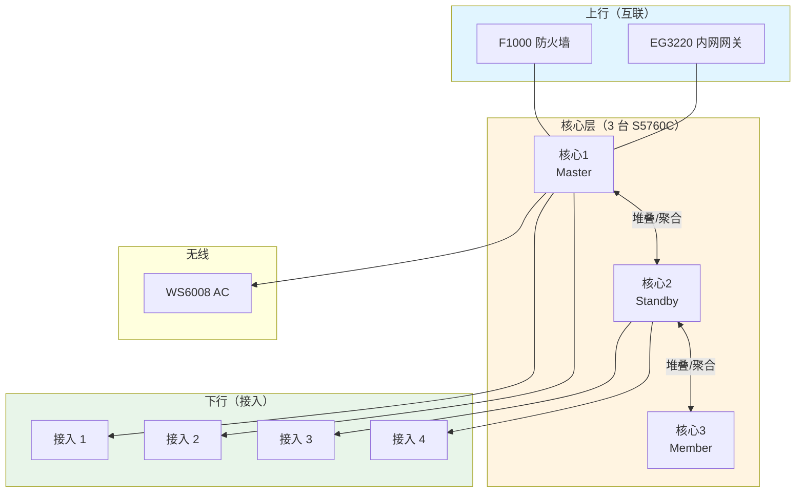
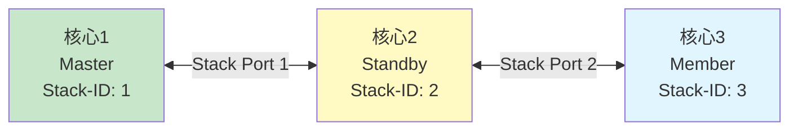
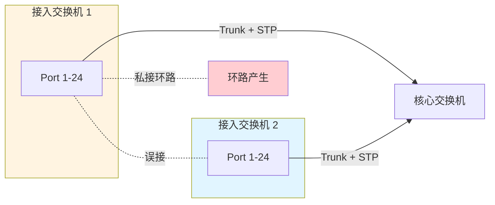
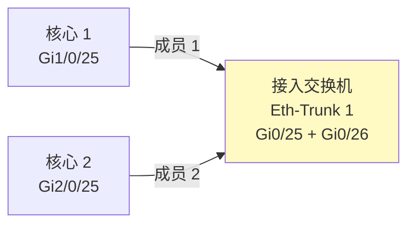

# 锐捷 RG-S5760C-24SFP/8GT8XS-X - 核心交换机 - 操作手册

> **设备类型**：万兆核心交换机
> **数量**：3 台（堆叠或独立，看现场）
> **角色**：业务网核心层
> **最后更新**：v1.0

---

## 设备架构图

### S5760C 核心层架构



### 堆叠 / CSS 拓扑



### 二层环路防护



### 链路聚合（跨机箱）



---

## 1. 设备基本信息

| 项目 | 内容 |
|------|------|
| 设备型号 | RG-S5760C-24SFP/8GT8XS-X |
| 角色 | 核心交换机 |
| 端口数 | 24 SFP + 8 GT + 8 10G SFP+ |
| 厂商 | 锐捷 |
| 物理位置 | ___ 机柜 ___ U 位 |
| 管理 IP | ___ |
| Stack 角色 | ___（Master/Standby/Member） |
| 序列号 1# | ___ |
| 序列号 2# | ___ |
| 序列号 3# | ___ |
| 固件版本 | ___ |
| 维保截止 | ___ |

---

## 2. 登录方式

### 2.1 Console 登录

```
Baud Rate: 9600
Data Bits: 8
Stop Bits: 1
Parity: None
Flow Control: None
```

### 2.2 SSH 登录

```bash
ssh admin@<管理IP>
```

---

## 3. 完整信息采集命令清单

### 3.1 基础信息

```
show version
show running-config
show startup-config
show clock
show inventory
show device
show module
show fan
show power
show temperature
```

### 3.2 堆叠状态

```
show stack
show stack detail
show stack member
show stack topology
```

### 3.3 接口与 VLAN

```
show ip interface brief
show interface
show interface brief
show interface status
show interface description
show interface counters
show interface counters error
show interface rate
show vlan
show vlan brief
show vlan-translation
show interface trunk
show interface switchport
```

### 3.4 二层协议

```
show spanning-tree
show spanning-tree root
show spanning-tree summary
show spanning-tree detail
show spanning-tree mst configuration
show aggregateport summary
show aggregateport load-balance
show mac-address-table
show mac-address-table count
show arp
show ip arp
```

### 3.5 三层

```
show ip route
show ip route summary
show ip protocols
show ip ospf neighbor
show ip ospf interface
show ip bgp summary
show ip bgp neighbors
show ip rip database
show vrrp
show vrrp brief
```

### 3.6 安全

```
show ip access-list
show acl
show dot1x
show port-security
show ip source binding
show dhcp snooping
show arp inspection
```

### 3.7 性能与日志

```
show cpu
show cpu history
show memory
show log
show logging
show environment
```

### 3.8 杂项

```
show users
show privilege
show snmp
show ntp
show clock
show file systems
dir
show boot
```

---

## 4. 配置保存与备份

### 4.1 保存到本地

```
write
copy running-config startup-config
```

### 4.2 备份到 TFTP

```
copy running-config tftp://<TFTP服务器IP>/s5760c-<设备号>-<日期>.cfg
```

### 4.3 备份到 FTP

```
copy running-config ftp://user:pass@<FTP服务器IP>/s5760c.cfg
```

---

## 5. 堆叠操作

### 5.1 查看堆叠状态

```
show stack
```

### 5.2 主备切换

```
# 主动切换（指定新 Master）
switch priority <member-id> <priority-value>
# 强制切换
slave auto-upgrade disable
```

### 5.3 退出堆叠（⚠️ 慎用）

```
show stack
# 找到要退出的 member-id
# 在该设备上执行
stack member <id> renumber <new-id>       # 重编号
stack member <id> remove                   # 移除
# 或者
no stack
```

---

## 6. 常见操作

### 6.1 接口 shutdown / no shutdown

```
configure terminal
interface gigabitEthernet 1/0/1
shutdown
no shutdown
end
write
```

### 6.2 查看接口错包

```
show interface counters error
show interface gigabitEthernet 1/0/1 counters
```

### 6.3 抓包（SPAN）

```
# 配置镜像源
configure terminal
monitor session 1 source interface gigabitEthernet 1/0/1 both
monitor session 1 destination interface gigabitEthernet 1/0/24
end
write
```

### 6.4 重启

```
write
reload
```

### 6.5 恢复出厂

```
write erase
reload
```

---

## 7. 风险点与雷区

| 雷区 | 说明 | 应对 |
|------|------|------|
| 堆叠分裂 | 多台堆叠时分裂会引发网络震荡 | `show stack` 定期看 |
| STP 阻塞了上行 | 配错 VLAN 优先级 | `show spanning-tree` 看根桥 |
| 聚合口成员不一致 | 两端配置不一致 | `show aggregateport summary` |
| SFP 模块不兼容 | 第三方模块 | 用锐捷原厂 |
| 接口 err/discard | 网线/模块问题 | 查 `show interface counters` |

---

## 8. 巡检要点

每日：
- [ ] PWR/SYS 灯正常
- [ ] CPU < 70%，内存 < 80%
- [ ] 堆叠状态 OK（如有堆叠）
- [ ] 关键接口 UP，无 err
- [ ] STP 根桥稳定

每周：
- [ ] 备份配置
- [ ] 检查堆叠链路
- [ ] 检查风扇/温度
- [ ] 抽查接口错包

---

## 9. 紧急情况处理

### 9.1 单台宕机

1. Console 看是否可登录
2. 看 PWR/SYS 灯
3. `reload` 软重启
4. 仍异常：硬断电 30 秒
5. 仍异常：备件替换

### 9.2 整堆叠不可达

1. 单独 Console 每一台
2. 确认堆叠线缆
3. 拔掉堆叠线，逐台重启
4. 仍异常：联系锐捷售后

### 9.3 STP 震荡

1. `show spanning-tree detail` 看哪个 VLAN 在变
2. 确认有没有新接入设备开了 STP
3. 检查 BPDU Guard 是否配了
4. 临时关掉不必要端口

---

## 10. 联系方式

| 类别 | 联系人 | 方式 |
|------|--------|------|
| 锐捷 400 售后 | 400-100-1112 | 7×24 |
| 内部 IT 主管 | ___ | ___ |

---

## 11. 变更记录

| 日期 | 变更人 | 变更内容 | 是否回滚验证 | 记录位置 |
|------|--------|---------|-------------|---------|
| | | | | |
| | | | | |
