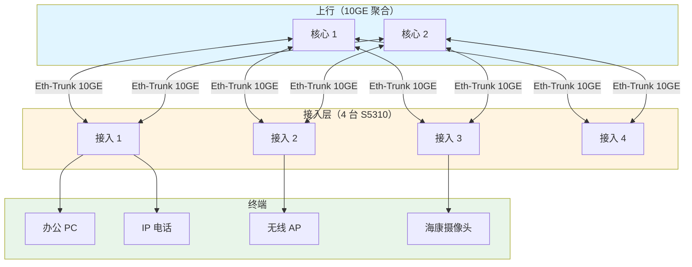
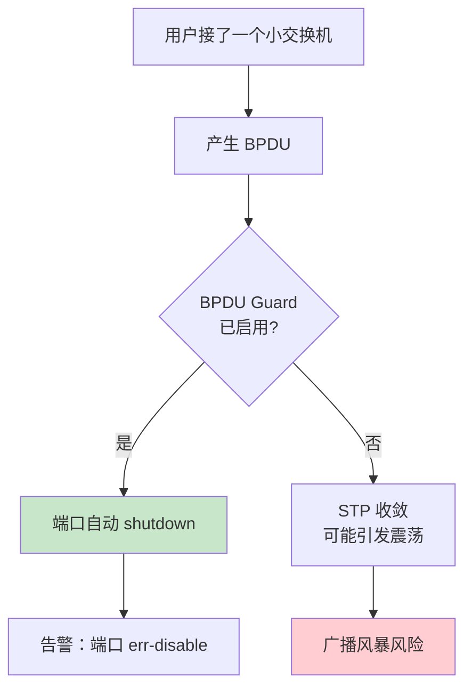
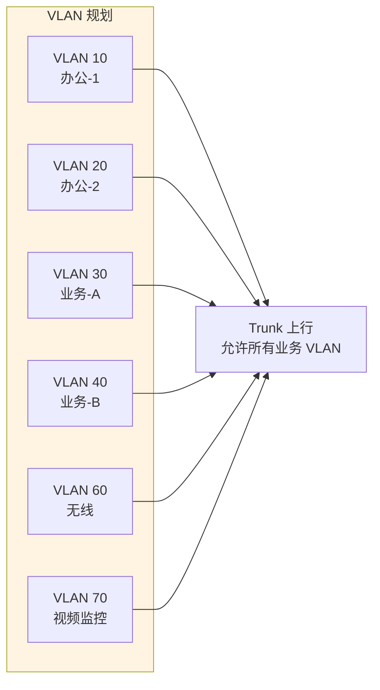

# 锐捷 RG-S5310-24GT4XS - 接入交换机 - 操作手册

> **设备类型**：千兆接入交换机（带 4 个万兆上行）
> **数量**：4 台
> **角色**：业务网接入层
> **最后更新**：v1.0

---

## 设备架构图

### S5310 接入层架构



### 端口安全架构


### 私接环路检测



### 接入 VLAN 规划



---

## 1. 设备基本信息

| 项目 | 内容 |
|------|------|
| 设备型号 | RG-S5310-24GT4XS |
| 角色 | 接入交换机 |
| 端口数 | 24 GE + 4 10GE SFP+ |
| 厂商 | 锐捷 |
| 物理位置 | ___ 机柜 ___ U 位 |
| 管理 IP | ___ |
| 上联核心 | S5760C（哪台、哪个口） |
| 序列号 | ___ |
| 固件版本 | ___ |
| 维保截止 | ___ |

---

## 2. 登录方式

### 2.1 Console 登录

```
Baud Rate: 9600
Data Bits: 8
Stop Bits: 1
Parity: None
Flow Control: None
```

### 2.2 SSH 登录

```bash
ssh admin@<管理IP>
```

---

## 3. 完整信息采集命令清单

### 3.1 基础信息

```
show version
show running-config
show startup-config
show clock
show inventory
show device
show module
show fan
show power
show temperature
```

### 3.2 接口与 VLAN

```
show ip interface brief
show interface
show interface brief
show interface status
show interface description
show interface counters
show interface counters error
show interface rate
show vlan
show vlan brief
show interface trunk
show interface switchport
```

### 3.3 二层协议

```
show spanning-tree
show spanning-tree root
show spanning-tree summary
show aggregateport summary
show mac-address-table
show mac-address-table count
show arp
```

### 3.4 三层（如启用）

```
show ip route
show ip interface
```

### 3.5 安全

```
show ip access-list
show port-security
show dot1x
show dhcp snooping
```

### 3.6 性能与日志

```
show cpu
show cpu history
show memory
show log
show logging
```

### 3.7 杂项

```
show users
show snmp
show ntp
show boot
dir
```

---

## 4. 配置保存与备份

### 4.1 保存到本地

```
write
copy running-config startup-config
```

### 4.2 备份到 TFTP

```
copy running-config tftp://<TFTP服务器IP>/s5310-<设备号>-<日期>.cfg
```

---

## 5. 常见操作

### 5.1 批量关闭未使用接口（推荐配置）

```
configure terminal
interface range gigabitEthernet 0/1-24
shutdown
end
write
```

### 5.2 接口启用

```
configure terminal
interface gigabitEthernet 0/1
no shutdown
end
write
```

### 5.3 配置端口安全

```
configure terminal
interface gigabitEthernet 0/1
switchport port-security
switchport port-security maximum 5
switchport port-security violation restrict
end
write
```

### 5.4 配置 BPDU Guard（防环路）

```
configure terminal
interface range gigabitEthernet 0/1-24
spanning-tree bpduguard enable
end
write
```

### 5.5 配置 DHCP Snooping

```
configure terminal
ip dhcp snooping
ip dhcp snooping vlan 1-4094
# 上联口设为 trust
interface tenGigabitEthernet 0/25
ip dhcp snooping trust
end
write
```

### 5.6 重启

```
write
reload
```

### 5.7 恢复出厂

```
write erase
reload
```

---

## 6. 风险点与雷区

| 雷区 | 说明 | 应对 |
|------|------|------|
| 私接环路 | 用户接小交换机/路由器造成环路 | 启用 STP + BPDU Guard + 边缘端口 |
| DHCP 欺骗 | 私接 DHCP 服务器 | 启用 DHCP Snooping |
| ARP 欺骗 | 中间人攻击 | 启用 ARP Inspection / DAI |
| 广播风暴 | 环路/病毒 | 启用 Storm Control |
| 未使用口开放 | 物理接入风险 | 全部 shutdown + description |
| 上联单挂 | 单条上联 | 配链路聚合（2 条 10GE） |

---

## 7. 巡检要点

每日：
- [ ] PWR/SYS 灯正常
- [ ] 上联口 UP
- [ ] CPU < 70%

每周：
- [ ] 备份配置
- [ ] 检查接口错包
- [ ] 检查 MAC 地址表异常

每月：
- [ ] 检查未使用接口是否仍 shutdown
- [ ] 检查端口安全配置

---

## 8. 紧急情况处理

### 8.1 单端口频繁 UP/DOWN

1. 拔掉网线，看是设备端还是线路问题
2. 换网线测试
3. 换 SFP 模块测试
4. 换端口测试

### 8.2 整台不可达

1. Console 直连
2. 看 PWR 灯
3. `reload` 软重启
4. 硬断电 30 秒
5. 备件替换

### 8.3 上联口全断

1. 检查光模块收发光（**用光功率计**）
2. 检查光纤是否折断
3. 检查对端端口是否 shutdown
4. 检查聚合配置

---

## 9. 联系方式

| 类别 | 联系人 | 方式 |
|------|--------|------|
| 锐捷 400 售后 | 400-100-1112 | 7×24 |
| 内部 IT 主管 | ___ | ___ |

---

## 10. 变更记录

| 日期 | 变更人 | 变更内容 | 是否回滚验证 | 记录位置 |
|------|--------|---------|-------------|---------|
| | | | | |
| | | | | |
