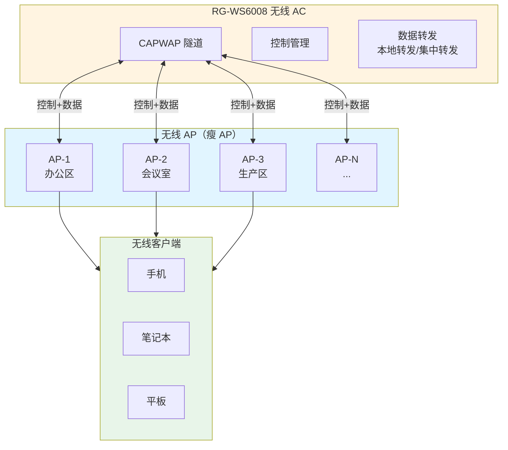
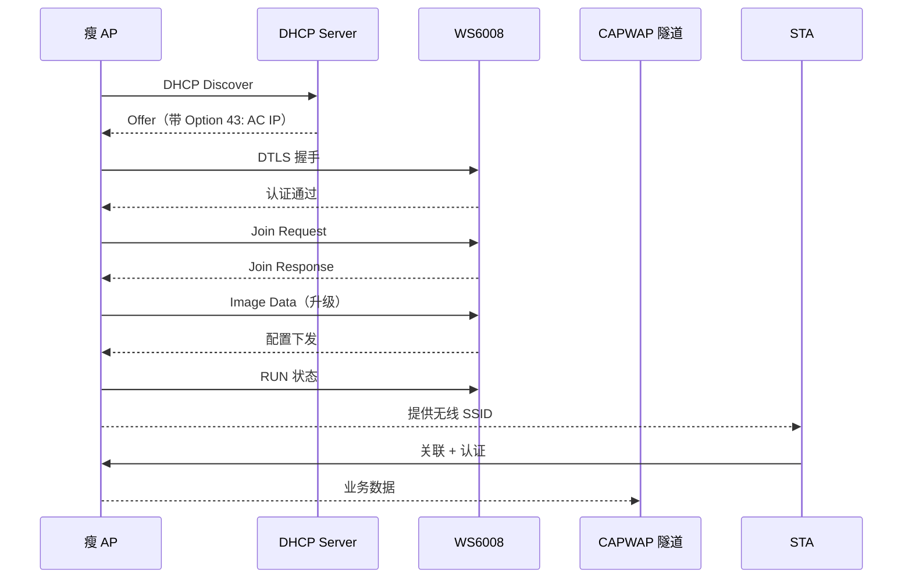
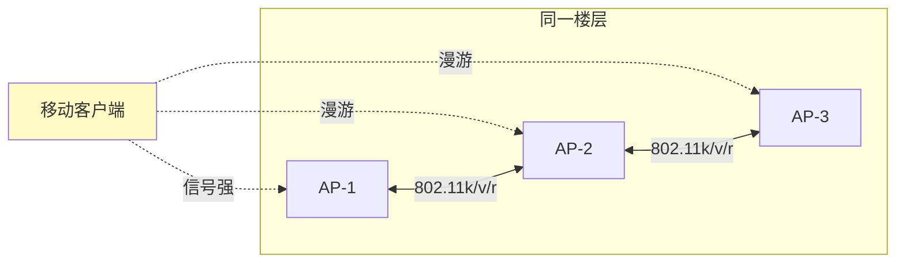
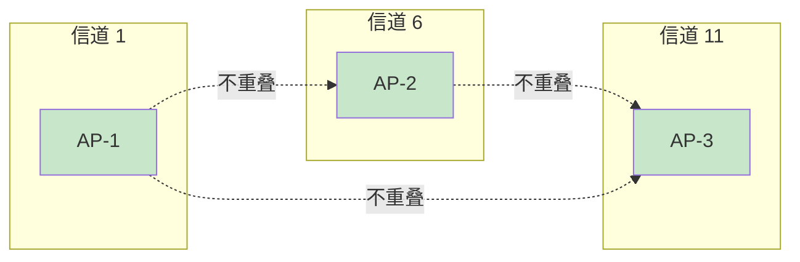

# 锐捷 RG-WS6008 - 无线 AP 控制器 - 操作手册

> **设备类型**：无线控制器（AC）
> **角色**：业务网无线 AP 集中管理
> **最后更新**：v1.0

---

## 设备架构图

### WS6008 无线 AC 架构



### AP 注册流程



### WLAN 漫游架构



### 无线信道规划（2.4G）



---

## 1. 设备基本信息

| 项目 | 内容 |
|------|------|
| 设备型号 | RG-WS6008 |
| 角色 | 无线 AC（控制器） |
| 最大管理 AP | 默认 32，可扩展 license |
| 厂商 | 锐捷 |
| 物理位置 | ___ 机柜 ___ U 位 |
| 管理 IP | ___ |
| AP 数量 | 当前在线 ___ 台 |
| 序列号 | ___ |
| 固件版本 | ___ |
| 维保截止 | ___ |
| 上联设备 | ___（哪台交换机哪个口） |
| 序列号 | ___ |

---

## 2. 登录方式

### 2.1 Console 登录

```
Baud Rate: 9600
Data Bits: 8
Stop Bits: 1
Parity: None
Flow Control: None
```

### 2.2 SSH 登录

```bash
ssh admin@<管理IP>
```

### 2.3 Web 登录

`https://<管理IP>`

---

## 3. 完整信息采集命令清单

### 3.1 基础信息

```
show version
show running-config
show startup-config
show clock
show inventory
```

### 3.2 AC 自身状态

```
show ac
show ac summary
show ac status
show license
show license usage
```

### 3.3 AP 信息

```
show ap-config summary
show ap-config running
show ap-config static
show ap-config ap <ap-mac>
show ap-config status
show ap-config reboot
show ap-config reset
```

### 3.4 客户端（STA）

```
show sta-config summary
show sta-config
show sta-config <sta-mac>
show sta-config online
show sta-config roaming
```

### 3.5 WLAN 配置

```
show wlan-config
show wlan-config <wlan-id>
show wlan-config security
show wlan-config qos
```

### 3.6 射频

```
show radio
show radio all
show radio <ap-mac>
show channel
show channel all
show power
show power all
```

### 3.7 漫游

```
show roaming
show roaming-cache
show mobility
show mobility tunnel
```

### 3.8 性能与日志

```
show cpu
show memory
show log
show logging
show trap
```

### 3.9 网络

```
show ip interface
show route
show arp
```

### 3.10 杂项

```
show users
show snmp
show ntp
```

---

## 4. 配置保存与备份

```
write
copy running-config tftp://<TFTP服务器IP>/ws6008-<日期>.cfg
```

---

## 5. 常见操作

### 5.1 查看当前在线 AP

```
show ap-config summary
# 看 Status 字段：RUN/Normal 表示正常
```

### 5.2 查看每个 AP 的客户端数

```
show ap-config <ap-mac>  # 看 STA 字段
```

### 5.3 踢下线某个客户端

```
# 拿到 STA 的 MAC
show sta-config summary
# 踢下线
sta-kick <sta-mac>  # 或通过 Web
```

### 5.4 重启某个 AP

```
ap-reset <ap-mac>
```

### 5.5 添加 AP（自动发现模式下无需操作）

```
# 默认 AP 上电后通过 option 43 / DHCP 自动发现 AC
# 如未自动发现，手动指定 AC IP
ap-config <ap-mac>
  ac-list 1
    ip-address <AC管理IP>
```

### 5.6 配置 WLAN（示例）

```
wlan-config 1 SSID-Name
  enable-broad-ssid
  cipher-suite tkip ccmp
  security rsn psk enable pass-phrase 12345678
  tunnel local
  no broadcast-ssid
  band-select enable
```

### 5.7 升级 AP 固件

```
# 1. 上传 AP 固件到 AC
copy tftp://<TFTP服务器IP>/ap-firmware.bin flash:/ap-firmware.bin
# 2. 指定固件
ap-image <ap-mac> flash:/ap-firmware.bin
# 3. 重启 AP 生效
ap-reset <ap-mac>
```

### 5.8 重启 AC（⚠️ 慎用，会断所有 AP）

```
write
reload
```

---

## 6. 风险点与雷区

| 雷区 | 说明 | 应对 |
|------|------|------|
| AC 宕机 | 所有 AP 离线（瘦 AP 架构） | AC 双机 / 异地容灾 |
| AP license 满 | 新 AP 注册失败 | `show license usage` |
| 信道干扰 | 2.4G 拥堵 | 自动信道 + 1/6/11 |
| 功率过高 | 同频干扰 | 自动功率调整 |
| 漫游粘滞 | 客户端不切换 | 启用 802.11k/v/r |
| 私接 AP | 安全风险 | 启用 WIDS / 无线入侵检测 |
| 客户端掉线 | 上联带宽/认证服务器问题 | 查 `show sta-config` |

---

## 7. 巡检要点

每日：
- [ ] AC 自身 CPU/内存
- [ ] AP 在线率（应 > 95%）
- [ ] 客户端总数
- [ ] 异常告警

每周：
- [ ] 检查每个 AP 的客户端数（防止单 AP 过载）
- [ ] 检查信道分布
- [ ] 备份配置

每月：
- [ ] 检查 AP 固件版本一致性
- [ ] 优化功率/信道
- [ ] 检查 license 有效期

---

## 8. 紧急情况处理

### 8.1 大面积 AP 掉线

1. 检查 AC 自身状态
2. 检查 AC 上联链路
3. 检查 DHCP / option 43
4. 批量重启 AP

```
ap-reset all
```

### 8.2 单个 AP 反复掉线

1. 现场看 AP 指示灯
2. 更换 AP 测试
3. 检查 PoE 供电（网线/交换机）
4. 检查信道干扰

### 8.3 客户端无法连接

1. 确认 SSID 广播
2. 确认密码
3. 确认认证服务器（RADIUS / 本地）
4. 抓包看协商过程

---

## 9. 联系方式

| 类别 | 联系人 | 方式 |
|------|--------|------|
| 锐捷 400 售后 | 400-100-1112 | 7×24 |
| 内部 IT 主管 | ___ | ___ |

---

## 10. 变更记录

| 日期 | 变更人 | 变更内容 | 是否回滚验证 | 记录位置 |
|------|--------|---------|-------------|---------|
| | | | | |
| | | | | |
