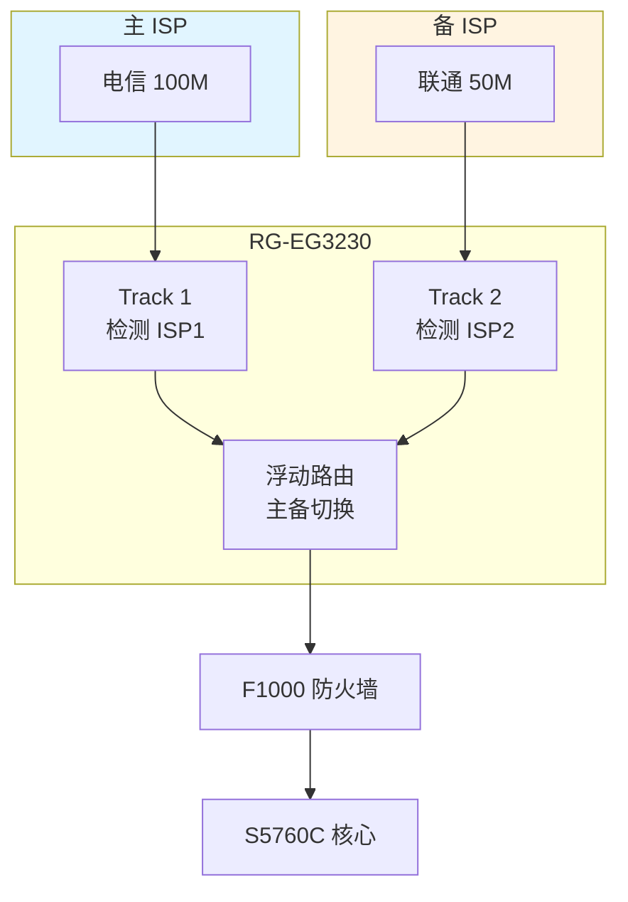
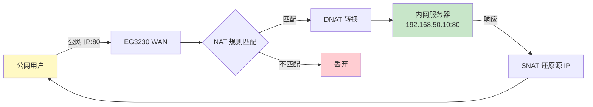
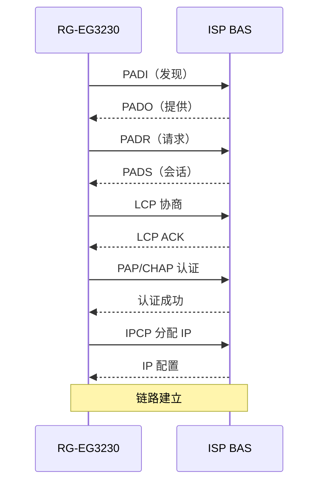

# 锐捷 RG-EG3230 - 外网网关 - 操作手册

> **设备类型**：NBR（Network Broadband Router）网关路由器
> **角色**：业务网外网出口（NAT/PPPoE/专线）
> **最后更新**：v1.0

> **与 EG3220 区别**：EG3230 是外网网关，通常上联 ISP/防火墙，承载公网流量和 NAT。

---

## 设备架构图

### EG3230 外网网关在出口的位置


### 外网双 ISP 备份架构



### 端口映射（DNAT）流程



### PPPoE 拨号流程



---

## 1. 设备基本信息

| 项目 | 内容 |
|------|------|
| 设备型号 | RG-EG3230 |
| 角色 | 外网网关 |
| 厂商 | 锐捷 |
| 物理位置 | ___ 机柜 ___ U 位 |
| 管理 IP | ___ |
| 上联对象 | ___（ISP / 防火墙 / 路由器） |
| 下联对象 | ___（内网核心 / 内网网关） |
| 运营商 | ___（电信 / 联通 / 移动） |
| 链路类型 | ___（PPPoE / 静态 IP / 专线） |
| 公网 IP | ___ |
| 序列号 | ___ |
| 固件版本 | ___ |
| 维保截止 | ___ |

---

## 2. 登录方式

### 2.1 Console 登录

```
Baud Rate: 9600
Data Bits: 8
Stop Bits: 1
Parity: None
Flow Control: None
```

### 2.2 SSH 登录

```bash
ssh admin@<管理IP>
```

### 2.3 Web 登录

`https://<管理IP>`

---

## 3. 完整信息采集命令清单

### 3.1 基础信息

```
show version
show running-config
show startup-config
show clock
show inventory
```

### 3.2 接口与链路

```
show ip interface brief
show interface
show interface brief
show interface description
show pppoe session
show pppoe session detail
show ppp
show ip route
```

### 3.3 NAT / 端口映射

```
show ip nat translation
show ip nat statistics
show ip nat pool
show ip access-list
show policy
show port-mapping
```

### 3.4 安全

```
show ip access-list
show policy
show session
show threat
show attack
```

### 3.5 VPN（如有）

```
show ipsec tunnel
show sslvpn session
show l2tp tunnel
show gre tunnel
```

### 3.6 性能与日志

```
show cpu
show cpu history
show memory
show log
show logging
show nat statistics
```

### 3.7 杂项

```
show users
show snmp
show ntp
dir
```

---

## 4. 配置保存与备份

```
write
copy running-config tftp://<TFTP服务器IP>/eg3230-<日期>.cfg
```

---

## 5. 常见操作

### 5.1 查看 PPPoE 状态

```
show pppoe session
# 看到的状态：
# - Connected：正常
# - Disconnected：掉线
# - Authenticating：正在认证
```

### 5.2 重拨 PPPoE

```
configure terminal
interface gigabitEthernet 0/0
pppoe-client dialer-pool-number 1
shutdown
no shutdown
end
write
```

### 5.3 查看 NAT 会话数

```
show ip nat statistics
show ip nat translation count
```

### 5.4 添加端口映射（Web 更方便）

```
configure terminal
# 内网 HTTP 服务映射到公网
ip nat inside source static tcp 192.168.1.100 80 interface gigabitEthernet 0/0 80
end
write
```

### 5.5 查看路由

```
show ip route
show ip route summary
```

### 5.6 重启

```
write
reload
```

### 5.7 恢复出厂

```
write erase
reload
```

---

## 6. 风险点与雷区

| 雷区 | 说明 | 应对 |
|------|------|------|
| 单 ISP 单链路 | 出口单点 | 双 ISP 备份 / 4G 备份 |
| PPPoE 频繁掉线 | 线路 / ISP 问题 | 抓包分析 / 联系 ISP |
| NAT 满 | 新连接失败 | 监控会话数 |
| 公网 IP 变更 | 端口映射失效 | 监控 IP 变化 / 用 DDNS |
| 默认放行策略 | 公网暴露 | 默认 deny，按需放行 |
| 私接绕过认证 | 流量绕开策略 | 防火墙强制入口 |

---

## 7. 巡检要点

每日：
- [ ] 设备 PWR/SYS 灯正常
- [ ] PPPoE / 专线 UP
- [ ] CPU < 70%
- [ ] NAT 会话数（< 80% 上限）
- [ ] 上下行流量正常

每周：
- [ ] 备份配置
- [ ] 检查告警日志
- [ ] 检查公网 IP 是否变更

每月：
- [ ] 检查 license
- [ ] 清理无用 NAT / 策略

---

## 8. 紧急情况处理

### 8.1 PPPoE 掉线

1. `show pppoe session` 看状态
2. `show interface` 看 WAN 口物理状态
3. 重拨 PPPoE（见 5.2）
4. 仍异常：联系 ISP

### 8.2 整机不可达

1. Console 直连
2. `reload` 软重启
3. 硬断电 30 秒
4. 启用备件

### 8.3 公网 IP 变更

1. 记录新 IP
2. 更新 DNS 解析
3. 更新所有端口映射
4. 通知业务方

---

## 9. 联系方式

| 类别 | 联系人 | 方式 |
|------|--------|------|
| 锐捷 400 售后 | 400-100-1112 | 7×24 |
| ISP 客服 | ___ | ___ |
| 内部 IT 主管 | ___ | ___ |

---

## 10. 变更记录

| 日期 | 变更人 | 变更内容 | 是否回滚验证 | 记录位置 |
|------|--------|---------|-------------|---------|
| | | | | |
| | | | | |
