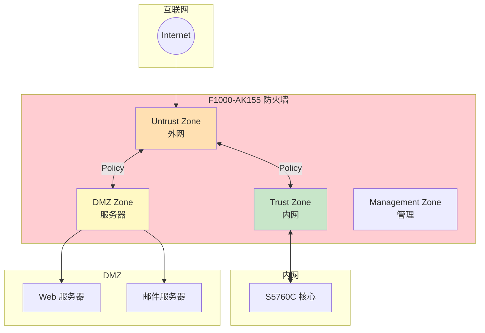
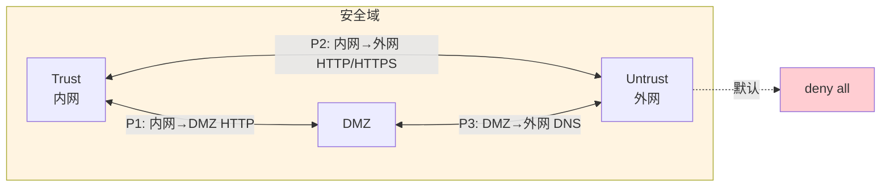
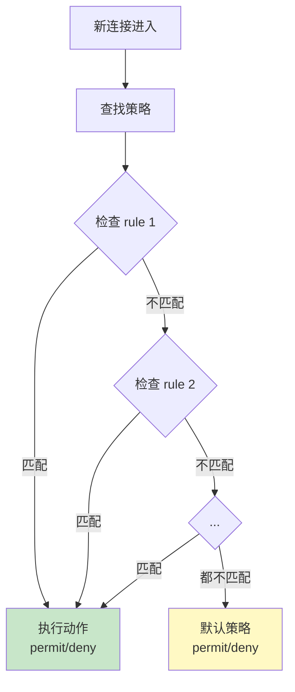
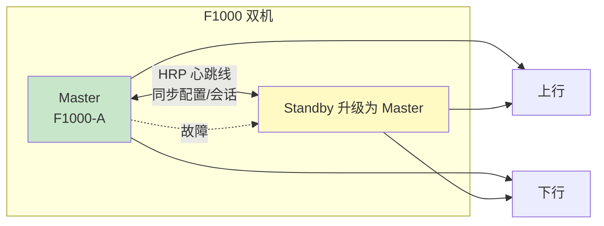
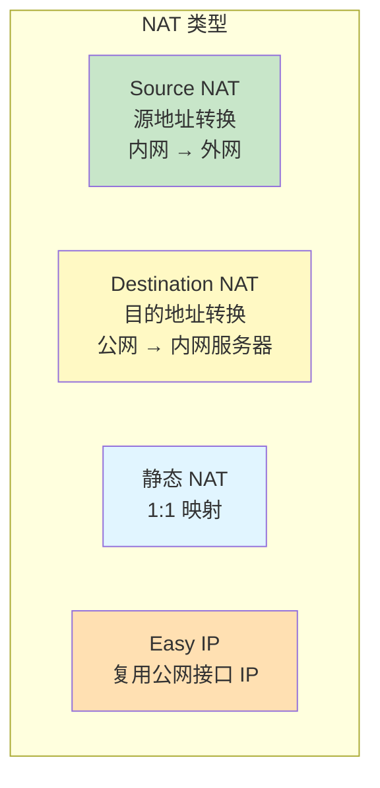

# 华三 F1000-AK155 - 防火墙 - 操作手册

> **设备类型**：H3C SecPath 系列防火墙
> **角色**：业务网出口 / 内网安全防护
> **最后更新**：v1.0

---

## 设备架构图

### F1000-AK155 防火墙在网络中的位置



### 安全域与策略



### 策略匹配顺序（按 rule-id 从小到大）



### HRP 双机热备



### NAT 类型



---

## 1. 设备基本信息

| 项目 | 内容 |
|------|------|
| 设备型号 | F1000-AK155 |
| 角色 | 防火墙 |
| 厂商 | 华三（H3C） |
| 操作系统 | Comware（基于 Linux） |
| 物理位置 | ___ 机柜 ___ U 位 |
| 管理 IP | ___ |
| 序列号 | ___ |
| 固件版本 | ___ |
| 维保截止 | ___ |
| 上联对象 | ___（外网网关 / ISP） |
| 下联对象 | ___（内网核心） |
| 运行模式 | 路由模式 / 透明模式 |
| HA 状态 | 单机 / 双机 |

---

## 2. 登录方式

### 2.1 Console 登录

```
Baud Rate: 9600
Data Bits: 8
Stop Bits: 1
Parity: None
Flow Control: None
```

### 2.2 SSH 登录

```bash
ssh admin@<管理IP>
```

### 2.3 Web 登录

`https://<管理IP>`（默认 443）

---

## 3. 完整信息采集命令清单

### 3.1 基础信息

```
display version
display device
display elabel
display fan
display power
display temperature
display cpu
display cpu history
display memory
display memory history
display clock
display current-configuration
display saved-configuration
```

### 3.2 接口

```
display interface
display interface brief
display interface description
display ip interface brief
display ip interface
```

### 3.3 安全域

```
display zone
display zone-pair
display security-zone
display interzone
```

### 3.4 策略

```
display policy
display policy interzone
display policy global
display policy statistics
display policy all
display packet-filter
display object-policy
display security-policy
```

### 3.5 NAT

```
display nat
display nat session
display nat server
display nat address-group
display nat statistics
display nat session statistics
display nat mapping
```

### 3.6 路由

```
display ip routing-table
display ip route
display ip routing-table statistics
display ospf peer
display ospf peer brief
display bgp peer
display bgp peer brief
display rip
display isis peer
```

### 3.7 对象组

```
display object-group
display object-group ip
display object-group service
display object-group time-range
display user-group
```

### 3.8 HA（如有）

```
display hrp
display hrp state
display hrp interface
display track
display redundancy group
```

### 3.9 VPN（如有）

```
display ike proposal
display ike sa
display ipsec proposal
display ipsec sa
display ipsec tunnel
display sslvpn session
display l2tp session
```

### 3.10 会话/性能

```
display session
display session statistics
display session aging-time
display session verbose
display firewall statistic
display connection statistics
```

### 3.11 攻击防护

```
display attack-defense
display attack-defense policy
display threat
display url-filter
display dns-filter
display black-white-list
display anti-virus
display ips
```

### 3.12 日志

```
display logbuffer
display logfile
display trapbuffer
display info-center
```

### 3.13 用户

```
display aaa
display aaa online-user
display local-user
display super
display rbac
```

### 3.14 杂项

```
display users
display snmp-agent
display ntp
display acl
display qos
display file
dir
```

---

## 4. 配置保存与备份

### 4.1 保存到本地

```
save
save safely    # 安全模式，断电不丢
```

### 4.2 备份到 TFTP

```
backup startup-configuration to <TFTP服务器IP> f1000-startup.cfg
backup current-configuration to <TFTP服务器IP> f1000-running.cfg
```

### 4.3 通过 FTP/SFTP

```
# 在 PC 上开启 SFTP 服务
# 在防火墙执行
<sftp client> -i 192.168.1.100 -u admin -p password get startup.cfg
```

---

## 5. 常见操作

### 5.1 查看会话数（确认墙容量）

```
display session statistics
display session aging-time
```

### 5.2 查看命中次数最多的策略

```
display policy statistics
# 关注 hit 次数，确认策略真的被命中
```

### 5.3 查看 NAT 转换

```
display nat session
display nat session verbose
```

### 5.4 抓包

```
# 华三特有 debug + 抓包组合
debugging ip packet acl 3000
terminal monitor
terminal debugging
# 抓包结束
undo debugging all
```

### 5.5 临时放行/封禁 IP

```
# 临时封禁
security-policy ip
  rule 100 name block-bad-ip
  source-ip bad_ip_xxx
  action drop
# 临时放行
  rule 200 name allow-test
  source-ip test_ip
  action permit
```

### 5.6 HA 切换（双机）

```
# 主动切换
hrp switch-to
# 或
hrp force-switch
```

### 5.7 重启

```
save
reboot
```

### 5.8 恢复出厂

```
reset saved-configuration
reboot
```

---

## 6. 风险点与雷区

| 雷区 | 说明 | 应对 |
|------|------|------|
| 默认策略 | F1000 不同版本默认不同 | 改前 `display policy interzone` |
| 策略顺序 | 后配的先生效 | 严格按规划编号 |
| session 满 | 新连接失败 | 监控 session 数 / 调小老化 |
| NAT 满 | 转换失败 | 监控 NAT session |
| HRP 同步 | 双机配置没同步 | `display hrp state` |
| 物理环路 | 心跳线 + 业务线 | 独立心跳口 |
| 默认账号 | admin/admin 还在 | 立即改密码 + 加固 |
| 远程管理 | Telnet / HTTP 开放 | 改 SSH / HTTPS |

---

## 7. 巡检要点

每日：
- [ ] CPU < 70%，内存 < 80%
- [ ] 双机状态 HRP OK（如有）
- [ ] session 数 / NAT 数正常
- [ ] 关键策略命中数

每周：
- [ ] 备份配置（双机都要）
- [ ] 检查攻击防护告警
- [ ] 检查 license 有效期

每月：
- [ ] 清理无用策略 / 对象
- [ ] 审计账号
- [ ] 固件漏洞检查

---

## 8. 紧急情况处理

### 8.1 整机不可达

1. Console 直连（心跳口或业务口都行）
2. `display cpu` / `display memory` 看资源
3. `reboot` 软重启
4. 硬断电 30 秒
5. 双机环境下，确认主备状态

### 8.2 误改策略导致全断

1. `display current-configuration` 看当前配置
2. 如果能 SSH：直接 undo
3. 如果不能 SSH：Console 进
   ```
   <FW> system-view
   [FW] security-policy ip
   [FW-policy-ip] undo rule xxx
   ```
4. 仍不行：`reset saved-configuration` + 灌入备份

### 8.3 双机脑裂

1. 看 HRP 状态
2. 检查心跳线
3. 强制切换
4. 联系华三售后

---

## 9. 联系方式

| 类别 | 联系人 | 方式 |
|------|--------|------|
| 华三 400 售后 | 400-810-0504 | 7×24 |
| 新华三官网 | https://www.h3c.com | |
| 内部 IT 主管 | ___ | ___ |

---

## 10. 变更记录

| 日期 | 变更人 | 变更内容 | 是否回滚验证 | 记录位置 |
|------|--------|---------|-------------|---------|
| | | | | |
| | | | | |
