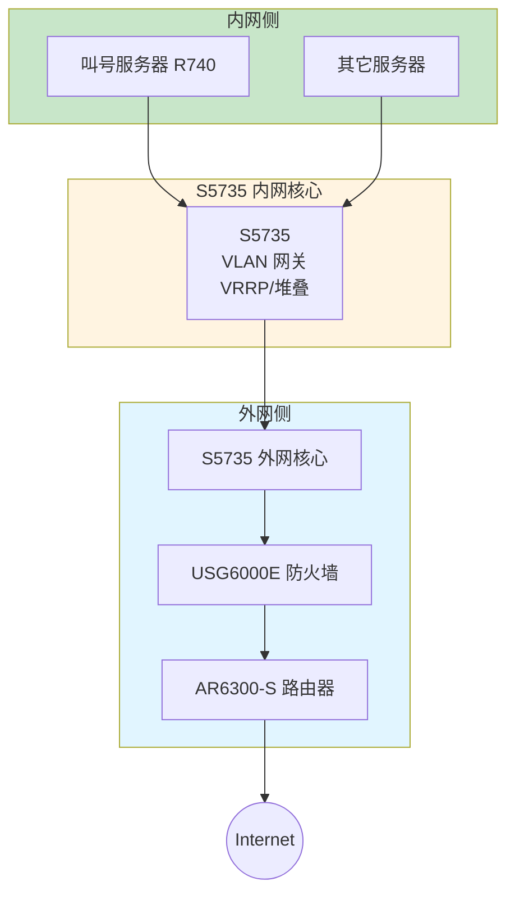
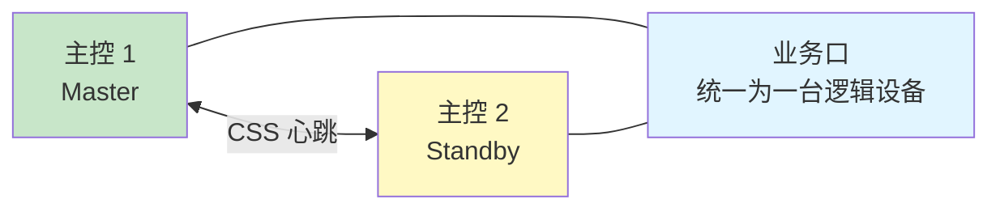
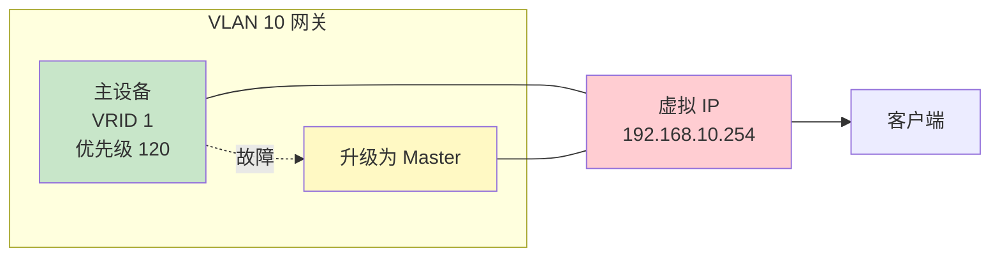
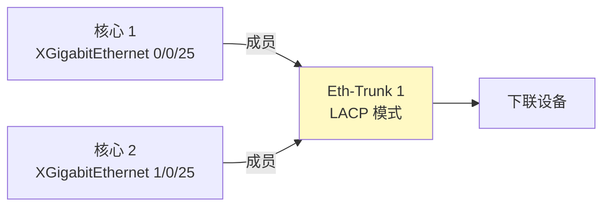
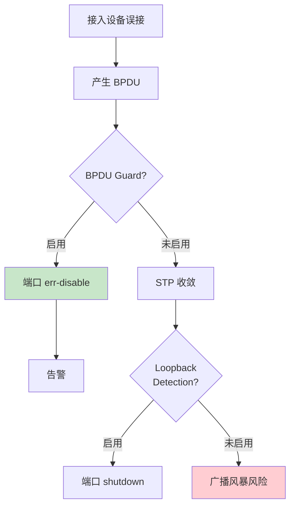

# 华为 S5735 - 二楼核心机房内网核心交换机 - 操作手册

> **设备类型**：华为 CloudEngine S5735 系列（万兆/千兆接入）
> **角色**：二楼核心机房内网核心交换机
> **最后更新**：v1.0

---

## 设备架构图

### 二楼核心机房 S5735 内网核心架构



### CSS 堆叠架构



### VRRP 双网关



### Eth-Trunk 跨机箱聚合



### 二层环路防护（STP）



---

## 1. 设备基本信息

| 项目 | 内容 |
|------|------|
| 设备型号 | S5735（具体型号以现场为准，如 S5735-S24T4X / S5735-L24T4X-A） |
| 角色 | 内网核心交换机 |
| 厂商 | 华为（Huawei） |
| 操作系统 | VRP（Versatile Routing Platform） |
| 物理位置 | 二楼核心机房 ___ 机柜 ___ U 位 |
| 管理 IP | ___ |
| 序列号 | ___ |
| 固件版本 | ___ |
| 维保截止 | ___ |
| 上联对象 | ___（AR6300-S / USG6000E） |
| 下联对象 | ___（接入交换机 / 服务器） |
| 堆叠/CSS 状态 | ___ |

---

## 2. 登录方式

### 2.1 Console 登录

```
Baud Rate: 9600
Data Bits: 8
Stop Bits: 1
Parity: None
Flow Control: None
```

### 2.2 SSH 登录

```bash
ssh admin@<管理IP>
```

### 2.3 Web 登录

`https://<管理IP>`（Web 网管，可选）

---

## 3. 完整信息采集命令清单

### 3.1 基础信息

```
display version
display device
display elabel
display fan
display power
display temperature
display cpu-usage
display cpu-usage history
display memory-usage
display memory-usage history
display clock
display current-configuration
display saved-configuration
display startup
```

### 3.2 接口

```
display interface
display interface brief
display interface description
display interface | include down
display ip interface brief
display ip interface
display port vlan
display interface trunk
```

### 3.3 VLAN

```
display vlan
display vlan brief
display vlan summary
display vlan <vlan-id>
```

### 3.4 二层协议

```
display stp
display stp brief
display stp root
display stp topology-change
display stp instance
display eth-trunk
display link-aggregation summary
display link-aggregation verbose
display mac-address
display mac-address count
display arp
```

### 3.5 三层

```
display ip routing-table
display ip routing-table verbose
display ip routing-table statistics
display ospf peer
display ospf peer brief
display ospf lsdb
display bgp peer
display bgp peer brief
display vrrp
display vrrp brief
display vrrp interface
```

### 3.6 安全

```
display acl
display acl all
display traffic-filter
display port-security
display dot1x
display dhcp snooping
display arp anti-attack
```

### 3.7 性能与日志

```
display cpu-usage
display memory-usage
display logbuffer
display trapbuffer
display info-center
```

### 3.8 杂项

```
display users
display aaa
display aaa online-user
display local-user
display super
display snmp-agent
display snmp-agent statistics
display ntp
display ntp status
display dns
display file
dir
```

### 3.9 堆叠/CSS

```
display stack
display stack configuration
display stack member
display css
display css status
```

---

## 4. 配置保存与备份

### 4.1 保存到本地

```
save
save safely
```

### 4.2 备份到 TFTP

```
tftp <TFTP服务器IP> put vrpcfg.zip
# 或
tftp <TFTP服务器IP> put startup.cfg
```

### 4.3 备份到 FTP

```
<FW> ftp 192.168.1.100
[FW-ftp] put vrpcfg.zip
```

### 4.4 通过 SFTP

```
sftp 192.168.1.100
put vrpcfg.zip
```

---

## 5. 常见操作

### 5.1 接口 UP/DOWN

```
system-view
interface GigabitEthernet 0/0/1
shutdown
# 或
undo shutdown
quit
save
```

### 5.2 接口错包查看

```
display interface GigabitEthernet 0/0/1 | include error
display interface GigabitEthernet 0/0/1
# 看最后几行：input errors, CRC, frame, overrun
```

### 5.3 配置 Trunk

```
system-view
interface GigabitEthernet 0/0/1
port link-type trunk
port trunk allow-pass vlan 10 20 30
quit
save
```

### 5.4 配置 Access

```
system-view
interface GigabitEthernet 0/0/2
port link-type access
port default vlan 10
quit
save
```

### 5.5 配置 Eth-Trunk

```
system-view
interface Eth-Trunk 1
mode lacp-static
# 或 mode manual load-balance
trunkport GigabitEthernet 0/0/1 to 0/0/2
port link-type trunk
port trunk allow-pass vlan all
quit
save
```

### 5.6 配置 VRRP

```
system-view
interface Vlanif 10
ip address 192.168.10.1 24
vrrp vrid 1 virtual-ip 192.168.10.254
vrrp vrid 1 priority 120
vrrp vrid 1 track interface GigabitEthernet 0/0/24 reduced 30
quit
save
```

### 5.7 配置 BPDU Guard

```
system-view
interface range GigabitEthernet 0/0/1 to 0/0/24
stp bpdu-protection
quit
save
```

### 5.8 配置 DHCP Snooping

```
system-view
dhcp enable
dhcp snooping enable
vlan 10
  dhcp snooping enable
  dhcp snooping trusted interface GigabitEthernet 0/0/24
quit
save
```

### 5.9 重启

```
save
reboot
```

### 5.10 恢复出厂

```
reset saved-configuration
reboot
```

---

## 6. 风险点与雷区

| 雷区 | 说明 | 应对 |
|------|------|------|
| 默认 VLAN 1 | 早期漏洞 | 改管理 VLAN，关闭 VLAN 1 三层 |
| VRRP 抢占 | 双活切换震荡 | 配 preempt delay |
| Eth-Trunk 一端没配 | 流量单走 | 强制 LACP |
| STP 根桥错乱 | 流量绕远 | 优先级 + 保护 |
| 二层环路 | 广播风暴 | 启用 STP + BPDU Guard + Loopback |
| 私接 DHCP | 中间人 | DHCP Snooping + IPSG |
| 管理 IP 不通 | 改错 VLAN | 留 Console 救命 |

---

## 7. 巡检要点

每日：
- [ ] PWR/SYS 灯正常
- [ ] CPU < 70%
- [ ] 关键接口 UP
- [ ] VRRP 状态

每周：
- [ ] 备份配置
- [ ] 检查接口错包
- [ ] 检查堆叠/CSS 状态
- [ ] 抽查 STP 拓扑

每月：
- [ ] 检查固件版本
- [ ] 审计账号
- [ ] 清理无用配置

---

## 8. 紧急情况处理

### 8.1 整机不可达

1. Console 直连
2. `display cpu-usage` / `display memory-usage`
3. `reboot` 软重启
4. 硬断电 30 秒
5. 备件替换

### 8.2 误改导致业务中断

1. `display current-configuration` 看当前
2. `undo` 单条命令撤销
3. 大段错乱：`reboot` 回 startup
4. 仍不行：Console 重灌备份

### 8.3 STP 震荡 / 广播风暴

1. 定位风暴源：拔可疑接入线
2. `display stp topology-change` 看哪个 VLAN 在变
3. 启用 BPDU Guard 阻止新设备发送 BPDU
4. 启用 Loopback Detection

---

## 9. 联系方式

| 类别 | 联系人 | 方式 |
|------|--------|------|
| 华为 400 售后 | 400-822-9999 | 7×24 |
| 华为企业支持 | https://support.huawei.com | |
| 内部 IT 主管 | ___ | ___ |

---

## 10. 变更记录

| 日期 | 变更人 | 变更内容 | 是否回滚验证 | 记录位置 |
|------|--------|---------|-------------|---------|
| | | | | |
| | | | | |
