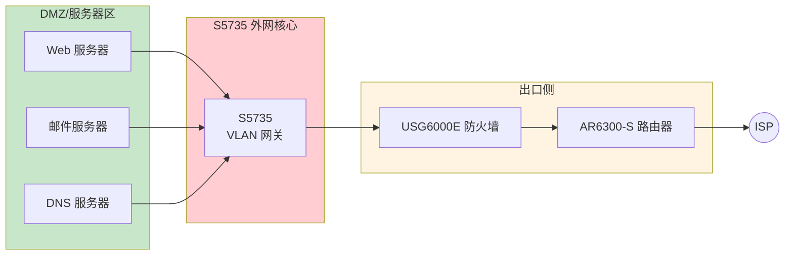
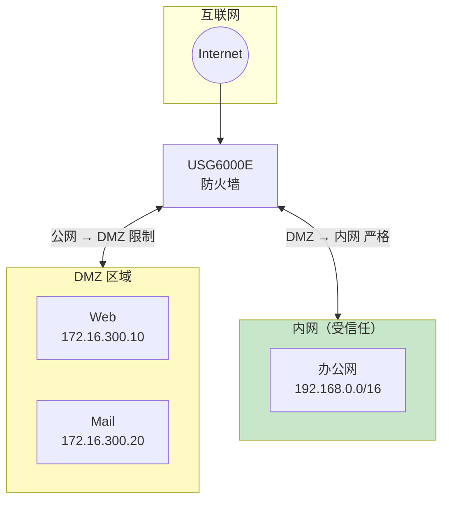
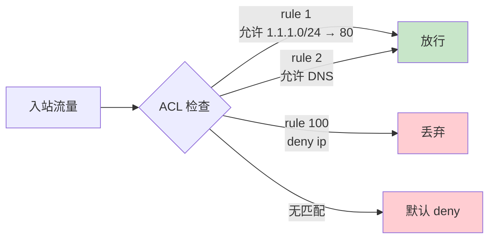

# 华为 S5735 - 二楼核心机房外网交换机 - 操作手册

> **设备类型**：华为 CloudEngine S5735 系列
> **角色**：二楼核心机房外网交换机
> **最后更新**：v1.0

> **与"内网核心"S5735 的区别**：本台是外网侧，连接 USG6000E 防火墙和可能的 AR6300-S 路由器，业务对象是"外网/服务器"。

---

## 设备架构图

### S5735 外网核心在二楼的位置



### DMZ 隔离架构



### ACL 入站过滤



---

## 1. 设备基本信息

| 项目 | 内容 |
|------|------|
| 设备型号 | S5735 |
| 角色 | 外网交换机 |
| 厂商 | 华为 |
| 操作系统 | VRP |
| 物理位置 | 二楼核心机房 ___ 机柜 ___ U 位 |
| 管理 IP | ___ |
| 序列号 | ___ |
| 固件版本 | ___ |
| 维保截止 | ___ |
| 上联对象 | ___（USG6000E / AR6300-S） |
| 下联对象 | ___（服务器 / DMZ 设备） |

---

## 2. 登录方式

（同 S5735 内网核心）

---

## 3. 完整信息采集命令清单

**所有命令与 S5735 内网核心完全相同**，参考 `07-华为S5735-内网核心/01-操作手册.md` 的第 3 节。

补充外网侧专项：

```
# 查看 ACL 命中
display acl
display acl <acl-number>
display traffic-filter applied-record

# 查看安全区域（如启用）
display zone
display security-policy

# 看服务器段 MAC / ARP
display mac-address
display arp
```

---

## 4. 配置保存与备份

```
save
tftp <TFTP服务器IP> put vrpcfg.zip
```

---

## 5. 常见操作

（参考 S5735 内网核心手册第 5 节）

外网侧特别场景：

### 5.1 配置 DMZ VLAN

```
system-view
vlan batch 100 200 300
interface GigabitEthernet 0/0/1
  port link-type access
  port default vlan 100
interface GigabitEthernet 0/0/2
  port link-type access
  port default vlan 200
quit
save
```

### 5.2 配置 ACL 限制入站

```
system-view
acl number 3000
  rule 5 permit tcp source 1.1.1.0 0.0.0.255 destination 192.168.100.0 0.0.0.255 destination-port eq 80
  rule 100 deny ip
quit
interface GigabitEthernet 0/0/24
  traffic-filter inbound acl 3000
quit
save
```

### 5.3 关闭不必要服务

```
undo telnet server enable
undo http server enable
undo http secure-server enable    # 如不需要
```

---

## 6. 风险点与雷区

| 雷区 | 说明 | 应对 |
|------|------|------|
| 公网接入端口接错 | 接到内网口 | 标签 + 颜色区分 |
| ACL 顺序错 | 重要流量被堵 | 严格按规划编号 |
| 默认账号 | 安全风险 | 改密码 + 限登录源 |
| 管理 Web 公网开 | 被扫描攻击 | 用 ACL 限源 |
| 服务器私接 | 绕过策略 | 802.1X / 端口安全 |

---

## 7. 巡检要点

每日：
- [ ] PWR/SYS 灯正常
- [ ] CPU < 70%
- [ ] 关键接口 UP
- [ ] ACL 命中数

每周：
- [ ] 备份配置
- [ ] 检查接口错包
- [ ] 检查服务器段 ARP 异常

每月：
- [ ] 审计账号
- [ ] 检查 ACL 有效性

---

## 8. 紧急情况处理

### 8.1 整机不可达

1. Console 直连
2. `reboot` 软重启
3. 硬断电 30 秒
4. 备件替换

### 8.2 误改 ACL 导致服务器不通

1. `display current-configuration` 看
2. `undo acl 3000` / `undo traffic-filter inbound` 撤销
3. `reboot` 软重启回 startup

---

## 9. 联系方式

| 类别 | 联系人 | 方式 |
|------|--------|------|
| 华为 400 售后 | 400-822-9999 | 7×24 |
| 内部 IT 主管 | ___ | ___ |

---

## 10. 变更记录

| 日期 | 变更人 | 变更内容 | 是否回滚验证 | 记录位置 |
|------|--------|---------|-------------|---------|
| | | | | |
| | | | | |
