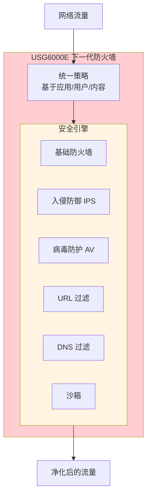
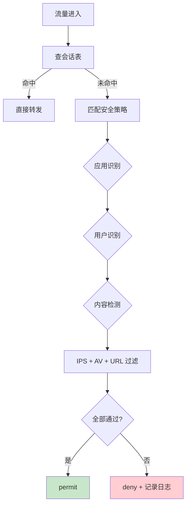
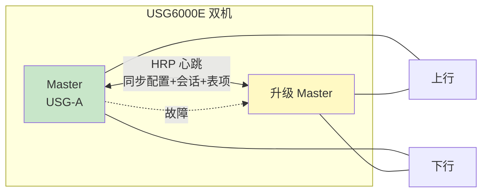
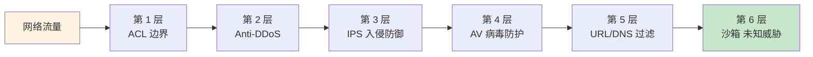

# 华为 USG6000E - 二楼核心机房防火墙 - 操作手册

> **设备类型**：华为 USG6000E 系列下一代防火墙
> **角色**：二楼核心机房外网防火墙
> **最后更新**：v1.0

> **与 F1000 对比**：USG6000E 是华为新一代 NGAF 平台，命令体系与 F1000 略有不同，集成 IPS/AV/URL 过滤等。

---

## 设备架构图

### USG6000E 下一代防火墙架构



### 安全策略匹配流程



### 双机热备 HRP



### 攻击防护层次



---

## 1. 设备基本信息

| 项目 | 内容 |
|------|------|
| 设备型号 | USG6000E（具体型号以现场为准，如 USG6335E / USG6355E / USG6385E） |
| 角色 | 外网防火墙 |
| 厂商 | 华为 |
| 操作系统 | VRP |
| 物理位置 | 二楼核心机房 ___ 机柜 ___ U 位 |
| 管理 IP | ___ |
| 序列号 | ___ |
| 固件版本 | ___ |
| 维保截止 | ___ |
| 上联对象 | ___（ISP / 路由器） |
| 下联对象 | ___（S5735 外网核心） |
| HA 状态 | 单机 / 双机 HRP |

---

## 2. 登录方式

### 2.1 Console 登录

```
Baud Rate: 9600
Data Bits: 8
Stop Bits: 1
Parity: None
Flow Control: None
```

### 2.2 SSH 登录

```bash
ssh admin@<管理IP>
```

### 2.3 Web 登录

`https://<管理IP>`（推荐图形化管理，USG6000E 的 Web 是主要操作界面）

---

## 3. 完整信息采集命令清单

### 3.1 基础信息

```
display version
display device
display elabel
display fan
display power
display temperature
display cpu
display memory
display clock
display current-configuration
display saved-configuration
display startup
```

### 3.2 接口

```
display interface
display interface brief
display interface description
display ip interface brief
display ip interface
```

### 3.3 安全域

```
display zone
display security-zone
display interzone
display interzone statistics
```

### 3.4 策略

```
display security-policy
display security-policy rule
display security-policy statistics
display security-policy hit
display policy
display policy interzone
```

### 3.5 NAT

```
display nat
display nat session
display nat server
display nat address-group
display nat statistics
display nat session statistics
display nat session aging-time
```

### 3.6 路由

```
display ip routing-table
display ip routing-table statistics
display ospf peer
display bgp peer
display rip
display isis peer
```

### 3.7 对象

```
display object-group
display object-group ip
display object-group service
display object-group url
display object-group application
display time-range
```

### 3.8 HA / 双机

```
display hrp
display hrp state
display hrp interface
display hrp track
display vrrp
display vrrp state
```

### 3.9 攻击防护

```
display threat
display attack-defense
display attack-defense statistics
display ips
display ips statistics
display av    # 病毒
display url-filter
display dns-filter
display sandbox
```

### 3.10 VPN

```
display ike sa
display ipsec sa
display ipsec tunnel
display sslvpn
display sslvpn session
display l2tp
```

### 3.11 会话

```
display session
display session statistics
display session aging-time
display session filter
display firewall statistic
```

### 3.12 日志

```
display logbuffer
display trapbuffer
display info-center
display logging
```

### 3.13 用户

```
display aaa
display aaa online-user
display local-user
display super
display rbac
```

### 3.14 杂项

```
display users
display snmp-agent
display ntp
display dns
display file
dir
```

---

## 4. 配置保存与备份

### 4.1 保存到本地

```
save
save safely
```

### 4.2 备份到 TFTP

```
tftp <TFTP服务器IP> put vrpcfg.zip
```

### 4.3 通过 Web 备份

`系统 > 配置文件 > 备份`

---

## 5. 常见操作

### 5.1 查看会话统计

```
display session statistics
display session aging-time
```

### 5.2 查看策略命中

```
display security-policy statistics
# 看 rule-id + 命中数
```

### 5.3 查看 NAT 转换

```
display nat session
display nat session verbose
```

### 5.4 临时放行/拒绝

```
system-view
security-policy
  rule name test-allow
    source-zone trust
    destination-zone untrust
    source-address 192.168.1.0 24
    destination-address any
    service any
    action permit
quit
save
```

### 5.5 HA 切换

```
hrp switch-to
# 或
hrp force-switch
```

### 5.6 重启

```
save
reboot
```

### 5.7 恢复出厂

```
reset saved-configuration
reboot
```

---

## 6. 风险点与雷区

| 雷区 | 说明 | 应对 |
|------|------|------|
| 默认 deny 规则 | USG6000E 改前请确认默认动作 | `display security-policy rule default` |
| 策略顺序 | 后配的先生效 | 按规划编号 |
| HRP 同步失败 | 双机配置不一致 | `display hrp state` |
| session 满 | 新连接失败 | 监控 + 调小老化 |
| NAT 满 | 转换失败 | 监控 NAT session |
| IPS/AV 误杀 | 业务被拦截 | 监控告警，加白名单 |
| 默认账号 | admin/Admin@123 | 改密码 |

---

## 7. 巡检要点

每日：
- [ ] CPU < 70%
- [ ] 内存 < 80%
- [ ] 双机状态 HRP OK
- [ ] session / NAT 数
- [ ] 攻击告警

每周：
- [ ] 备份配置
- [ ] 检查 IPS 命中
- [ ] 检查 URL/AV 告警

每月：
- [ ] 清理无用策略
- [ ] 审计账号
- [ ] 检查 license（IPS/AV/URL 特征库）

---

## 8. 紧急情况处理

### 8.1 整机不可达

1. Console 直连
2. `reboot` 软重启
3. 硬断电 30 秒

### 8.2 误改策略导致全断

1. `display current-configuration` 看
2. `undo security-policy rule xxx` 撤销
3. `reboot` 回 startup

### 8.3 双机脑裂

1. 检查心跳线
2. 强制切换
3. 联系华为售后

---

## 9. 联系方式

| 类别 | 联系人 | 方式 |
|------|--------|------|
| 华为 400 售后 | 400-822-9999 | 7×24 |
| 华为企业支持 | https://support.huawei.com | |
| 内部 IT 主管 | ___ | ___ |

---

## 10. 变更记录

| 日期 | 变更人 | 变更内容 | 是否回滚验证 | 记录位置 |
|------|--------|---------|-------------|---------|
| | | | | |
| | | | | |
