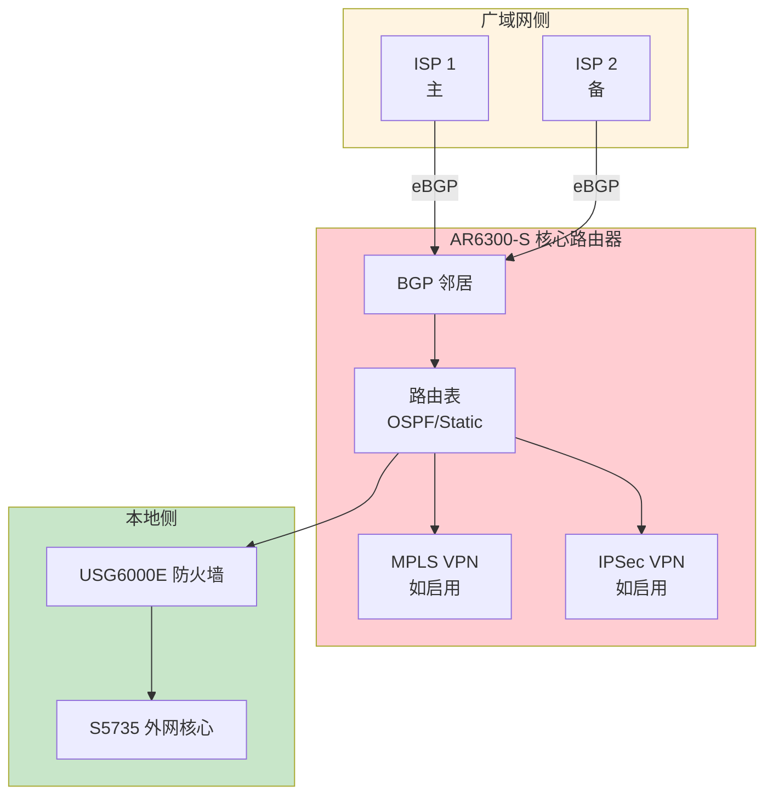
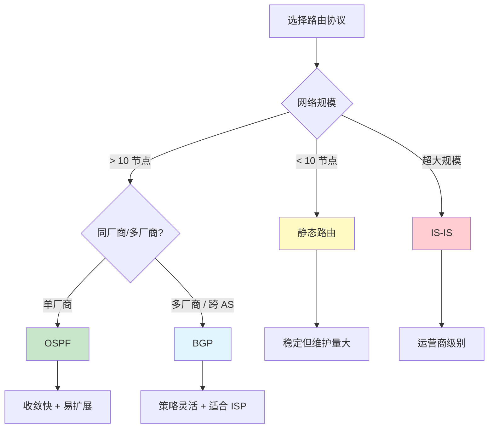
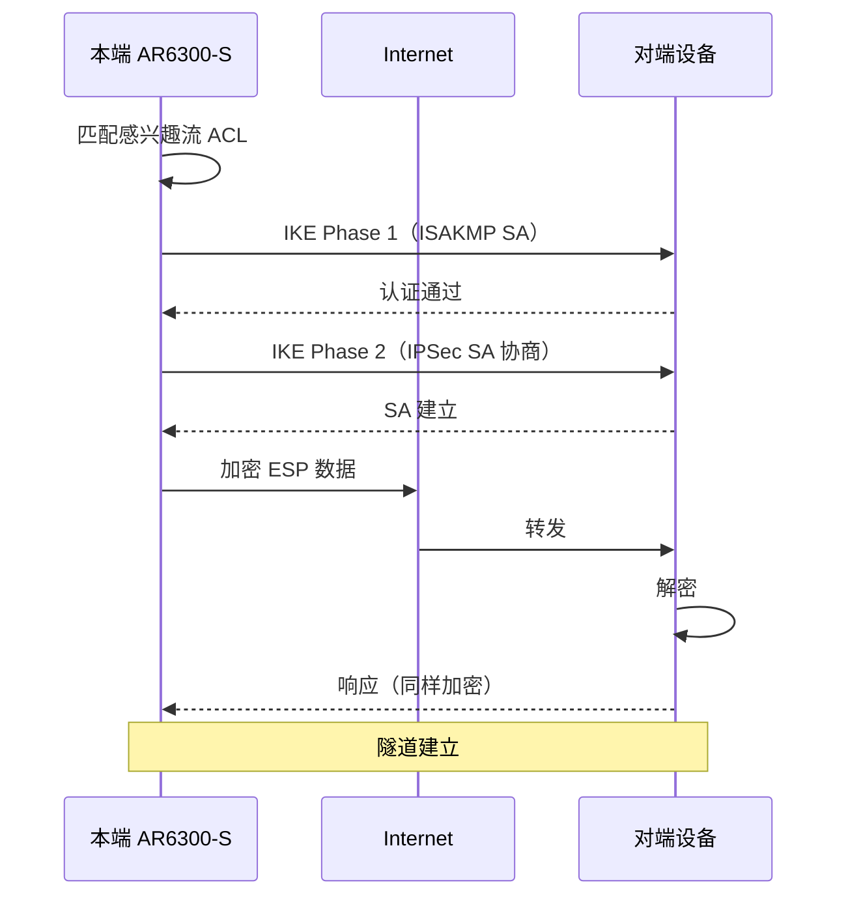
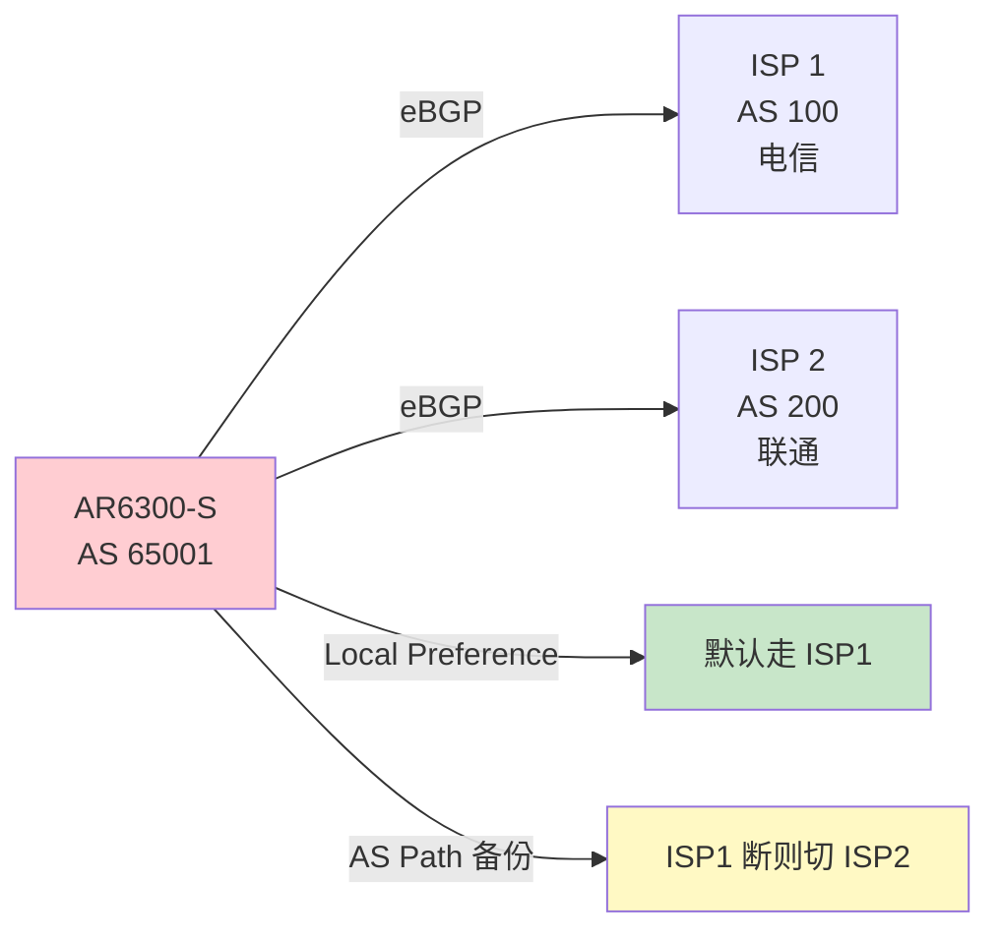

# 华为 AR6300-S - 二楼核心机房核心路由器 - 操作手册

> **设备类型**：华为 AR6300 系列高端路由器
> **角色**：二楼核心机房核心路由器（出口/广域网汇聚）
> **最后更新**：v1.0

---

## 设备架构图

### AR6300-S 核心路由器在二楼机房的位置



### 路由协议选择决策树



### IPSec VPN 隧道



### BGP 双 ISP 选路



---

## 1. 设备基本信息

| 项目 | 内容 |
|------|------|
| 设备型号 | AR6300-S |
| 角色 | 核心路由器 |
| 厂商 | 华为 |
| 操作系统 | VRP |
| 物理位置 | 二楼核心机房 ___ 机柜 ___ U 位 |
| 管理 IP | ___ |
| 序列号 | ___ |
| 固件版本 | ___ |
| 维保截止 | ___ |
| 上联对象 | ___（ISP / USG6000E） |
| 下联对象 | ___（S5735 / 二楼交换机） |
| 接口槽位 | ___ |

---

## 2. 登录方式

### 2.1 Console 登录

```
Baud Rate: 9600
Data Bits: 8
Stop Bits: 1
Parity: None
Flow Control: None
```

### 2.2 SSH 登录

```bash
ssh admin@<管理IP>
```

---

## 3. 完整信息采集命令清单

### 3.1 基础信息

```
display version
display device
display elabel
display fan
display power
display temperature
display cpu-usage
display cpu-usage history
display memory-usage
display memory-usage history
display clock
display current-configuration
display saved-configuration
```

### 3.2 接口

```
display interface
display interface brief
display interface description
display ip interface brief
display ip interface
display interface | include down
```

### 3.3 路由

```
display ip routing-table
display ip routing-table verbose
display ip routing-table statistics
display ospf peer
display ospf peer brief
display ospf lsdb
display ospf interface
display bgp peer
display bgp peer brief
display bgp routing-table
display rip
display rip database
display isis peer
display isis brief
```

### 3.4 MPLS（如启用）

```
display mpls lsp
display mpls ldp
display mpls ldp neighbor
display vrf
display vrf brief
```

### 3.5 策略路由 / PBR

```
display policy-based-route
display traffic-policy
display traffic-policy applied-record
```

### 3.6 NAT（如启用）

```
display nat
display nat session
display nat server
display nat address-group
```

### 3.7 安全

```
display acl
display acl all
display traffic-filter
display firewall
display attack-defense
```

### 3.8 VPN

```
display ike sa
display ipsec sa
display ipsec tunnel
display l2tp
display gre
```

### 3.9 HA / VRRP

```
display vrrp
display vrrp brief
display vrrp interface
display redundancy group
```

### 3.10 性能与日志

```
display cpu-usage
display memory-usage
display logbuffer
display trapbuffer
```

### 3.11 用户与杂项

```
display aaa
display aaa online-user
display local-user
display super
display users
display snmp-agent
display ntp
display dns
dir
```

---

## 4. 配置保存与备份

### 4.1 保存到本地

```
save
save safely
```

### 4.2 备份到 TFTP

```
tftp <TFTP服务器IP> put vrpcfg.zip
```

### 4.3 备份到 FTP

```
ftp 192.168.1.100
put vrpcfg.zip
```

### 4.4 通过 SFTP

```
sftp 192.168.1.100
put vrpcfg.zip
```

---

## 5. 常见操作

### 5.1 接口 UP/DOWN

```
system-view
interface GigabitEthernet 0/0/1
shutdown
# 或
undo shutdown
quit
save
```

### 5.2 配置静态路由

```
system-view
ip route-static 0.0.0.0 0.0.0.0 1.1.1.1
quit
save
```

### 5.3 配置 OSPF

```
system-view
ospf 1 router-id 1.1.1.1
  area 0
    network 10.1.1.0 0.0.0.255
    network 192.168.1.0 0.0.0.255
quit
save
```

### 5.4 配置 BGP

```
system-view
bgp 65001
  router-id 1.1.1.1
  peer 2.2.2.2 as-number 65002
  peer 2.2.2.2 ebgp-max-hop 255
  ipv4-family unicast
    peer 2.2.2.2 enable
quit
save
```

### 5.5 配置 VRRP

```
system-view
interface GigabitEthernet 0/0/1
vrrp vrid 1 virtual-ip 192.168.1.254
vrrp vrid 1 priority 120
vrrp vrid 1 track interface GigabitEthernet 0/0/24 reduced 30
quit
save
```

### 5.6 配置 IPSec VPN

```
system-view
acl number 3000
  rule 5 permit ip source 10.1.1.0 0.0.0.255 destination 10.2.1.0 0.0.0.255
quit
ike proposal 1
  encryption-algorithm aes-cbc-128
  authentication-algorithm sha1
  dh group2
quit
ipsec proposal prop1
  esp authentication-algorithm sha1
  esp encryption-algorithm aes-128
quit
ike peer peer1 v2
  remote-address 2.2.2.2
  pre-shared-key cipher Huawei@123
quit
ipsec policy policy1 1 isakmp
  proposal prop1
  ike-peer peer1
  security acl 3000
quit
interface GigabitEthernet 0/0/1
  ipsec policy policy1
quit
save
```

### 5.7 重启

```
save
reboot
```

### 5.8 恢复出厂

```
reset saved-configuration
reboot
```

---

## 6. 风险点与雷区

| 雷区 | 说明 | 应对 |
|------|------|------|
| 路由黑洞 | 配置错导致流量丢失 | 改前模拟，改后跟踪 |
| OSPF 区域错 | 邻居起不来 | 严格匹配 area-id |
| BGP 邻居不稳 | TCP 重传 | 改 timer 调优 |
| IPSec 隧道断 | 密钥过期 / 路由变 | 监控 IKE SA |
| 默认路由遗漏 | 备份链路不可用 | 配两条默认路由 |
| ACL 误拦 | 业务中断 | 改前 review |
| 配置超长 | VRP 启动慢 | 定期清理 |

---

## 7. 巡检要点

每日：
- [ ] PWR/SYS 灯正常
- [ ] CPU < 70%
- [ ] 路由邻居稳（OSPF/BGP）
- [ ] 关键接口 UP

每周：
- [ ] 备份配置
- [ ] 检查路由抖动
- [ ] 检查接口错包

每月：
- [ ] 检查 license
- [ ] 检查固件版本
- [ ] 审计账号

---

## 8. 紧急情况处理

### 8.1 整机不可达

1. Console 直连
2. `reboot` 软重启
3. 硬断电 30 秒
4. 备件替换

### 8.2 路由邻居起不来

1. `display ospf peer` 看状态
2. 检查接口 IP / 掩码
3. 检查 area-id 一致
4. 检查认证（如果有）
5. 检查 hello/dead timer

### 8.3 IPSec 隧道断

1. `display ike sa` 看 IKE 状态
2. `display ipsec sa` 看 IPSec SA
3. 检查对端 IP 是否通
4. 检查 ACL 是否匹配流量
5. 检查 pre-shared-key 一致
6. 重建隧道：`undo ipsec policy` + 重新应用

---

## 9. 联系方式

| 类别 | 联系人 | 方式 |
|------|--------|------|
| 华为 400 售后 | 400-822-9999 | 7×24 |
| 华为企业支持 | https://support.huawei.com | |
| 内部 IT 主管 | ___ | ___ |

---

## 10. 变更记录

| 日期 | 变更人 | 变更内容 | 是否回滚验证 | 记录位置 |
|------|--------|---------|-------------|---------|
| | | | | |
| | | | | |
