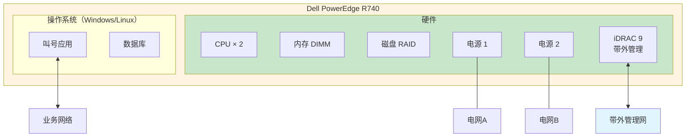
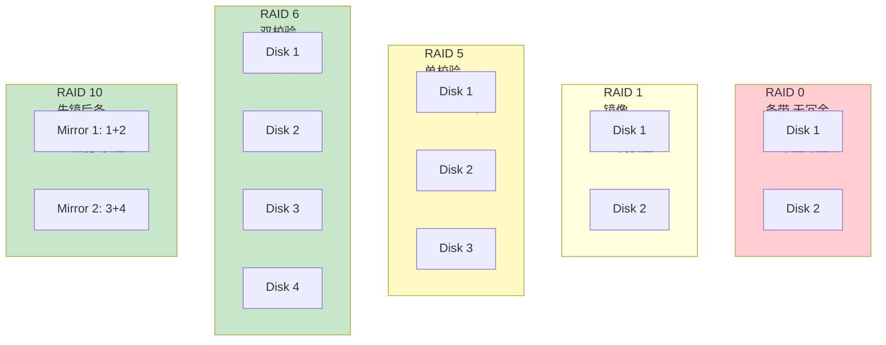
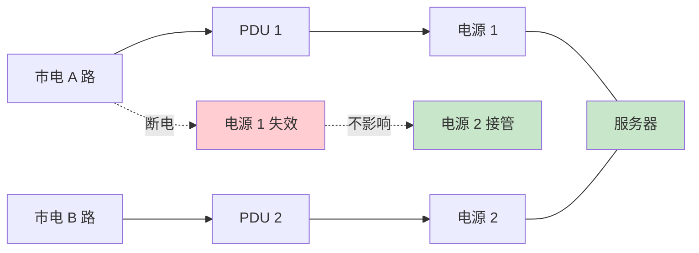

# 戴尔 R740 - 二楼核心机房叫号服务器 - 操作手册

> **设备类型**：戴尔 PowerEdge R740 机架式服务器
> **角色**：叫号系统（排队叫号）
> **最后更新**：v1.0

> 这不是网络设备，但属于核心机房资产，运维也要管。

---

## 设备架构图

### 戴尔 R740 叫号服务器架构



### iDRAC 带外管理拓扑


### RAID 配置（推荐 RAID 6 或 RAID 10）



### 双电源供电



---

## 1. 设备基本信息

| 项目 | 内容 |
|------|------|
| 设备型号 | Dell PowerEdge R740 |
| 角色 | 叫号服务器 |
| 操作系统 | Windows Server / Linux（以现场为准） |
| 物理位置 | 二楼核心机房 ___ 机柜 ___ U 位 |
| iDRAC IP | ___（带外管理，必填） |
| 业务 IP | ___ |
| 业务端口 | ___ |
| 网关 | ___ |
| DNS | ___ |
| 服务名称 | ___ |
| 序列号 | ___（**Service Tag**） |
| 维保截止 | ___ |
| 上联交换机 | ___（哪个口、哪个 VLAN） |
| 资产编号 | ___ |

---

## 2. 登录方式

### 2.1 操作系统登录

- 远程桌面：`mstsc /v:<业务IP>`
- SSH（Linux）：`ssh user@<业务IP>`

### 2.2 带外管理（iDRAC）

```
https://<iDRAC IP>
# 默认账号 root，默认密码在机器标签上
# ⚠️ 第一次登录强制改密码
```

iDRAC 用途：
- 远程开关机
- 远程 Console（HTML5 KVM）
- 查看硬件健康（温度、风扇、电源、磁盘）
- 安装操作系统
- 收集日志（SupportAssist）

---

## 3. 完整信息采集命令清单

### 3.1 Windows Server

#### 网络配置
```cmd
ipconfig /all
route print
netstat -an
netstat -ano | findstr LISTENING
nslookup
tracert 8.8.8.8
```

#### 系统信息
```cmd
systeminfo
hostname
wmic computersystem get model,name
wmic bios get serialnumber,version
wmic cpu get name
wmic memorychip get capacity,speed
wmic diskdrive get model,size
wmic logicaldisk get caption,size,freespace
```

#### 服务
```cmd
sc query
sc query type= service state= all
Get-Service
```

#### 性能
```cmd
typeperf "\Processor(_Total)\% Processor Time"
typeperf "\Memory\Available MBytes"
# 或
resmon
perfmon
```

#### 日志
```cmd
eventvwr
# 或
wevtutil qe System /c:10 /rd:true /f:text
wevtutil qe Application /c:10 /rd:true /f:text
```

#### 进程
```cmd
tasklist
tasklist /svc
wmic process get name,processid,workingsetsize
```

#### 用户
```cmd
net user
net localgroup administrators
qwinsta   # 当前会话
quser     # 当前登录用户
```

#### 防火墙
```cmd
netsh advfirewall show allprofiles
netsh advfirewall firewall show rule name=all
```

### 3.2 Linux

```bash
# 网络
ip a
ip route
ss -tlnp
cat /etc/resolv.conf
traceroute 8.8.8.8

# 系统
uname -a
hostname
cat /etc/os-release
lscpu
free -h
lsblk
df -h
dmidecode -t system | grep -i serial

# 服务
systemctl list-units --type=service --state=running
systemctl status <service>

# 性能
top
htop
iostat
vmstat
sar
nvidia-smi   # 如有 GPU

# 日志
journalctl -n 100
journalctl -u <service> -n 100
dmesg | tail

# 进程
ps aux
pstree

# 用户
who
last
cat /etc/passwd
cat /etc/sudoers
```

### 3.3 iDRAC（Web）

登录 `https://<iDRAC IP>` 后查看：
- **System > Properties**：型号、序列号、BIOS
- **System > Event Log**：硬件事件日志
- **Hardware > Health**：温度、电源、风扇
- **Configuration > System Settings**：网络、存储、CPU
- **Maintenance > SupportAssist**：导出日志

---

## 4. 配置保存与备份

### 4.1 操作系统配置

- **Windows**：DSA（ Dell System Assistant）/ Windows Backup / 第三方（如 Veeam）
- **Linux**：tar / rsync / Bacula

### 4.2 iDRAC 配置

- 在 Web 控制台手动备份
- 通过 RACADM 命令：
  ```bash
  racadm get -t xml -f idrac.xml
  ```

### 4.3 数据备份

- 叫号系统的数据库（SQL Server / MySQL / PostgreSQL）单独备份
- 备份到 NAS / 异地
- 至少保留 30 天
- 每月做一次恢复演练

---

## 5. 常见操作

### 5.1 远程重启（Windows）

```cmd
shutdown /r /t 60 /c "计划内重启"
```

### 5.2 远程重启（Linux）

```bash
sudo shutdown -r +1 "计划内重启"
# 或
sudo reboot
```

### 5.3 通过 iDRAC 强制关机

```
# 在 iDRAC Web
Configuration > System Settings > Power Configuration
# 或
racadm systemaction poweroff
racadm systemaction poweron
racadm systemaction powercycle   # 断电再开
```

### 5.4 查看硬件健康（iDRAC）

```
Dashboard > Hardware > Health
# 看：
# - CPU：温度、状态
# - Memory：DIMM 状态
# - Power Supplies：PSU 状态
# - Fans：转速
# - Temperature：CPU/系统温度
# - Storage：磁盘状态（预测性故障）
```

### 5.5 收集硬件日志

```
Maintenance > SupportAssist > Export SupportAssist Collection
# 或通过 racadm
racadm supportassist collect
```

### 5.6 远程 KVM（HTML5）

```
Dashboard > Virtual Console
# 可远程操作，键盘鼠标视频
```

### 5.7 磁盘扩容（以 ESXi 下的 R740 为例）

1. iDRAC 给物理盘配置 RAID
2. OS 层扫描新盘
3. 扩展卷 / 挂载

---

## 6. 风险点与雷区

| 雷区 | 说明 | 应对 |
|------|------|------|
| iDRAC 默认密码 | 公网暴露会被攻击 | 改密码 + 限登录源 |
| 单电源 | 断电就宕机 | 双电源 + 双 PDU |
| 磁盘单点 | RAID 5 坏两块就丢 | RAID 6 / RAID 10 |
| 内存故障 | 单条坏可降级 | iDRAC 告警 + 监控 |
| iLO / iDRAC 网段 | 与业务网混 | 独立带外管理网 |
| 远程桌面 3389 公网 | 勒索病毒 | 改端口 + VPN 准入 |
| 默认账号 sa / root | 数据库 / 系统 | 改密码 + 限 IP |
| 无备份 | 数据丢失 | 每天备份 + 异地 |
| 时钟不同步 | 日志对不上 | NTP 同步 |
| 没监控 | 故障发现晚 | 装 Zabbix Agent |

---

## 7. 巡检要点

每日：
- [ ] 业务服务 UP
- [ ] 操作系统 CPU/内存/磁盘正常
- [ ] 硬件健康（iDRAC）
- [ ] 备份任务执行

每周：
- [ ] 检查事件日志
- [ ] 检查磁盘空间
- [ ] 备份验证

每月：
- [ ] 备份恢复演练
- [ ] 固件升级评估（Dell Repository Manager）
- [ ] 账号审计

---

## 8. 紧急情况处理

### 8.1 整机不可达（操作系统）

1. iDRAC 是否可达
   - 可达：通过 iDRAC 远程 KVM 进去看
   - 不可达：检查 PDU、电源
2. 远程 KVM 看屏幕
3. 能看到画面但卡死：通过 iDRAC 硬重启
4. 完全没反应：iDRAC 拉日志 → 报修

### 8.2 硬件故障告警（iDRAC 黄色/红色告警）

1. 看 `System > Event Log`
2. 找到具体告警组件
3. 单条内存/风扇/电源：可降级，**准备好备件 + 维护窗口**
4. 硬盘预测性故障：立即备份 + 换盘
5. 多组件告警：可能主板问题，立即停机保数据

### 8.3 数据丢失 / 数据库损坏

1. **先停业务**（避免二次破坏）
2. 启用最近一次备份恢复
3. 数据库：尝试修复（`DBCC CHECKDB` / `mysqlcheck`）
4. 不行：找备份恢复

### 8.4 勒索病毒 / 安全事件

1. 立即断网（iDRAC 关机或拔网线）
2. 评估影响范围
3. 不要付赎金
4. 从备份恢复
5. 复盘 + 加固

---

## 9. 联系方式

| 类别 | 联系人 | 方式 |
|------|--------|------|
| Dell 400 售后 | 400-886-8611 | 7×24 |
| Dell 在线支持 | https://www.dell.com/support | |
| OS 厂商（微软/红帽） | ___ | ___ |
| 应用厂商（叫号系统） | ___ | ___ |
| 内部 IT 主管 | ___ | ___ |

---

## 10. 变更记录

| 日期 | 变更人 | 变更内容 | 是否回滚验证 | 记录位置 |
|------|--------|---------|-------------|---------|
| | | | | |
| | | | | |
