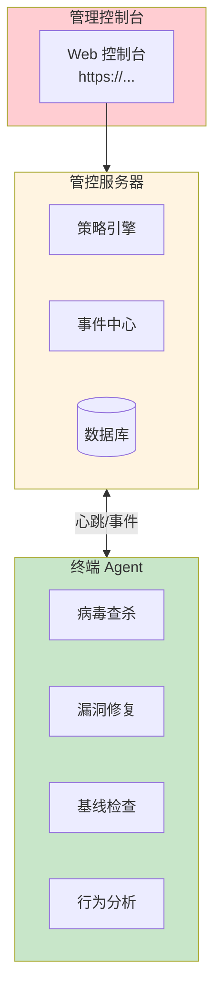
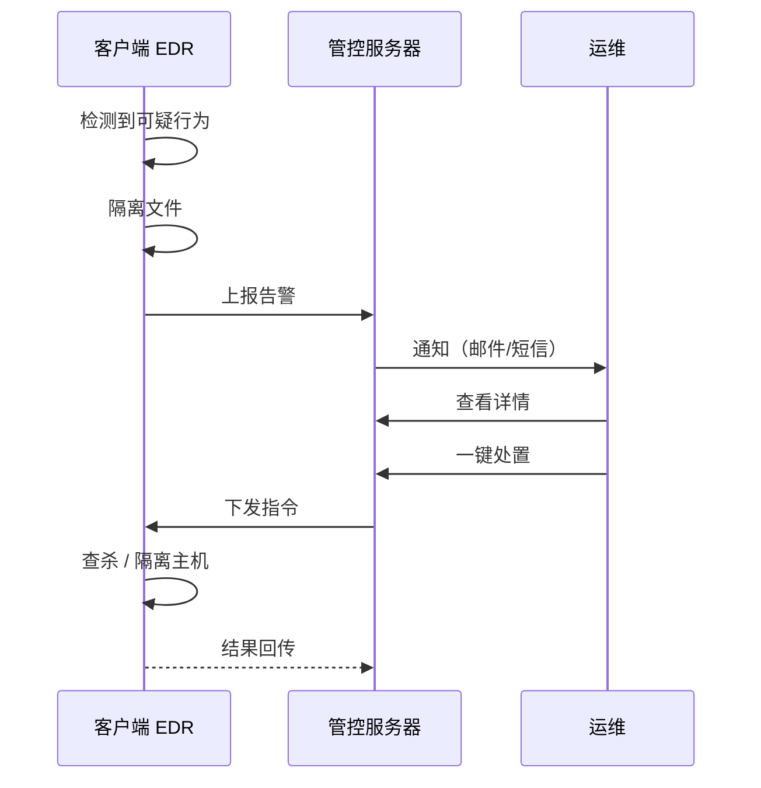
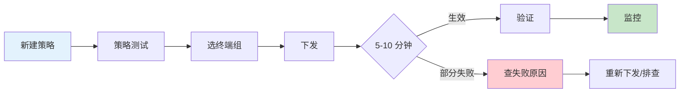
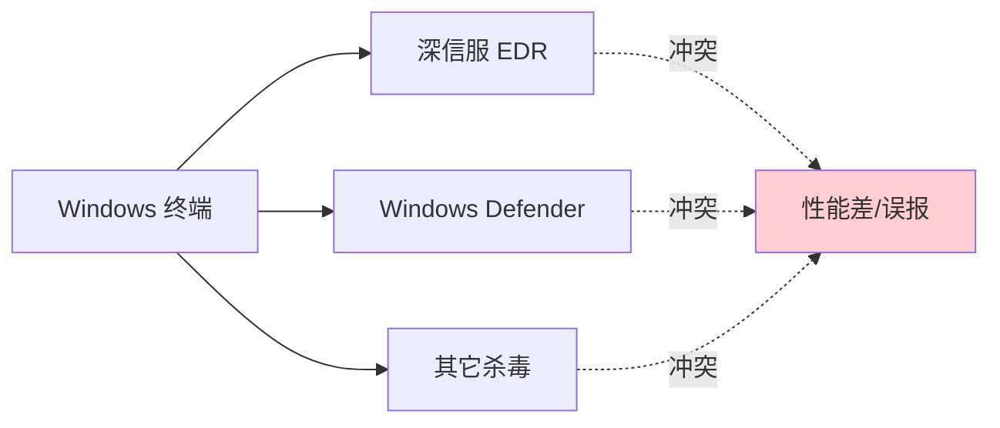

# 深信服 - 终端防护 - 操作手册

> **设备类型**：深信服 EDR / SIP / EPP 终端安全
> **角色**：办公终端安全防护
> **最后更新**：v1.0

> 深信服终端防护一般是**软件 + 管理控制台**架构，不算网络设备，但属于运维管辖范围。

---

## 系统架构图

### 深信服终端防护 EDR 架构



### 威胁处置流程



### 策略下发流程



### 多 EDR 冲突示意



---

## 1. 系统信息

| 项目 | 内容 |
|------|------|
| 产品 | 深信服 ___（EDR / SIP / EPP / 其它） |
| 控制台地址 | https://___ |
| 控制台账号 | ___ |
| 管理服务器位置 | ___（本地 / 云端） |
| 客户端版本 | ___ |
| 客户端数量 | ___ |
| 维保截止 | ___ |
| 部署方式 | 直连 / 旁路 |
| 对接运维 | ___（深信服原厂 / 渠道） |

---

## 2. 登录方式

### 2.1 管理控制台

浏览器打开 `https://<控制台地址>`，使用 admin 账号登录。

### 2.2 客户端

- Windows：右下角托盘图标
- macOS：菜单栏图标

---

## 3. 信息采集（管理控制台）

### 3.1 资产视角

```
控制台路径（参考）：
  资产管理 > 终端列表
  资产管理 > 软件资产
  资产管理 > 硬件资产
```

需要采集：
- 终端总数 / 在线数 / 离线数
- 操作系统分布
- 软件安装清单
- 高危软件清单

### 3.2 安全态势

```
控制台路径（参考）：
  态势感知 > 风险概览
  事件管理 > 病毒事件
  事件管理 > 告警事件
```

需要采集：
- 过去 7/30 天告警数
- 病毒查杀记录
- 漏洞修复情况
- 失陷主机

### 3.3 策略

```
控制台路径（参考）：
  策略管理 > 病毒防护策略
  策略管理 > 漏洞修复策略
  策略管理 > 基线检查策略
```

需要采集：
- 当前生效策略列表
- 策略下发到客户端的状态
- 策略版本

### 3.4 后台数据库（如果自建）

- 服务器：___
- 操作系统：___
- 端口：___
- 数据库类型：___

---

## 4. 备份

### 4.1 控制台配置备份

```
控制台 > 系统管理 > 配置备份
```

或通过 SSH/RDP 登录管理服务器，备份 `/opt/sangfor/edr` 或类似目录。

### 4.2 客户端离线包备份

```
保留近 3 个版本的全平台离线安装包
```

---

## 5. 常见操作

### 5.1 客户端离线安装（Windows）

```cmd
# 把离线包拷到目标机器
EDR_Offline_Package.exe /S    # 静默安装
# 或
EDR_Offline_Package.exe /install
```

### 5.2 客户端在线安装

浏览器打开 `https://<控制台>/download`，下载在线安装包执行。

### 5.3 查杀

```
控制台 > 事件管理 > 病毒事件
# 对具体告警执行：远程查杀 / 隔离文件 / 隔离主机
```

### 5.4 漏洞修复

```
控制台 > 漏洞管理 > 扫描
# 选范围 -> 立即扫描
# 看结果：一键修复 / 选修复
```

### 5.5 远程终端（部分版本支持）

```
控制台 > 终端列表 > 选中目标 > 远程终端
# 可远程 SSH/RDP
```

### 5.6 策略下发

```
控制台 > 策略管理 > 新建策略
# 配置完 -> 下发到指定终端组
# 等 5-10 分钟生效
```

### 5.7 客户端卸载

需要控制台先发起"卸载授权"（防私自卸载），客户端才能卸载。

```
控制台 > 终端管理 > 选中终端 > 卸载授权
```

---

## 6. 风险点与雷区

| 雷区 | 说明 | 应对 |
|------|------|------|
| 控制台默认密码 | 极危险 | 改密码 + 二次认证 |
| 客户端大量离线 | 策略下发失败 | 排查网络 / 客户端状态 |
| 病毒库过期 | 新型病毒拦不住 | 自动升级 / 定期检查 |
| 误杀业务 | 关键服务被隔离 | 加白名单 |
| 性能影响 | 杀毒扫盘卡终端 | 调整扫描窗口 |
| 与其他 EDR 冲突 | 多个杀毒软件打架 | 部署前清理 |
| 卸载后失联 | 终端不受控 | 卸载授权 + 留痕 |
| 服务器宕机 | 管控失效 | 双机 / 异地 |

---

## 7. 巡检要点

每日：
- [ ] 控制台可访问
- [ ] 客户端在线率（应 > 95%）
- [ ] 告警事件

每周：
- [ ] 检查病毒库版本
- [ ] 检查策略下发状态
- [ ] 检查离线终端

每月：
- [ ] 检查病毒/漏洞趋势
- [ ] 检查 license
- [ ] 备份控制台配置

---

## 8. 紧急情况处理

### 8.1 客户端大面积失联

1. 检查控制台到终端的网络
2. 检查控制台服务状态
3. 排查是否有策略冲突 / 大规模卸载
4. 备选：客户端手动重装

### 8.2 误杀业务

1. 控制台查杀记录 -> 找到隔离项
2. 还原文件 / 取消隔离
3. 加白名单
4. 调整策略

### 8.3 勒索 / 大规模中毒

1. 控制台一键断网（隔离主机组）
2. 评估影响
3. 备份恢复
4. 复盘 + 加固

### 8.4 控制台不可达

1. 看管理服务器（物理机 / 虚机）状态
2. 看磁盘 / 数据库是否满
3. 重启服务
4. 联系深信服售后

---

## 9. 联系方式

| 类别 | 联系人 | 方式 |
|------|--------|------|
| 深信服 400 | 400-806-6868 | 7×24 |
| 深信服官网 | https://www.sangfor.com.cn | |
| 内部 IT 主管 | ___ | ___ |

---

## 10. 变更记录

| 日期 | 变更人 | 变更内容 | 是否回滚验证 | 记录位置 |
|------|--------|---------|-------------|---------|
| | | | | |
| | | | | |
