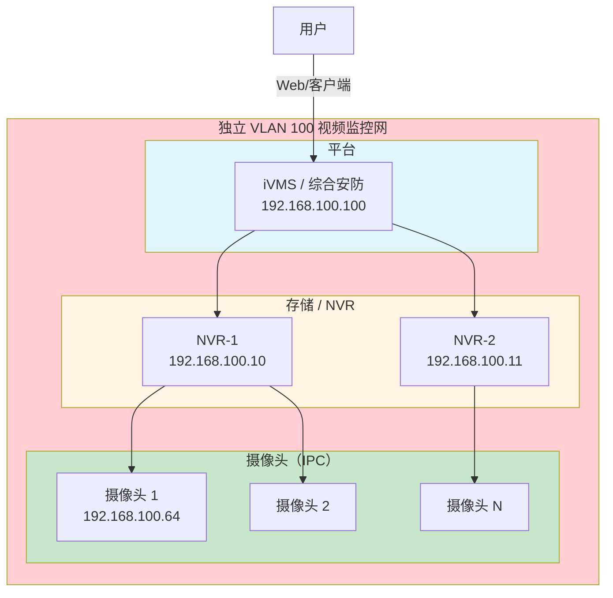
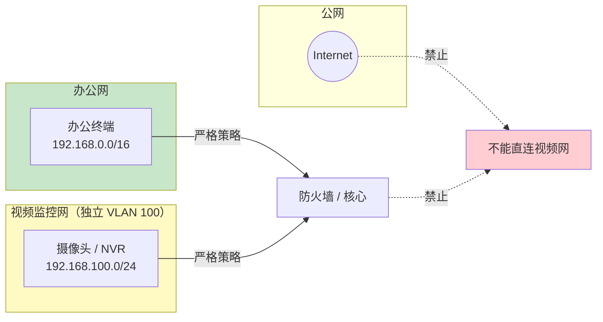
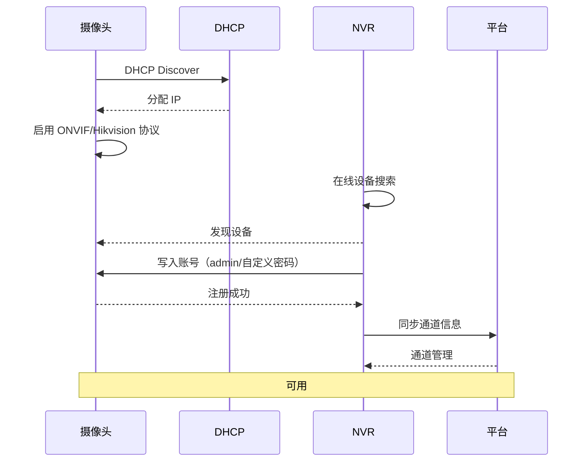
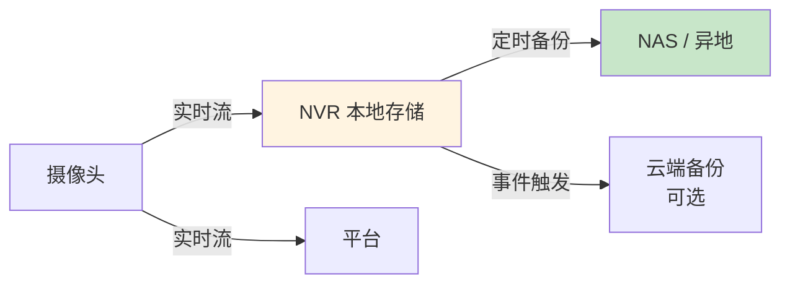
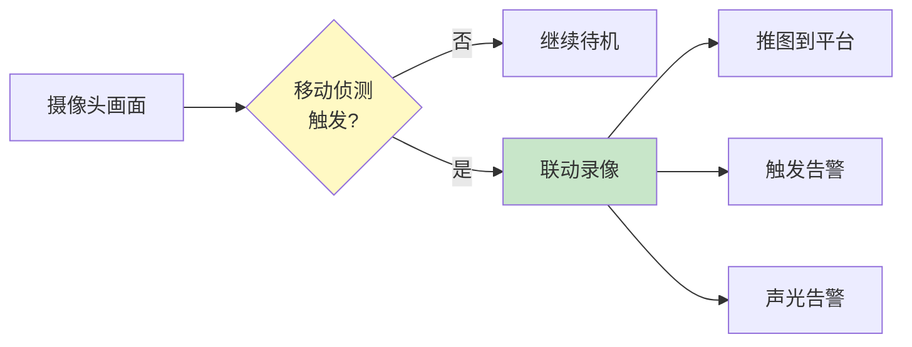

# 海康威视 - 视频监控 / NVR / 门禁 - 操作手册

> **设备类型**：海康威视视频监控、存储、门禁
> **角色**：厂区视频监控 / 门禁管理
> **最后更新**：v1.0

> 你没列具体型号，所以这份手册按"海康威视"通用做法写。具体设备以现场为准。

---

## 系统架构图

### 海康视频监控系统架构



### 网络隔离设计（必须）



### 摄像头添加流程



### 录像存储架构



### 移动侦测联动



---

## 1. 系统信息

| 项目 | 内容 |
|------|------|
| 设备类型 | 摄像头（IPC） / NVR / DVR / 门禁 / 平台软件 |
| 型号 | ___（每个型号分别列） |
| 厂商 | 海康威视（Hikvision） |
| 数量 | 摄像头 ___ 个 / NVR ___ 台 / DVR ___ 台 |
| 物理位置 | ___（摄像头位置 / 存储位置） |
| 管理 IP 段 | ___（建议独立 VLAN） |
| 平台地址 | https://___（iVMS / 综合安防管理平台） |
| 平台账号 | ___ |
| 维保截止 | ___ |
| 海康对接人 | ___ |

---

## 2. 网络隔离（强烈建议）

> ⚠️ 视频监控 / 门禁设备**必须与办公网隔离**！

### 2.1 独立 VLAN 规划

```
VLAN 100: 海康视频监控（摄像头 + NVR）
VLAN 101: 门禁管理
VLAN 102: 监控管理平台
```

### 2.2 防火墙策略

- 监控网 → 办公网：默认 deny，按需放行（流媒体转发、告警）
- 办公网 → 监控网：禁止
- 公网 → 监控网：禁止（**不要把摄像头/NVR 暴露公网**）

### 2.3 暴露公网的风险

- 默认弱口令（admin/12345）公网扫到就被看
- 摄像头漏洞（海康老版本漏洞很多）
- 被攻击后成为肉鸡发起 DDoS
- 隐私/合规风险

> **如果非要远程访问**：用 VPN / 堡垒机 / 零信任，不要直接映射公网。

---

## 3. 信息采集

### 3.1 摄像头（IPC）

#### 海康威视摄像头默认信息

| 项目 | 默认值 |
|------|--------|
| IP | 192.168.1.64（DHCP 启用） |
| 用户名 | admin |
| 密码 | （需激活时设置） |
| 端口 | HTTP 80 / RTSP 554 / ONVIF 8899 / SDK 8000 |
| 协议 | Hikvision / ONVIF / RTSP |

#### Web 登录

```
http://<摄像头IP>
# 输入 admin 账号密码
# 看：实时预览、回放、配置
```

#### 通过 NVR / 平台管理

```
平台 > 视频管理 > 通道管理
# 看：在线状态、码流、录像状态
```

### 3.2 NVR

#### Web 登录

```
http://<NVR IP>
```

#### SSH / Telnet（部分型号）

```
ssh admin@<NVR IP>
# 默认密码与 Web 相同
```

#### 命令采集

```
# 部分 NVR 支持 telnet/SSH 后命令
show version
show system
show network
show channel
show disk
show record
```

### 3.3 存储

```
控制台 > 存储管理
# 看：磁盘状态、RAID、容量、录像计划
```

---

## 4. 命令采集清单

### 4.1 NVR / DVR 命令（海康通用）

```
# 部分型号支持 SSH / telnet 登录后的命令
show version
show system
show network
show channel
show disk
show raid
show record
show log
show user
show time
```

### 4.2 通过 HTTP API（海康 ISAPI）

```bash
# 获取系统信息（需要认证）
curl -u admin:password http://<NVR_IP>/ISAPI/System/deviceInfo
curl -u admin:password http://<NVR_IP>/ISAPI/ContentMgmt/InputProxy/channels
curl -u admin:password http://<NVR_IP>/ISAPI/Streaming/channels
curl -u admin:password http://<NVR_IP>/ISAPI/ContentMgmt/Record/tracks
```

### 4.3 平台侧（iVMS / 综合安防）

```
平台 > 资产管理
平台 > 录像计划
平台 > 告警
平台 > 门禁
平台 > 事件日志
```

---

## 5. 配置备份

### 5.1 摄像头配置

- 通过 Web：配置 > 系统 > 维护 > 导出配置
- 通过 4200 客户端：批量导出

### 5.2 NVR 配置

- Web：系统 > 维护 > 导出配置
- 通过 4200 / iVMS：批量导出
- 通过 ISAPI：
  ```bash
  curl -u admin:pass http://<NVR_IP>/ISAPI/System/Configuration/export
  ```

### 5.3 平台配置

- 数据库：MySQL / PostgreSQL（按平台版本）
- 通过平台自身的备份功能

### 5.4 录像备份

- **不要存放在原 NVR**
- 异地备份到 NAS / 磁盘阵列
- 关键摄像头双备份

---

## 6. 常见操作

### 6.1 激活新摄像头

```
Web 登录（首次需要激活）
1. 输入 admin 密码
2. 设置安全问题或邮箱（找回密码用）
3. 配置 IP（DHCP 或静态）
4. 启用 Hik-Connect（云端访问，可选）
5. 时区 / 时间同步 NTP
```

### 6.2 添加摄像头到 NVR

```
NVR Web > 通道管理 > 添加
# 方式一：手动添加（输入 IP、端口、协议、账号）
# 方式二：在线设备搜索（自动发现同一网段）
```

### 6.3 配置录像计划

```
NVR Web > 录像管理 > 录像计划
# 选项：全天 / 定时 / 移动侦测 / 报警触发
# 推荐：移动侦测 + 全天备份
```

### 6.4 配置移动侦测

```
NVR Web > 事件管理 > 移动侦测
# 画区域、灵敏度、布防时间
# 联动：录像、告警、推图
```

### 6.5 远程回放

```
Web / 4200 客户端 / iVMS / 手机 APP
# 选时间、选通道、回放
# 可下载片段
```

### 6.6 修改摄像头密码

```
Web > 系统 > 用户管理
# 改 admin 密码
# 加复杂密码
```

### 6.7 升级固件

```
1. 海康官网下载固件
2. Web > 系统 > 维护 > 升级
3. 上传固件 -> 升级（不要断电）
4. 升级完自动重启
```

### 6.8 关闭不必要的服务

```
Web > 网络 > 高级
# 关闭：UPnP（防止自动暴露端口）
# 关闭：Hik-Connect（如果不用云端）
# 关闭：Bonjour / 多播
```

---

## 7. 风险点与雷区

| 雷区 | 说明 | 应对 |
|------|------|------|
| 默认弱口令 | 极易被攻击 | 改强密码 + 定期改 |
| ONVIF 公网开 | 摄像头可被发现 | 默认 deny，按需放行 |
| 暴露公网 | 公开直播 / DDoS 肉鸡 | 严格隔离 |
| 摄像头老固件 | 已知漏洞 | 定期升级 |
| 网络风暴 | 摄像头发送大量组播 | 限制组播 + 独立 VLAN |
| 录像丢帧 | 磁盘满 / RAID 故障 | 监控容量 + RAID 5/6 |
| 时钟不准 | 录像时间错位 | NTP 同步 |
| 授权过期 | 平台功能受限 | 检查 license |
| 第三方平台调用 | 接口暴露 | API 限源 + 认证 |

---

## 8. 巡检要点

每日：
- [ ] 摄像头在线率（应 > 95%）
- [ ] 录像正常
- [ ] 磁盘容量
- [ ] 告警事件

每周：
- [ ] 抽查回放
- [ ] 检查网络流量
- [ ] 检查日志

每月：
- [ ] 备份配置
- [ ] 检查固件版本
- [ ] 检查账号安全
- [ ] 录像完整性抽检

---

## 9. 紧急情况处理

### 9.1 摄像头大规模离线

1. 看 NVR / 平台：是否某个交换机下全断
2. 看交换机：NVR / 摄像头接入交换机端口状态
3. 看电源：PoE 交换机 / 摄像头电源
4. 重启 NVR / 摄像头
5. 物理断电再上电

### 9.2 录像丢失

1. 看磁盘状态
2. 看录像计划是否被误改
3. 看摄像头时间是否正常
4. 尝试数据恢复
5. **提前做好异地备份**

### 9.3 摄像头被黑 / 异常画面

1. 立即隔离（断网）
2. 改密码
3. 升级固件
4. 重置出厂
5. 重新配置
6. 复盘：怎么被进的

### 9.4 NVR 故障

1. iDRAC / IPMI 看硬件
2. 备份最近一次配置
3. 拔盘挂到新 NVR
4. 仍不行：联系海康售后

---

## 10. 联系方式

| 类别 | 联系人 | 方式 |
|------|--------|------|
| 海康 400 | 400-700-5998 | 7×24 |
| 海康官网 | https://www.hikvision.com | |
| 海康本地服务商 | ___ | ___ |
| 内部 IT 主管 | ___ | ___ |

---

## 11. 变更记录

| 日期 | 变更人 | 变更内容 | 是否回滚验证 | 记录位置 |
|------|--------|---------|-------------|---------|
| | | | | |
| | | | | |
