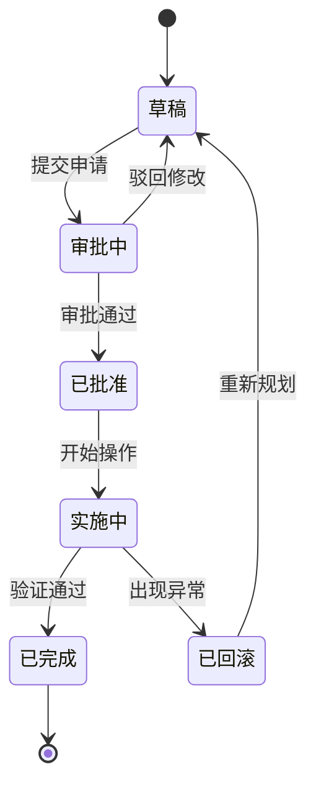
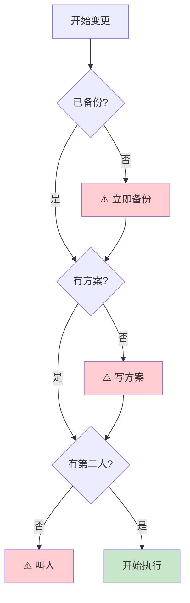
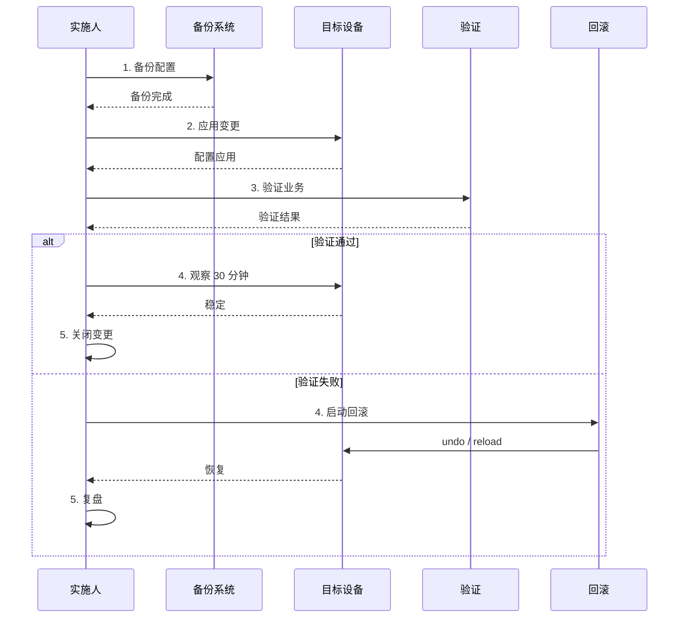

# 网络变更申请单

> **编号**：CHG-YYYYMMDD-XXX
> **状态**：⏳ 草稿 / 🟡 审批中 / 🟢 已批准 / 🔵 实施中 / ✅ 已完成 / ❌ 已回滚

---

## 变更流程全景



### 变更前决策点



### 变更实施泳道



---

## 1. 变更基本信息

| 项目 | 内容 |
|------|------|
| 变更标题 | ___ |
| 申请人 | ___ |
| 实施人 | ___ |
| 审核人 | ___ |
| 业务对接人 | ___ |
| 计划开始时间 | ___ |
| 预计时长 | ___ |
| 影响范围 | ☐ 核心 ☐ 重要 ☐ 一般 |
| 紧急程度 | ☐ P0 紧急 ☐ P1 高 ☐ P2 中 ☐ P3 低 |
| 变更窗口 | ☐ 工作日 ☐ 周末 ☐ 凌晨 ☐ 业务低峰 |

---

## 2. 变更原因

> 为什么要做这个变更？业务诉求 / 安全加固 / 故障修复 / 性能优化 / 其它

_________________________________________________
_________________________________________________

---

## 3. 影响范围

### 3.1 受影响设备

| 设备名 | 设备 IP | 角色 | 操作 |
|--------|---------|------|------|
| | | | |
| | | | |

### 3.2 受影响业务

| 业务系统 | 影响方式 | 持续时间 |
|---------|---------|---------|
| | | |
| | | |

### 3.3 受影响用户

- 受影响用户数：___
- 影响时段：___
- 是否已通知：☐ 是 ☐ 否

---

## 4. 风险评估

| 风险点 | 可能性 | 影响 | 应对措施 |
|--------|--------|------|---------|
| 改错导致业务中断 | | | |
| 改完不生效 | | | |
| 引发联动问题 | | | |
| 设备宕机 | | | |

**回滚决策点**：什么时候决定回滚？什么条件触发回滚？

_________________________________________________

---

## 5. 变更前准备

- [ ] 备份当前配置（保存到 `04-配置备份/`）
- [ ] 在测试环境验证（如有）
- [ ] 通知业务方 / 用户
- [ ] 准备回滚方案
- [ ] 第二人在场
- [ ] 变更窗口审批通过
- [ ] 工具就绪（终端、Console、笔记本电源）

---

## 6. 变更步骤

> 逐步列出，越详细越好。每一步都要能 undo。

### 步骤 1：___
```
# 命令
```

**验证**：
```
# 验证命令
```

**回滚**：
```
# 回滚命令
```

### 步骤 2：___
```
# 命令
```

**验证**：
```
# 验证命令
```

**回滚**：
```
# 回滚命令
```

### 步骤 N：___
```
# 命令
```

---

## 7. 验证步骤

变更完成后需要验证的事项：

- [ ] 设备 SSH 可达
- [ ] 配置正确应用
- [ ] 受影响业务测试通过
- [ ] 接口 UP，无错包
- [ ] 路由 / 邻居正常
- [ ] 监控告警无异常
- [ ] 观察 30 分钟稳定

---

## 8. 回滚方案

> 任何一步发现异常，立即回滚！

### 8.1 一键回滚（首选）

```
# 如果是单条命令错
undo <命令>

# 如果是大段错乱
copy startup-config running-config
# 或
reload
```

### 8.2 灌入备份回滚

```
# 1. 找到变更前的备份
ls -lh 04-配置备份/历史备份/<设备名>/<变更前日期>.cfg

# 2. 灌入
scp <本地备份> admin@<设备IP>:/tmp/
ssh admin@<设备IP>
copy tftp <备份文件>
# 或
load <本地文件>
```

### 8.3 应急联系

| 角色 | 联系人 | 电话 |
|------|--------|------|
| 厂商 400 | ___ | ___ |
| 内部 IT 主管 | ___ | ___ |
| 业务方 | ___ | ___ |

---

## 9. 变更记录

### 9.1 实施记录

| 时间 | 操作 | 结果 |
|------|------|------|
| | | |
| | | |
| | | |

### 9.2 命令回放

> 把实际执行的命令粘过来（包括错误和回滚）

```
[10:30:00] ssh admin@10.1.1.1
[10:30:05] <config>
...
```

### 9.3 截图

> 关键步骤的截图粘到 `05-变更流程与记录/变更截图/`

---

## 10. 变更后总结

- [ ] 变更目标达成
- [ ] 无业务影响 / 影响在预期内
- [ ] 文档已更新
- [ ] 监控规则已更新
- [ ] 备份已验证

**经验教训**：
_________________________________________________
_________________________________________________

---

## 11. 审批

| 角色 | 姓名 | 审批意见 | 签字 | 时间 |
|------|------|---------|------|------|
| 申请人 | | | | |
| 实施人 | | | | |
| 审核人 | | | | |
| 业务方 | | | | |
| IT 主管 | | | | |
