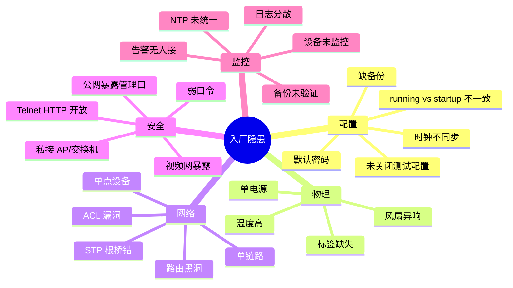
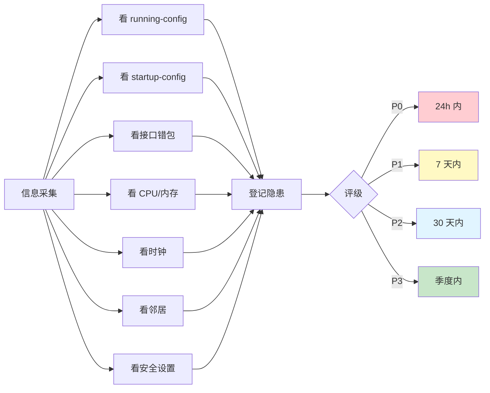

# 入厂隐患清单

> **填表人**：___
> **填表时间**：___
> **版本**：v1.0

> 把所有发现的隐患登记在这里，按 P0/P1/P2/P3 排序，定期回顾处理进度。

---

## 隐患分类框架



### 隐患处理优先级矩阵

```mermaid
quadrantChart
    title 隐患优先级矩阵
    x-axis "处理成本 低 --> 高"
    y-axis "影响程度 低 --> 高"
    quadrant-1 立即处理 (P0)
    quadrant-2 重要排期 (P1)
    quadrant-3 持续观察 (P3)
    quadrant-4 规划处理 (P2)
    "配置无备份": [0.2, 0.95]
    "公网暴露管理": [0.3, 0.9]
    "默认弱口令": [0.2, 0.85]
    "时钟不同步": [0.4, 0.7]
    "单点设备": [0.7, 0.8]
    "单链路": [0.6, 0.6]
    "标签缺失": [0.3, 0.4]
    "新设备加监控": [0.4, 0.6]
    "老固件": [0.5, 0.5]
    "机柜走线乱": [0.7, 0.3]
```

### 隐患发现路径



---

## 风险等级说明

| 等级 | 说明 | 响应时间 |
|------|------|---------|
| P0 | 立即影响业务 / 安全 | 24 小时内 |
| P1 | 重要隐患，可能影响业务 | 7 天内 |
| P2 | 一般隐患，需要规划 | 30 天内 |
| P3 | 优化项 | 季度内 |

---

## P0 紧急（24 小时内处理）

| # | 隐患描述 | 影响设备 | 发现时间 | 处理方案 | 责任人 | 状态 | 关闭时间 |
|---|---------|---------|---------|---------|--------|------|---------|
| 1 | | | | | | ☐ 未处理 | |
| 2 | | | | | | ☐ 未处理 | |
| 3 | | | | | | ☐ 未处理 | |

---

## P1 高（7 天内处理）

| # | 隐患描述 | 影响设备 | 发现时间 | 处理方案 | 责任人 | 状态 | 关闭时间 |
|---|---------|---------|---------|---------|--------|------|---------|
| 1 | | | | | | ☐ 未处理 | |
| 2 | | | | | | ☐ 未处理 | |
| 3 | | | | | | ☐ 未处理 | |

---

## P2 中（30 天内处理）

| # | 隐患描述 | 影响设备 | 发现时间 | 处理方案 | 责任人 | 状态 | 关闭时间 |
|---|---------|---------|---------|---------|--------|------|---------|
| 1 | | | | | | ☐ 未处理 | |
| 2 | | | | | | ☐ 未处理 | |
| 3 | | | | | | ☐ 未处理 | |

---

## P3 低（季度内处理）

| # | 隐患描述 | 影响设备 | 发现时间 | 处理方案 | 责任人 | 状态 | 关闭时间 |
|---|---------|---------|---------|---------|--------|------|---------|
| 1 | | | | | | ☐ 未处理 | |
| 2 | | | | | | ☐ 未处理 | |

---

## 常见隐患 Checklist

### 时钟与同步
- [ ] 所有设备时差在 1 分钟内
- [ ] NTP 服务器配置正确
- [ ] NTP 服务器本身时间准确

### 配置一致性
- [ ] running-config 和 startup-config 一致
- [ ] 没有未保存的临时配置
- [ ] 没有测试残留

### 接口与链路
- [ ] 没有接口长期 err/discard/CRC 高
- [ ] 没有 shutdown 但被接入的接口
- [ ] 关键链路有冗余
- [ ] 光功率在合理范围

### 冗余与高可用
- [ ] HSRP/VRRP 双活
- [ ] STP 根桥合理
- [ ] 聚合链路成员一致
- [ ] 双机状态同步

### 路由
- [ ] OSPF/BGP 邻居稳定
- [ ] 没有路由黑洞
- [ ] 默认路由有备份
- [ ] 路由汇总合理

### 安全
- [ ] 没有默认密码
- [ ] 没有过期账号
- [ ] Telnet / HTTP 已关闭
- [ ] ACL 默认 deny
- [ ] 管理 IP 段限制源
- [ ] 公网无暴露管理口

### 监控与备份
- [ ] 所有设备在监控
- [ ] 自动备份在跑
- [ ] 备份有验证
- [ ] 告警有人接

### 物理
- [ ] 设备双电源
- [ ] 风扇正常
- [ ] 温度正常
- [ ] 线缆标签清晰
- [ ] 机柜整洁

---

## 回顾机制

- **每周一**：过一遍 P0/P1 进度
- **每月末**：过一遍 P0/P1/P2 进度
- **每季度**：全清单 review，重新定级
