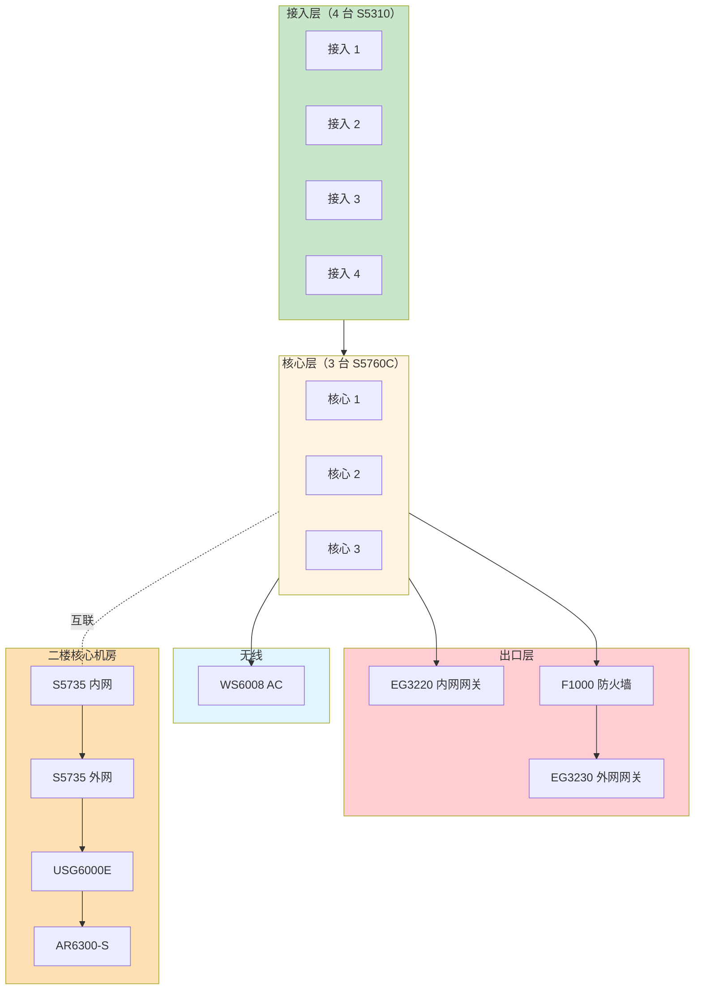
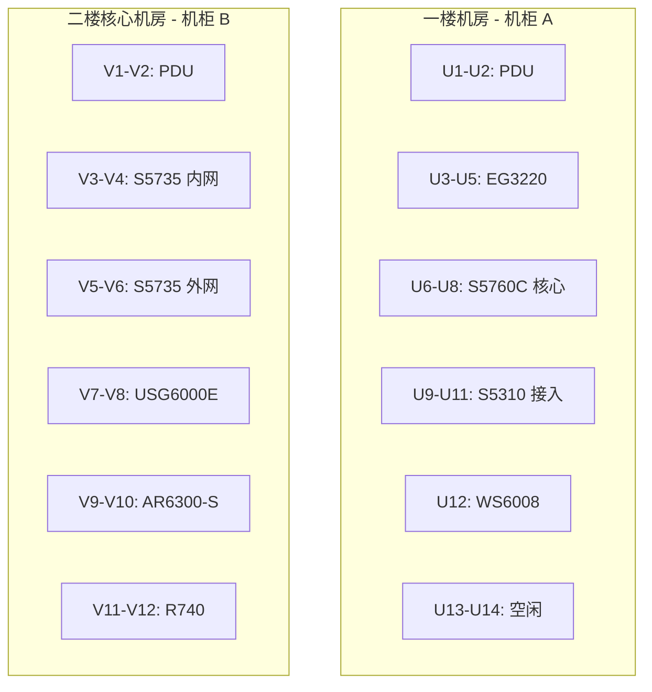

# 资产清单模板

> **填表人**：___
> **最后更新**：___

---

## 资产总览

### 网络分层架构图

### 机房机柜布局示意

---

## 1. 网络设备清单

### 一楼 / 业务网（锐捷）

| # | 设备名 | 型号 | 序列号 | 固件版本 | 管理 IP | 物理位置 | 角色 | 维保截止 | 备注 |
|---|--------|------|--------|----------|---------|---------|------|---------|------|
| 1 | RG-EG3220 | RG-EG3220 | | | | | 内网网关 | | |
| 2 | RG-S5760C-核心1 | RG-S5760C-24SFP/8GT8XS-X | | | | | 核心交换机 | | |
| 3 | RG-S5760C-核心2 | RG-S5760C-24SFP/8GT8XS-X | | | | | 核心交换机 | | |
| 4 | RG-S5760C-核心3 | RG-S5760C-24SFP/8GT8XS-X | | | | | 核心交换机 | | |
| 5 | RG-S5310-接入1 | RG-S5310-24GT4XS | | | | | 接入交换机 | | |
| 6 | RG-S5310-接入2 | RG-S5310-24GT4XS | | | | | 接入交换机 | | |
| 7 | RG-S5310-接入3 | RG-S5310-24GT4XS | | | | | 接入交换机 | | |
| 8 | RG-S5310-接入4 | RG-S5310-24GT4XS | | | | | 接入交换机 | | |
| 9 | RG-WS6008 | RG-WS6008 | | | | | 无线 AC | | |
| 10 | RG-EG3230 | RG-EG3230 | | | | | 外网网关 | | |
| 11 | H3C-F1000-AK155 | F1000-AK155 | | | | | 防火墙 | | |

### 二楼 / 核心机房（华为）

| # | 设备名 | 型号 | 序列号 | 固件版本 | 管理 IP | 物理位置 | 角色 | 维保截止 | 备注 |
|---|--------|------|--------|----------|---------|---------|------|---------|------|
| 12 | Huawei-S5735-内网核心 | S5735 | | | | | 内网核心 | | |
| 13 | Huawei-S5735-外网核心 | S5735 | | | | | 外网核心 | | |
| 14 | Huawei-USG6000E | USG6000E | | | | | 防火墙 | | |
| 15 | Huawei-AR6300-S | AR6300-S | | | | | 核心路由器 | | |

### 服务器

| # | 设备名 | 型号 | 序列号 | 操作系统 | 业务 IP | iDRAC IP | 物理位置 | 角色 | 维保截止 |
|---|--------|------|--------|----------|---------|----------|---------|------|---------|
| 1 | 叫号服务器 | Dell R740 | | | | | 二楼核心机房 | 叫号系统 | |

---

## 2. 链路清单

### 2.1 一楼业务网内部互联

| 起点 | 终点 | 类型 | 速率 | VLAN/Trunk | IP 段 | 备注 |
|------|------|------|------|-----------|-------|------|
| EG3220 | S5760C-核心1 | GE | 1G | | | |
| S5760C-核心1 | S5760C-核心2 | 10GE | 10G | | | 堆叠/聚合？ |
| S5760C-核心1 | S5310-接入1 | 10GE | 10G | | | |
| | | | | | | |

### 2.2 一楼业务网出口

| 起点 | 终点 | 类型 | 速率 | 备注 |
|------|------|------|------|------|
| S5760C-核心1 | F1000-AK155 | GE | 1G | |
| F1000-AK155 | EG3230 | GE | 1G | |
| EG3230 | ISP | GE | 1G | PPPoE/专线 |

### 2.3 二楼核心机房内部

| 起点 | 终点 | 类型 | 速率 | IP 段 | 备注 |
|------|------|------|------|-------|------|
| S5735-内网 | S5735-外网 | 10GE | 10G | | 互联 |
| S5735-内网 | R740 | GE | 1G | | 服务器接入 |
| S5735-外网 | USG6000E | GE | 1G | | 防火墙 |
| USG6000E | AR6300-S | GE | 1G | | 路由器 |
| AR6300-S | ISP | GE | 1G | | 公网出口 |

### 2.4 一楼与二楼互联

| 起点 | 终点 | 类型 | 速率 | 物理路径 | IP 段 | 备注 |
|------|------|------|------|---------|-------|------|
| ? | ? | ? | ? | 室内/室外 | | **待确认** |

> ⚠️ **一楼二楼怎么通，这是第一周必须搞清楚的问题！**

---

## 3. 账号清单

> ⚠️ **密码不要明文写在这里！**
> 密码统一存到 Bitwarden / 1Password / KeePass。

| 设备 | 用户名 | 角色 | 密码位置 | 最后修改 | 备注 |
|------|--------|------|---------|---------|------|
| RG-EG3220 | admin | 网络管理员 | Bitwarden | | |
| RG-EG3220 | audit | 只读 | Bitwarden | | |
| RG-S5760C-* | admin | 网络管理员 | Bitwarden | | |
| | | | | | |
| H3C-F1000 | admin | 网络管理员 | Bitwarden | | |
| Huawei-S5735 | admin | 网络管理员 | Bitwarden | | |
| Huawei-USG6000E | admin | 网络管理员 | Bitwarden | | |
| Huawei-AR6300-S | admin | 网络管理员 | Bitwarden | | |

### 特殊账号

| 设备 | 用户名 | 用途 | 备注 |
|------|--------|------|------|
| 所有设备 | localuser | 本地应急 | Console 口专用 |
| | | | |

---

## 4. 物理信息

### 4.1 一楼机房

| 机柜 | 设备 | U 位 | 电源 PDU | 备注 |
|------|------|------|---------|------|
| | | | | |
| | | | | |

### 4.2 二楼核心机房

| 机柜 | 设备 | U 位 | 电源 PDU | 备注 |
|------|------|------|---------|------|
| | | | | |
| | | | | |

---

## 5. 维保信息

| 设备 | 维保厂商 | 维保级别 | 起始日期 | 截止日期 | 联系人 | 400 号码 |
|------|---------|---------|---------|---------|--------|---------|
| 锐捷设备 | 锐捷 | | | | | 400-100-1112 |
| 华三设备 | 新华三 | | | | | 400-810-0504 |
| 华为设备 | 华为 | | | | | 400-822-9999 |
| Dell 服务器 | Dell | | | | | 400-886-8611 |
| 海康设备 | 海康 | | | | | 400-700-5998 |
| 深信服 | 深信服 | | | | | 400-806-6868 |

---

## 6. 上网链路信息

| 链路 | 运营商 | 带宽 | 类型 | 公网 IP | 接入方式 | 到期日 | 联系人 |
|------|--------|------|------|---------|---------|--------|--------|
| 主 | | | | | | | |
| 备 | | | | | | | |

---

## 7. 巡检路线图

> 把机柜走线按巡检顺序画一遍，照着走

1. 进机房 → 静电环
2. 看机柜 ___ 顶部 → 底部
3. 设备指示灯逐一看
4. 听风扇异响
5. 摸温度（红外测温枪）
6. 检查线缆标签
7. 检查 PDU 电流
8. 出机房 → 取消静电环

---

## 8. 紧急联系

| 角色 | 姓名 | 电话 | 邮箱 | 备注 |
|------|------|------|------|------|
| 前任网管 | | | | |
| IT 主管 | | | | |
| 业务负责人 | | | | |
| 锐捷对接 | | | | |
| 华三对接 | | | | |
| 华为对接 | | | | |
| 物业 / 机房 | | | | |
| ISP 客服 | | | | |
