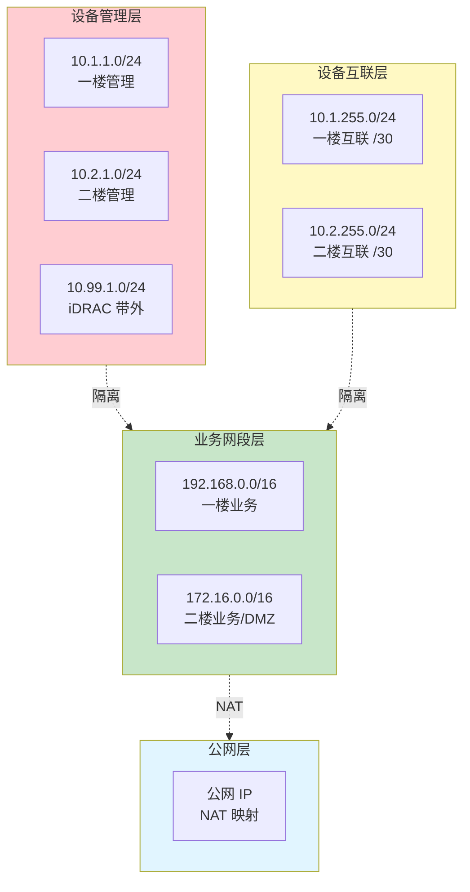
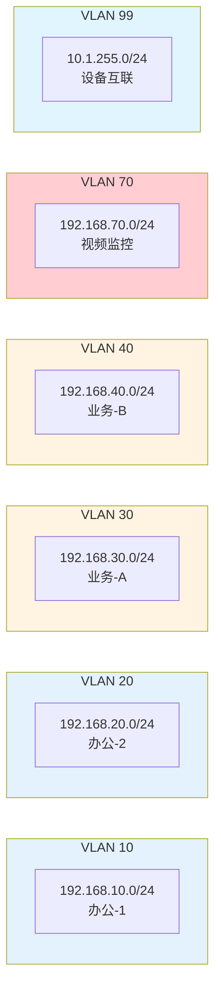
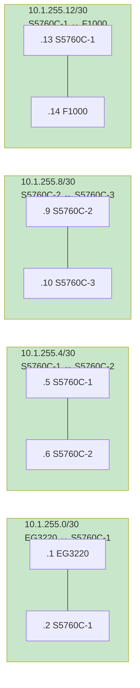

# IP 地址规划表

> **填表人**：___
> **最后更新**：___

---

## IP 规划总览

### IP 网段分层架构

### VLAN 与子网对应

### 互联地址规划（/30 子网示例）

---

## 1. 管理网段（带外/带内管理）

| 用途 | 网段 | 网关 | DHCP | 备注 |
|------|------|------|------|------|
| 一楼设备管理 | 10.1.1.0/24 | | | 设备 loopback / 管理 IP |
| 二楼设备管理 | 10.2.1.0/24 | | | |
| 服务器带外（iDRAC） | 10.99.1.0/24 | | | 独立网段 |
| 堡垒机 | 10.99.2.0/24 | | | |

### 设备管理 IP 分配

| 设备 | 管理 IP | Loopback | 备注 |
|------|---------|---------|------|
| RG-EG3220 | 10.1.1.1 | | |
| RG-S5760C-核心1 | 10.1.1.10 | | |
| RG-S5760C-核心2 | 10.1.1.11 | | |
| RG-S5760C-核心3 | 10.1.1.12 | | |
| RG-S5310-接入1 | 10.1.1.20 | | |
| RG-S5310-接入2 | 10.1.1.21 | | |
| RG-S5310-接入3 | 10.1.1.22 | | |
| RG-S5310-接入4 | 10.1.1.23 | | |
| RG-WS6008 | 10.1.1.30 | | |
| RG-EG3230 | 10.1.1.2 | | |
| H3C-F1000-AK155 | 10.1.1.50 | | |
| Huawei-S5735-内网 | 10.2.1.1 | | |
| Huawei-S5735-外网 | 10.2.1.2 | | |
| Huawei-USG6000E | 10.2.1.10 | | |
| Huawei-AR6300-S | 10.2.1.20 | | |
| R740 iDRAC | 10.99.1.x | | |

---

## 2. 业务网段（一楼）

| VLAN | 名称 | 网段 | 网关 | DHCP | 用途 |
|------|------|------|------|------|------|
| 1 | 默认 | 192.168.1.0/24 | | | 尽量不用 |
| 10 | 办公-1 | 192.168.10.0/24 | | | |
| 20 | 办公-2 | 192.168.20.0/24 | | | |
| 30 | 业务-A | 192.168.30.0/24 | | | |
| 40 | 业务-B | 192.168.40.0/24 | | | |
| 50 | 服务器 | 192.168.50.0/24 | | | |
| 60 | 无线 | 192.168.60.0/24 | | | |
| 70 | 视频监控 | 192.168.70.0/24 | | | 海康 |
| 80 | 门禁 | 192.168.80.0/24 | | | |
| 99 | 设备互联 | 10.1.255.0/24 | | | 设备间互联 |

> ⚠️ 实际网段以现场为准！这里只是模板

---

## 3. 业务网段（二楼）

| VLAN | 名称 | 网段 | 网关 | 用途 |
|------|------|------|------|------|
| 1 | 默认 | | | |
| 100 | 核心业务 | 172.16.100.0/24 | | |
| 200 | 服务器 | 172.16.200.0/24 | | |
| 300 | DMZ | 172.16.300.0/24 | | |
| 999 | 设备互联 | 10.2.255.0/24 | | |

---

## 4. 设备互联地址

| 起点 | 终点 | 接口 | IP 段 | 掩码 | 备注 |
|------|------|------|-------|------|------|
| EG3220 | S5760C-核心1 | | 10.1.255.0/30 | | |
| S5760C-核心1 | S5760C-核心2 | | 10.1.255.4/30 | | |
| S5760C-核心2 | S5760C-核心3 | | 10.1.255.8/30 | | |
| S5760C-核心1 | F1000 | | 10.1.255.16/30 | | |
| F1000 | EG3230 | | 10.1.255.20/30 | | |
| S5735-内网 | S5735-外网 | | 10.2.255.0/30 | | |
| S5735-外网 | USG6000E | | 10.2.255.4/30 | | |
| USG6000E | AR6300-S | | 10.2.255.8/30 | | |
| S5735-内网 | R740 | | 10.2.255.12/30 | | |

---

## 5. 公网 IP / NAT 映射

| 公网 IP | 协议 | 端口 | 内网 IP | 内网端口 | 用途 |
|---------|------|------|---------|---------|------|
| | | | | | |
| | | | | | |
| | | | | | |

---

## 6. VPN 地址池

| 用途 | 地址池 | 掩码 | DNS | 备注 |
|------|--------|------|-----|------|
| SSLVPN | | | | |
| L2TP | | | | |
| IPSec | | | | |
| 站点到站点 | | | | |

---

## 7. 保留网段

| 网段 | 用途 |
|------|------|
| 10.0.0.0/8 | 私网（RFC1918） |
| 172.16.0.0/12 | 私网（RFC1918） |
| 192.168.0.0/16 | 私网（RFC1918） |
| 100.64.0.0/10 | CGNAT |
| 169.254.0.0/16 | 链路本地（不要用） |
| 224.0.0.0/4 | 组播（不要用） |
| 127.0.0.0/8 | 回环（不要用） |

---

## 8. 规划原则

1. **业务网段与设备管理网段严格分离**
2. **业务网段按部门 / 业务 / 楼层划分**
3. **预留 20% 的网段空间**（未来扩展）
4. **统一编址**：VLAN ID 与网段第三段对应（如 VLAN 10 = 192.168.10.0/24）
5. **互联地址用 /30**，节约地址
6. **DHCP 范围不与静态 IP 冲突**
7. **保留网段文档化**
