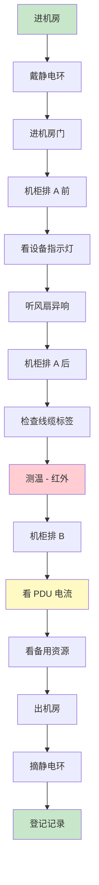
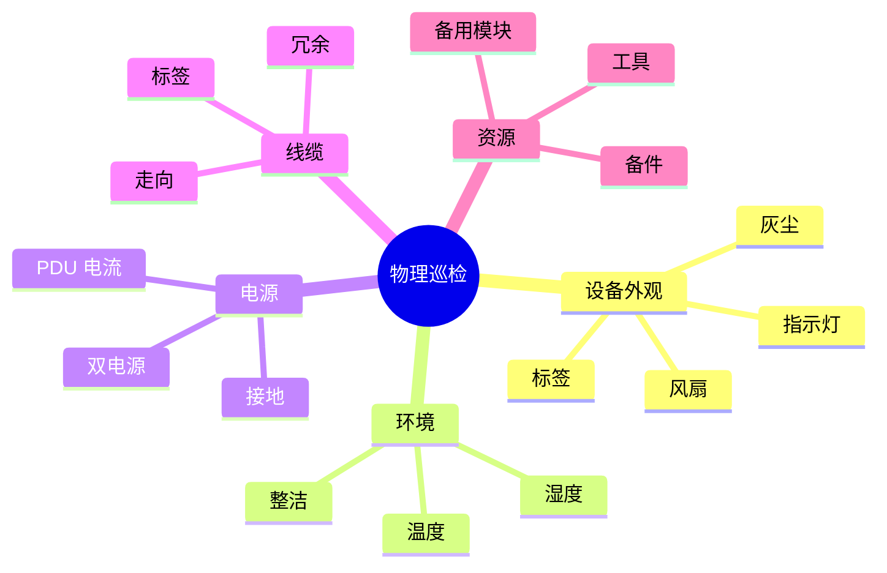
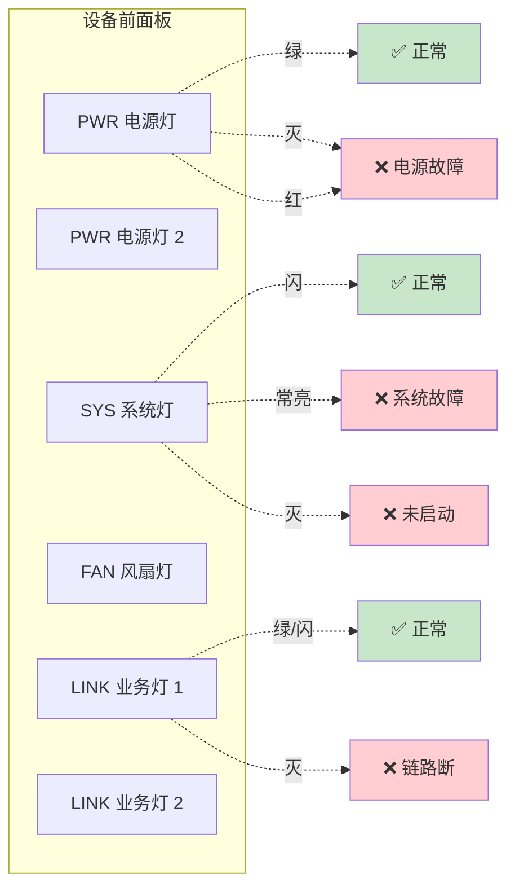
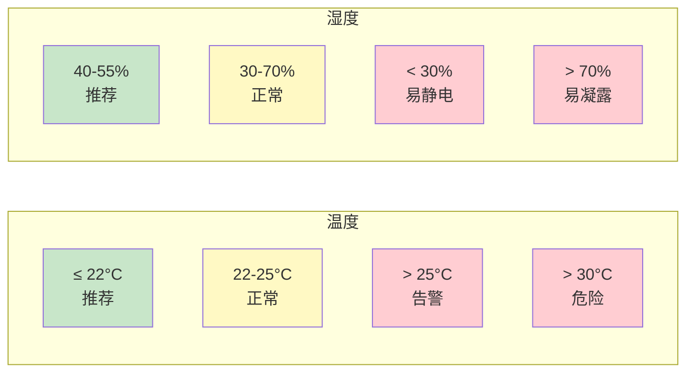

# 物理巡检记录

> **巡检人**：___
> **巡检时间**：___
> **机房**：___

---

## 巡检流程

### 巡检路线示意

### 巡检关注点

### 设备前面板灯位示意

### 机房温湿度标准

---

## 巡检 Checklist

### 机柜整体

| 项 | 状态 | 备注 |
|----|------|------|
| 机柜门可正常开合 | ☐ 正常 ☐ 异常 | |
| 机柜内整洁，无杂物 | ☐ 正常 ☐ 异常 | |
| 机柜接地良好 | ☐ 正常 ☐ 异常 | |
| 散热良好（前后通风） | ☐ 正常 ☐ 异常 | |
| 标签清晰 | ☐ 正常 ☐ 异常 | |
| PDU 工作正常 | ☐ 正常 ☐ 异常 | |

### 设备 1：___

| 项 | 状态 | 备注 |
|----|------|------|
| PWR 灯 | ☐ 绿 ☐ 灭 ☐ 红 | |
| SYS 灯 | ☐ 绿 ☐ 灭 ☐ 红 | |
| LINK 灯 | ☐ 绿 ☐ 闪 ☐ 灭 | |
| 风扇运转 | ☐ 正常 ☐ 异响 | |
| 电源 1 | ☐ 正常 ☐ 异常 | |
| 电源 2（如有） | ☐ 正常 ☐ 异常 | |
| 表面温度 | ___℃ | 用红外测温枪 |
| Console 线 | ☐ 已接 ☐ 未接 | |
| 序列号标签 | ☐ 清晰 ☐ 缺失 | |

### 设备 2：___

（按同样格式记录）

### 设备 3：___

（按同样格式记录）

---

## 线缆检查

| 线缆编号 | 起点 | 终点 | 类型 | 标签 | 状态 | 备注 |
|---------|------|------|------|------|------|------|
| | | | | | ☐ 正常 ☐ 异常 | |
| | | | | | ☐ 正常 ☐ 异常 | |
| | | | | | ☐ 正常 ☐ 异常 | |

---

## 备用资源

| 资源 | 数量 | 位置 | 状态 |
|------|------|------|------|
| 备用 SFP 模块 | | | |
| 备用网线 | | | |
| 备用 Console 线 | | | |
| 备用电源线 | | | |
| 备用光跳线 | | | |
| 备用风扇模块 | | | |
| 备用电源模块 | | | |

---

## 温度记录

| 设备 | 进风温度 | 出风温度 | 备注 |
|------|---------|---------|------|
| | | | |
| | | | |

> **建议**：核心设备进风 ≤ 25℃，出风 ≤ 35℃

---

## 拍照记录

> 拍：机柜前后、每台设备全貌、异常位置

照片存到 `06-资产与拓扑/巡检照片/`

---

## 异常与处理

| # | 异常描述 | 设备/位置 | 严重程度 | 处理 | 关闭时间 |
|---|---------|---------|---------|------|---------|
| 1 | | | | | |
| 2 | | | | | |
| 3 | | | | | |

---

## 巡检总结

> 本次巡检发现 ___ 个问题，已处理 ___ 个，遗留 ___ 个。

_________________________________________________
_________________________________________________

**签名**：________
**日期**：________
