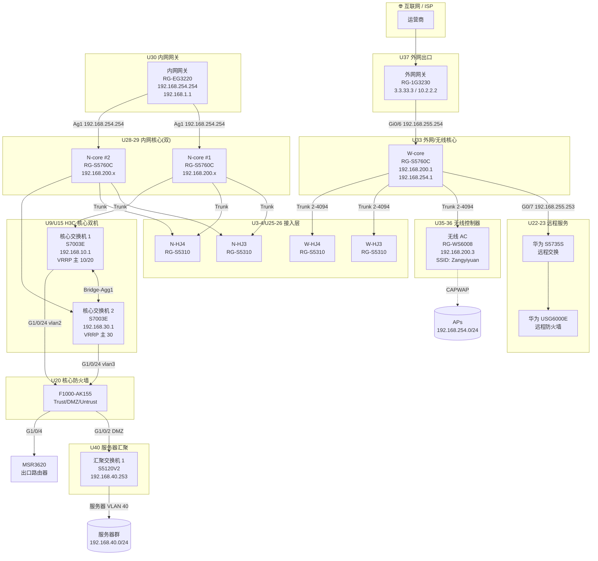
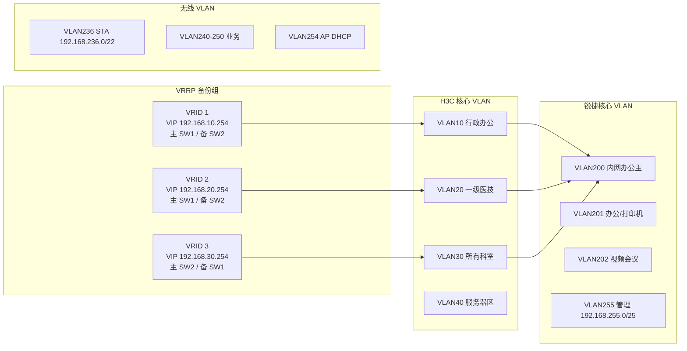

# 9 号机柜网络拓扑图

## 物理拓扑(Mermaid)



## 逻辑拓扑(VLAN 与 VRRP)



## 机柜物理布局(U 位)

```
U42 ┌──────────────────────────────┐
U41 │                              │  (空)
U40 │  汇聚交换机 1  H3C S5120V2    │
U39 │                              │  (空)
U38 │                              │  (空)
U37 │  外网网关  RG-1G3230           │
U36 │  无线 AP 控制器 AC            │
U35 │  RG-WS6008                   │
U34 │                              │  (空)
U33 │  W-core  RG-S5760C            │
U32 │                              │  (空)
U31 │                              │  (空)
U30 │  内网网关  RG-EG3220          │
U29 │  N-core #1  RG-S5760C         │
U28 │  N-core #2  RG-S5760C         │
U27 │                              │  (空)
U26 │  W-HJ3  RG-S5310              │
U25 │  N-HJ3  RG-S5310              │
U24 │                              │  (空)
U23 │  华为防火墙  USG6000E          │
U22 │  华为交换机  S5735S-L24T4S-A   │  (远程服务)
U21 │                              │  (空)
U20 │  核心防火墙  F1000-AK155       │
U19 │                              │  (空)
U18 │                              │  (空)
U17 │                              │  (空)
U16 │                              │  (空)
U15 │  核心交换机 2  S7003E          │
U14 │                              │  (空)
U13 │                              │  (空)
U12 │                              │  (空)
U11 │                              │  (空)
U10 │                              │  (空)
U9  │  核心交换机 1  S7003E          │
U8  │                              │  (空)
U7  │                              │  (空)
U6  │                              │  (空)
U5  │                              │  (空)
U4  │  W-HJ4  RG-S5310              │
U3  │  N-HJ4  RG-S5310              │
U2  │                              │  (空)
U1  └──────────────────────────────┘
```

## 关键链路速率

| 链路 | 类型 | 速率 |
|------|------|------|
| H3C SW1 ⇄ SW2 | 2×GE Bridge-Agg | 2 Gbps |
| N-core #1 ⇄ 内网网关 EG3220 | Ag1(万兆) | 10 Gbps |
| N-core 万兆上联 | TenGigabitEthernet 0/27-32 | 10 Gbps |
| W-core 万兆上联 | TenGigabitEthernet 0/25-32 | 10 Gbps |
| 外网网关 EG3230 ⇄ WAN | Gi0/7 100Mbps | 100 Mbps(带宽限速) |
| 内网网关 EG3220 ⇄ 外网 WAN | Gi0/5 1Gbps | 1 Gbps |
| 接入交换机 ⇄ 核心 | 24×GE + 4×10GE | GE / 10GE |
| 防火墙 ⇄ 核心 | 2×GE | 1+1 Gbps 冗余 |
