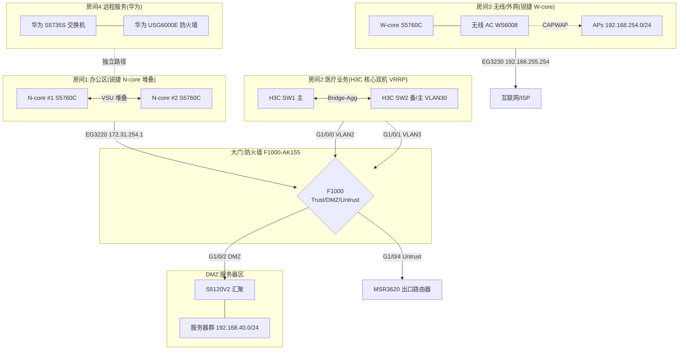

# 01 · 现状架构解读

> 把 9 号机柜拆成 **4 块独立小网络** + **1 道防火墙大门** 来理解。

---

## 一、4 块拼图

把整个机柜想象成 4 间独立的房间,房间之间**不直接打通**,要通信必须走"大门"(防火墙或网关)。

### 房间 1:办公区(锐捷 N-core)

- **设备**:U28 + U29 两台锐捷 S5760C(VSU 堆叠,本质是一台逻辑设备)
- **网段**:VLAN 200/201/202/203/204/205(192.168.200.0/24 等)
- **角色**:行政办公、打印机、视频会议、办公终端
- **DHCP**:N-core 自身给 200-205 段分配地址
- **出门**:通过 EG3220 走防火墙 F1000 出去上外网

### 房间 2:医疗业务区(H3C 核心)

- **设备**:U9 + U15 两台 H3C S7003E(VRRP 双机,**真双机**)
- **网段**:VLAN 10(行政办公)、VLAN 20(一级医技)、VLAN 30(所有科室)
- **角色**:医生护士站、医疗终端、临床信息系统
- **DHCP**:H3C 核心给 VLAN 10/20 分配地址
- **出门**:直接通过 F1000 G1/0/0、G1/0/1 进出防火墙

> **⚠️ 注意:VLAN 10(行政办公)在 H3C 和 N-core 都出现,IP 段都是 192.168.10.0/24** —— 文档未说明这是否真的并存,需要现场确认。

### 房间 3:无线 / 外网区(锐捷 W-core)

- **设备**:U33 一台锐捷 S5760C(U37 EG3230 充当外网网关)
- **网段**:VLAN 200(AC 管理)、VLAN 236(STA 客户端 192.168.236.0/22)、VLAN 240-250(业务)、VLAN 254(AP DHCP)
- **角色**:访客 WiFi、AP 接入
- **出门**:EG3230 走 ISP 物理专线
- **SSID**:`Zangyiyuan`(藏医院),WPA2-PSK 密码 `XXK123123`(明文,需更换)

### 房间 4:远程服务区(华为设备)

- **设备**:U22 华为 S5735S-L24T4S-A 交换机 + U23 华为 USG6000E 防火墙
- **角色**:推测承担远程办公接入(从拓扑图推断)
- **现状**:**没有配置文件**,完全是黑盒

---

## 二、5 个核心概念(术语表)

### 1. VLAN(虚拟局域网)

**作用**:把一台物理交换机"切"成多个互不干扰的逻辑网络。

**例子**:
```
一台锐捷 N-core 物理交换机
  ├── VLAN 10  → 192.168.10.0/24  行政办公
  ├── VLAN 20  → 192.168.20.0/24  一级医技
  ├── VLAN 200 → 192.168.200.0/24 办公主
  ├── VLAN 201 → 192.168.201.0/24 打印机
  └── VLAN 202 → 192.168.202.0/24 视频会议
```

**两个重要属性**:
- **Access 口**:只属于 1 个 VLAN(接电脑)
- **Trunk 口**:能跑多个 VLAN(交换机之间互联)

### 2. VRRP(虚拟路由冗余协议)

**作用**:两台核心交换机"假装"是同一台,对外只暴露 1 个虚拟 IP。任一台挂了,另一台自动接管。

**本机柜实例**:
```
192.168.10.254  ← 虚拟 IP(VIP)
        ↑
   ┌────┴────┐
 SW1(主)  SW2(备)
优先级110   优先级100
```

**特点**:SW1 是 VLAN 10/20 的主,SW2 是 VLAN 30 的主(分担流量)。

### 3. VSU 堆叠(锐捷私有协议)

**作用**:多台物理交换机在逻辑上变成 1 台。配置完全一样,管理也只当 1 台看。

**本机柜实例**:N-core #1 + #2 = 一台逻辑设备(配置完全一致就是这个原因)。

**和 VRRP 的区别**:

| | VRRP 双机 | VSU 堆叠 |
|---|----------|---------|
| 设备数 | 2 台独立 | 2 台合一 |
| 配置 | 可以不同 | 必须相同 |
| 转发 | 主备/分担 | 一起转发 |
| 故障切换 | 秒级 | 毫秒级 |

### 4. 链路聚合(LACP / Bridge-Aggregation)

**作用**:多根网线绑成 1 根,带宽叠加 + 一根断了另一根顶上。

**本机柜实例**:
- H3C SW1 ⇄ SW2:Bridge-Agg1(2 根 GE)
- N-core → EG3220:AggregatePort 1(2 根 GE,实为万兆)
- N-core 万兆上联:6 条万兆聚合

### 5. Trust / DMZ / Untrust(防火墙三区)

**作用**:防火墙把接口按"信任级别"分组,跨区必须走策略。

```
   ┌──Trust──┐    ┌───DMZ────┐    ┌─Untrust─┐
   │ 内网核心  │ →  │ 对外服务器 │ →  │  互联网   │
   │ 用户     │    │ HIS/PACS  │    │          │
   └─────────┘    └──────────┘    └──────────┘
   高信任           中等            低信任
```

**本机柜实例**:F1000-AK155 防火墙
- **Trust**:G1/0/0(←SW1)、G1/0/1(←SW2)、G1/0/5(管理)、G1/0/15(←EG3220)
- **DMZ**:G1/0/2 / G1/0/2.40(→S5120V2 服务器区)
- **Untrust**:G1/0/3(专线)、G1/0/4(→MSR3620)

---

## 三、设备清单(U 位图)

```
U42 ┌──────────────────────────────┐
U41 │                              │  空
U40 │  汇聚交换机 1  H3C S5120V2    │  ← 服务器区汇聚
U39 │                              │
U38 │                              │
U37 │  外网网关  RG-1G3230           │  ← 房间3 出门用
U36 │  无线 AC 控制器 RG-WS6008     │  ← 房间3
U35 │  RG-WS6008(主)               │
U34 │                              │
U33 │  W-core  RG-S5760C            │  ← 房间3 核心
U32 │                              │
U31 │                              │
U30 │  内网网关  RG-EG3220          │  ← 房间1 出门用
U29 │  N-core #1  RG-S5760C         │  ← 房间1(堆叠)
U28 │  N-core #2  RG-S5760C         │  ← 房间1(堆叠)
U27 │                              │
U26 │  W-HJ3  RG-S5310              │  ← 房间3 接入
U25 │  N-HJ3  RG-S5310              │  ← 房间1 接入
U24 │                              │
U23 │  华为防火墙  USG6000E          │  ← 房间4
U22 │  华为交换机  S5735S-L24T4S-A   │  ← 房间4
U21 │                              │
U20 │  核心防火墙  F1000-AK155       │  ← 4 房间之间的"大门"
U19 │                              │
U18 │                              │
U17 │                              │
U16 │                              │
U15 │  核心交换机 2  S7003E          │  ← 房间2 核心
U14 │                              │
U13 │                              │
U12 │                              │
U11 │                              │
U10 │                              │
U9  │  核心交换机 1  S7003E          │  ← 房间2 核心
U8  │                              │
U7  │                              │
U6  │                              │
U5  │                              │
U4  │  W-HJ4  RG-S5310              │  ← 房间3 接入
U3  │  N-HJ4  RG-S5310              │  ← 房间1 接入
U2  │                              │
U1  └──────────────────────────────┘
```

---

## 四、4 块 + 防火墙的逻辑关系图



---

## 五、一句话总结

> **9 号机柜 = 4 间独立小网络(办公/医疗/无线/远程) + 1 道核心防火墙。**
> **房间之间不直接打通,必须走防火墙或独立网关。**
