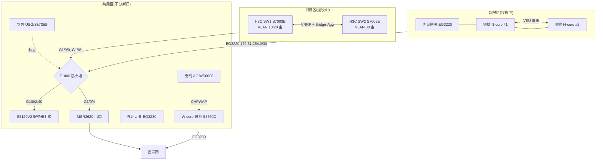

# 01 · 现状架构解读

> **核心背景:这是一台"迁移中"的机柜。**
>
> - **旧院区** 用 VLAN 10-40(由 H3C 核心承载),**正在逐步退役**
> - **新院区** 用 VLAN 200-205(由锐捷 N-core 承载),**正在逐步接管**
> - **公用的部分**(防火墙、服务器、无线、远程)两边都共用
>
> 之前我以为这是个"设计混乱"的网络,实际是**两套网络在过渡期内并存**,大部分"乱"都是**迁移期的正常状态**。

---

## 一、总体结构(迁移期视图)

```
┌────────────────────┬────────────────────┐
│   旧院区(退役中)   │   新院区(接管中)   │
│                    │                    │
│  H3C 核心 SW1/SW2  │  锐捷 N-core 堆叠    │
│  VLAN 10/20/30/40  │  VLAN 200-205       │
│  VRRP 双机         │  VSU 堆叠           │
│                    │                    │
└────────┬───────────┴──────────┬─────────┘
         │                       │
         │    共用大门 F1000      │
         └───────────┬───────────┘
                     ↓
        ┌────────────────────────────┐
        │  F1000 防火墙              │  ← Trust/DMZ/Untrust
        │  S5120V2 服务器汇聚(VLAN 40)│
        └────────────┬───────────────┘
                     ↓
              服务器群(共用)

────────────────── 公用区(不分新旧) ──────────────────

  锐捷 W-core(无线/外网)  +  华为 USG6000E/S5735S(远程)
  EG3230(外网)            +  EG3220(内网,N-core 专用)
```

---

## 二、4 块独立模块

### 模块 A:旧院区核心(H3C)—— 正在退役

- **设备**:U9 + U15 两台 H3C S7003E
- **冗余方式**:**VRRP 双机**(两台独立设备,虚拟一个 IP)
- **承载的 VLAN**:
  - VLAN 10 = 行政办公(`192.168.10.0/24`)
  - VLAN 20 = 一级医技(`192.168.20.0/24`)
  - VLAN 30 = 所有科室(`192.168.30.0/24`)
  - VLAN 40 = 服务器区(`192.168.40.0/24`,也在 S5120V2 上)
- **VRRP 状态**:
  - SW1:VLAN 10/20 主(优先级 110),VLAN 30 备
  - SW2:VLAN 30 主(优先级 110),VLAN 10/20 备
  - 虚拟 IP:VLAN 10 → `192.168.10.254`、VLAN 20 → `192.168.20.254`、VLAN 30 → `192.168.30.254`

**当前状态**:**承载旧院区全部业务,正在等终端/服务器逐批迁走。**

---

### 模块 B:新院区核心(锐捷 N-core)—— 正在接管

- **设备**:U28 + U29 两台锐捷 S5760C
- **冗余方式**:**VSU 堆叠**(两台物理机 = 一台逻辑机)
- **承载的 VLAN**:
  - **新院区业务**:VLAN 200-205(办公/打印机/视频会议等)
  - **迁移期兼容**:VLAN 10/20/30/40 也保留(让旧设备可以直接插)
  - 管理/互联:VLAN 4(10.12.4.0/24,用途待查)、VLAN 100(互联 EG3220)、VLAN 255
- **DHCP 服务**:N-core 自身为 VLAN 10/20/200-205 提供 DHCP(迁移期会有冲突,见 03)

**当前状态**:**新院区已上线运行,旧院区部分业务也开始切过来,迁移期重叠。**

---

### 模块 C:共用区(防火墙 + 服务器 + 无线 + 远程)

这部分**不分新旧**,两边都用。

#### C-1. 核心防火墙 F1000-AK155(U20)

- 角色:**新旧两区共用的"大门"**
- 接口:
  - G1/0/0 ← SW1(旧核心,VLAN 2)
  - G1/0/1 ← SW2(旧核心,VLAN 3)
  - G1/0/15 ← EG3220(新院区,172.31.254.0/30)
  - G1/0/2.40 → S5120V2(服务器区,VLAN 40)
  - G1/0/4 → MSR3620(出口路由器)
- 安全分区:Trust(内网) / DMZ(服务器) / Untrust(互联网)

#### C-2. 服务器汇聚 S5120V2(U40)

- 角色:**所有服务器的接入点**(HIS、PACS、OA 等)
- VLAN 40(`192.168.40.0/24`)
- 现在还是接在 F1000 G1/0/2.40,**没有变化**
- 未来如果服务器也迁移(比如上云),这块就退役

#### C-3. 无线/外网区(锐捷 W-core + EG3230)

- W-core(U33):无线/外网核心,SSID `Zangyiyuan`
- EG3230(U37):外网网关,Gi0/7 → ISP(10.2.2.1)
- STA 客户端:VLAN 236(`192.168.236.0/22`)
- **不分新旧**,两边都能用

#### C-4. 远程服务区(华为)

- 华为 USG6000E(U23)+ 华为 S5735S(U22)
- 推测承担远程办公接入
- **没有配置文档** —— 独立问题,与迁移无关

---

### 模块 D:接入层(分新旧)

| 设备 | U 位 | 所属院区 | 上联核心 |
|------|------|---------|---------|
| N-HJ3 / N-HJ4 | U25-26 / U3-4 | **新院区** | 锐捷 N-core |
| W-HJ3 / W-HJ4 | U25-26 / U3-4 | **无线/外网**(共用) | W-core |

**注意**:N-HJ 和 W-HJ 在 U 位上有重叠(N-HJ3 在 U25,W-HJ3 在 U26),但属于不同院区。

---

## 三、5 个核心概念(术语表)

> 这部分内容没变,迁移期也要懂这些。

### 1. VLAN(虚拟局域网)

**作用**:把一台物理交换机"切"成多个互不干扰的逻辑网络。

```
一台锐捷 N-core 物理交换机
  ├── VLAN 10  → 192.168.10.0/24  旧院区行政办公(迁移期保留)
  ├── VLAN 200 → 192.168.200.0/24 新院区办公主
  ├── VLAN 201 → 192.168.201.0/24 新院区打印机
  └── VLAN 202 → 192.168.202.0/24 新院区视频会议
```

### 2. VRRP(虚拟路由冗余协议)

**作用**:两台核心交换机"假装"是同一台,对外只暴露 1 个虚拟 IP。

**本机柜实例**(H3C 旧核心):
```
192.168.10.254  ← 虚拟 IP
        ↑
   ┌────┴────┐
 SW1(主)  SW2(备)
```

### 3. VSU 堆叠(锐捷私有)

**作用**:多台物理交换机在逻辑上变成 1 台。

**本机柜实例**:N-core #1 + #2 = 一台逻辑设备(配置完全相同)。

### 4. 链路聚合(LACP / Bridge-Aggregation)

**作用**:多根网线绑成 1 根,带宽叠加 + 冗余。

### 5. Trust / DMZ / Untrust(防火墙三区)

```
   Trust(高信任)   →  DMZ(中等)   →  Untrust(低信任)
   内网核心/用户      对外服务器       互联网
```

---

## 四、迁移期特有的现象

### 现象 1:同一 VLAN 出现在两台核心上

| VLAN | 在 H3C 上 | 在 N-core 上 | 原因 |
|------|----------|--------------|------|
| 10 | ✓ 旧院区 | ✓ 兼容保留 | 旧终端直接插新接入 |
| 20 | ✓ 旧院区 | ✓ 兼容保留 | 同上 |
| 30 | ✓ 旧院区 | ✓ 兼容保留 | 同上 |
| 40 | ✓ 服务器 | ✓ 兼容保留 | 服务器可能也会切 |
| 200-205 | ✗ | ✓ 新院区 | 新业务 |

**这不是 bug,是迁移期刻意保留的"双归属"**,让旧终端可以平滑过渡到新核心。

### 现象 2:同一 VLAN 有多个 DHCP 源

H3C 和 N-core 都可能为 VLAN 10/20 提供 DHCP。

**风险**:DHCP 抢答 → 部分终端拿到错误 IP → 莫名其妙断网。
**对策**:迁移期需要明确"哪个 VLAN 现在归谁管",DHCP 跟着网关走。

### 现象 3:旧核心的 VRRP 状态 = "真的还在跑"

虽然有新核心,但 H3C SW1/SW2 仍是**生产设备**,上面还接着旧院区的真实终端和服务器。
**不能随便关** —— 任何动 H3C 的操作都需要选业务低峰期。

---

## 五、设备清单(U 位图,标注新旧)

```
U42 ┌──────────────────────────────────────┐
U41 │                                      │  空
U40 │  汇聚交换机 1  H3C S5120V2            │  ← 共用(服务器)
U39 │                                      │
U38 │                                      │
U37 │  外网网关  RG-1G3230                   │  ← 共用(无线/外网)
U36 │  无线 AC 控制器 RG-WS6008             │  ← 共用
U35 │  RG-WS6008(主)                       │
U34 │                                      │
U33 │  W-core  RG-S5760C                    │  ← 共用(无线/外网核心)
U32 │                                      │
U31 │                                      │
U30 │  内网网关  RG-EG3220                  │  ← **新院区专用**
U29 │  N-core #1  RG-S5760C                 │  ← **新院区核心**(堆叠)
U28 │  N-core #2  RG-S5760C                 │  ← **新院区核心**(堆叠)
U27 │                                      │
U26 │  W-HJ3  RG-S5310                      │  ← 共用(无线接入)
U25 │  N-HJ3  RG-S5310                      │  ← **新院区接入**
U24 │                                      │
U23 │  华为防火墙  USG6000E                  │  ← 共用(远程)
U22 │  华为交换机  S5735S-L24T4S-A           │  ← 共用(远程)
U21 │                                      │
U20 │  核心防火墙  F1000-AK155               │  ← 共用(大门)
U19 │                                      │
U18 │                                      │
U17 │                                      │
U16 │                                      │
U15 │  核心交换机 2  S7003E                  │  ← **旧院区核心**
U14 │                                      │
U13 │                                      │
U12 │                                      │
U11 │                                      │
U10 │                                      │
U9  │  核心交换机 1  S7003E                  │  ← **旧院区核心**
U8  │                                      │
U7  │                                      │
U6  │                                      │
U5  │                                      │
U4  │  W-HJ4  RG-S5310                      │  ← 共用(无线接入)
U3  │  N-HJ4  RG-S5310                      │  ← **新院区接入**
U2  │                                      │
U1  └──────────────────────────────────────┘
```

**新院区设备** = N-core(堆叠)+ N-HJ3/4 + EG3220
**旧院区设备** = H3C SW1/SW2(等终端迁完就退)
**共用设备** = 防火墙、服务器汇聚、W-core、无线 AC、华为、MSR3620

---

## 六、迁移期架构图(Mermaid)



---

## 七、一句话总结

> **这台机柜 = 旧院区(H3C 核心,退役中) + 新院区(锐捷 N-core,接管中) + 共用区(防火墙/服务器/无线/远程)。**
> **"4 个核心"中 2 个是迁移过渡,1 个是无线,1 个是远程,真正长期存在的只有 1 个(新核心)+ 共用区。**
